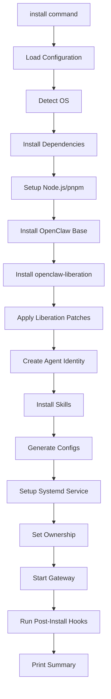
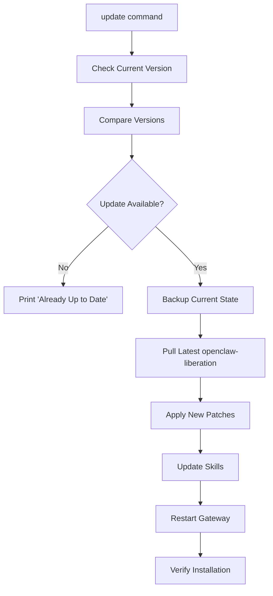
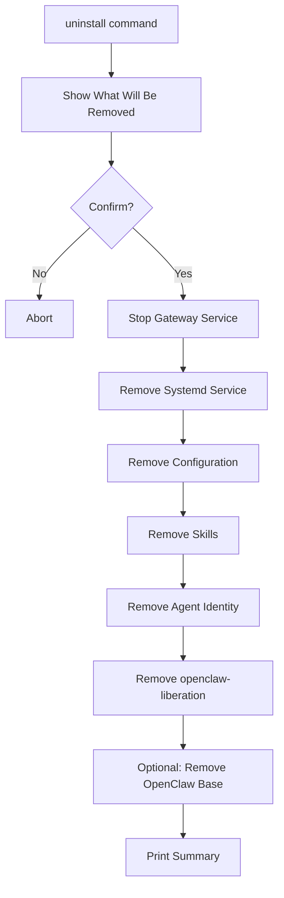
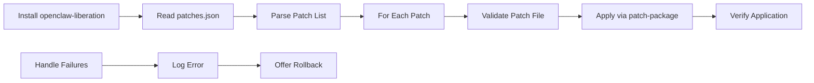
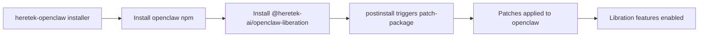
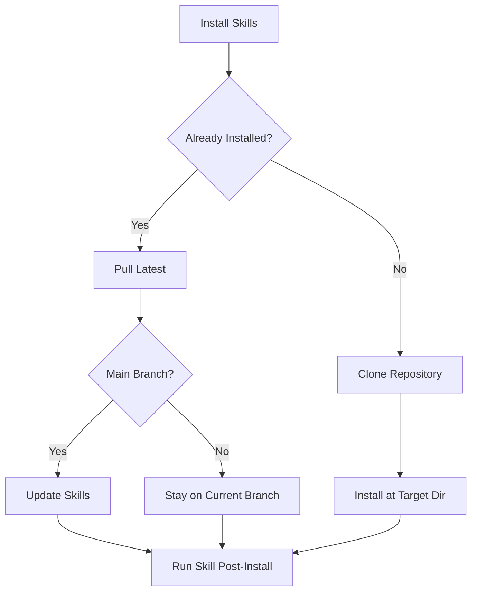
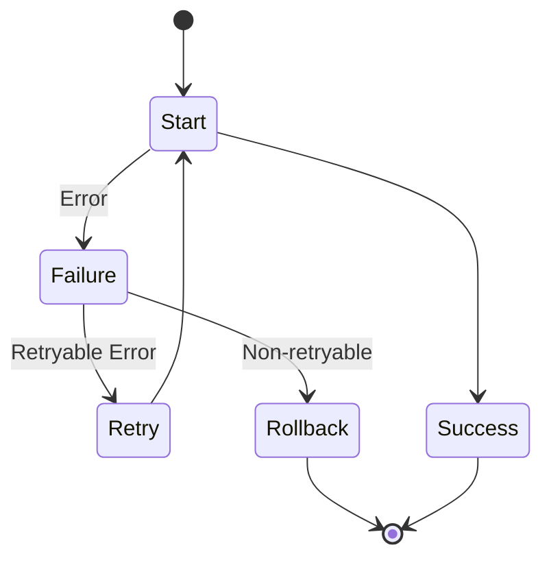

# Heretek-OpenClaw Installer Design

## Overview

This document defines the architecture for the next-generation Heretek-OpenClaw installer. The design replaces the monolithic `install.sh` with a modular, CLI-driven approach that integrates seamlessly with the `openclaw-liberation` npm package.

## Design Goals

| Goal | Description |
|------|-------------|
| **Modularity** | Separate concerns into discrete components |
| **Extensibility** | Support plugins, custom patches, and skill modules |
| **Idempotency** | Safe to run multiple times without side effects |
| **Recoverability** | Support rollback on failure |
| **Observability** | Detailed logging and progress reporting |

---

## File Structure

```
heretek-openclaw/
├── INSTALLER_DESIGN.md           # This document
├── install.sh                   # Entry point (legacy compatibility)
├── installer/                   # New modular installer
│   ├── cli.js                   # Main CLI entry point
│   ├── index.js                # Module exports
│   ├── package.json            # Installer package metadata
│   │
│   ├── commands/                # CLI command implementations
│   │   ├── install.js          # install subcommand
│   │   ├── update.js           # update subcommand
│   │   ├── uninstall.js        # uninstall subcommand
│   │   ├── create-agent.js     # create-agent subcommand
│   │   ├── apply-patch.js      # apply-patch subcommand
│   │   ├── verify.js           # verify subcommand
│   │   └── status.js           # status subcommand
│   │
│   ├── lib/                     # Shared libraries
│   │   ├── os-detect.js        # OS detection utilities
│   │   ├── dependencies.js     # Dependency installation
│   │   ├── node-setup.js       # Node.js/pnpm setup
│   │   ├── npm-utils.js        # npm package utilities
│   │   ├── file-utils.js       # File operations
│   │   ├── config-gen.js       # Configuration generation
│   │   ├── patch-applier.js    # Patch application logic
│   │   ├── agent-builder.js    # Agent creation logic
│   │   ├── skills-installer.js # Skills installation
│   │   ├── systemd-manager.js  # Systemd service management
│   │   └── logger.js           # Logging utilities
│   │
│   ├── templates/               # Agent templates
│   │   ├── triad-agent/        # Default triad agent template
│   │   │   ├── SOUL.md
│   │   │   ├── IDENTITY.md
│   │   │   ├── AGENTS.md
│   │   │   ├── USER.md
│   │   │   ├── MEMORY.md
│   │   │   ├── BLUEPRINT.md
│   │   │   └── config.json
│   │   │
│   │   └── minimal-agent/      # Minimal agent template
│   │       ├── SOUL.md
│   │       ├── IDENTITY.md
│   │       └── config.json
│   │
│   ├── config/                 # Default configurations
│   │   ├── default.json        # Default settings
│   │   ├── presets/            # Installation presets
│   │   │   ├── development.json
│   │   │   ├── production.json
│   │   │   └── minimal.json
│   │   └── schemas/            # Configuration schemas
│   │       └── install-config.schema.json
│   │
│   └── hooks/                   # Lifecycle hooks
│       ├── pre-install.js
│       ├── post-install.js
│       ├── pre-update.js
│       ├── post-update.js
│       ├── pre-uninstall.js
│       └── post-uninstall.js
│
├── identity/                    # Identity files (copied to agent)
│   ├── SOUL.md
│   ├── IDENTITY.md
│   ├── AGENTS.md
│   ├── USER.md
│   ├── MEMORY.md
│   └── BLUEPRINT.md
│
├── README.md
├── LICENSE
└── CHANGELOG.md
```

---

## Component Breakdown

### 1. CLI Entry Point (`installer/cli.js`)

The main CLI interface that dispatches to subcommands.

**Command Structure:**

```bash
heretek-openclaw <command> [options]
```

**Available Commands:**

| Command | Description |
|---------|-------------|
| `install` | Full installation (default) |
| `update` | Update existing installation |
| `uninstall` | Clean uninstallation |
| `create-agent` | Create a new liberated agent |
| `apply-patch` | Apply liberation patches manually |
| `verify` | Verify installation integrity |
| `status` | Show installation status |

**Global Options:**

| Option | Description |
|--------|-------------|
| `--config <path>` | Custom configuration file |
| `--verbose` | Enable verbose logging |
| `--quiet` | Suppress non-essential output |
| `--force` | Force operation even if already done |
| `--dry-run` | Show what would be done without doing it |

### 2. Install Command (`installer/commands/install.js`)

Performs full installation with the following flow:



### 3. Update Command (`installer/commands/update.js`)

Updates existing installation:



### 4. Uninstall Command (`installer/commands/uninstall.js`)

Clean removal with confirmation:



### 5. Create-Agent Command (`installer/commands/create-agent.js`)

Creates a new liberated agent with triad identity:

```bash
heretek-openclaw create-agent <agent-name> [options]

Options:
  --template <name>     Agent template (triad, minimal) [default: triad]
  --triad              Enable triad mode (3 agents)
  --model <name>       Model to use
  --model-url <url>    Model endpoint URL
  --workspace <path>   Workspace directory
```

### 6. Patch Applicator (`installer/lib/patch-applier.js`)

Integrates with `openclaw-liberation`:

```javascript
// Key functions
async function applyLiberationPatches(options)
async function verifyPatchesApplied()
async function listAvailablePatches()
async function applySpecificPatch(patchName)
```

**Patch Application Flow:**



### 7. Agent Builder (`installer/lib/agent-builder.js`)

Creates agent identity from templates:

```javascript
// Key functions
async function createAgent(name, template, options)
async function generateTriadIdentity(agentName)
async function copyIdentityFiles(targetDir)
async function configureAgent(agentConfig)
```

### 8. Skills Installer (`installer/lib/skills-installer.js`)

Manages heretek-skills installation:

```javascript
// Key functions
async function installSkills(targetDir, options)
async function updateSkills()
async function listInstalledSkills()
async function installSkill(skillName)
```

---

## CLI Interface Design

### Interactive Mode

When run without subcommands, enters interactive installer:

```bash
$ heretek-openclaw

🦞 Heretek-OpenClaw Installer
═══════════════════════════════

1) Install (full installation)
2) Update (update existing)
3) Create Agent (add new agent)
4) Uninstall (remove installation)
5) Exit

Select option [1-5]:
```

### Command Mode

**Install:**

```bash
# Full installation with defaults
sudo heretek-openclaw install

# Custom configuration
sudo heretek-openclaw install --config /path/to/config.json

# Specific version
sudo heretek-openclaw install --version 2026.3.31

# Skip prompts
sudo heretek-openclaw install --skip-prompts

# Dry run
sudo heretek-openclaw install --dry-run
```

**Update:**

```bash
# Update to latest
sudo heretek-openclaw update

# Update specific component
sudo heretek-openclaw update --patch-only
sudo heretek-openclaw update --skills-only

# Check without applying
sudo heretek-openclaw update --check
```

**Create Agent:**

```bash
# Create with default triad template
heretek-openclaw create-agent my-agent

# Create minimal agent
heretek-openclaw create-agent minimal-agent --template minimal

# Create with custom model
heretek-openclaw create-agent production-agent --model gpt-4o --model-url https://api.openai.com/v1
```

**Verify:**

```bash
# Full verification
heretek-openclaw verify

# Specific checks
heretek-openclaw verify --patches
heretek-openclaw verify --skills
heretek-openclaw verify --identity
```

---

## Configuration Options

### Default Configuration (`installer/config/default.json`)

```json
{
  "version": "1.0.0",
  "openclaw": {
    "package": "openclaw",
    "version": "latest",
    "registry": "https://npmjs.org"
  },
  "liberation": {
    "package": "@heretek-ai/openclaw-liberation",
    "version": "latest",
    "autoApply": true,
    "patches": ["all"]
  },
  "installation": {
    "user": "openclaw",
    "group": "openclaw",
    "configDir": "/home/openclaw/.openclaw",
    "workspaceDir": "/home/openclaw/.openclaw/workspace",
    "skillsDir": "/home/openclaw/.openclaw/skills",
    "gatewayPort": 18789
  },
  "skills": {
    "repository": "https://github.com/Heretek-AI/heretek-skills.git",
    "branch": "main",
    "autoUpdate": true
  },
  "systemd": {
    "enable": true,
    "autoStart": true,
    "serviceName": "openclaw-gateway"
  },
  "model": {
    "provider": "ollama",
    "defaultModel": "qwen3.5:cloud",
    "defaultUrl": "http://localhost:11434"
  }
}
```

### Environment Variables

| Variable | Description | Default |
|----------|-------------|---------|
| `HERETEK_CONFIG` | Configuration file path | `~/.heretek/openclaw.json` |
| `HERETEK_OPENCLAW_VERSION` | OpenClaw version | `latest` |
| `HERETEK_LIBERATION_VERSION` | Liberation version | `latest` |
| `HERETEK_SKIP_PROMPTS` | Skip interactive prompts | `false` |
| `HERETEK_VERBOSE` | Verbose logging | `false` |

---

## Integration Points

### openclaw-liberation Integration



**Package Dependencies:**

```json
{
  "dependencies": {
    "openclaw": "^2026.3.0",
    "@heretek-ai/openclaw-liberation": "^2026.3.23"
  }
}
```

### Patch Application Methods

The installer supports multiple patch application strategies:

| Method | Description | Use Case |
|--------|-------------|----------|
| `auto` | Apply all patches from patches.json | Default installation |
| `selective` | User selects patches | Custom installation |
| `category` | Apply patches by category | Specific features |
| `none` | Skip patch application | Development/debugging |

### Skills Repository Integration



---

## File Locations

### Installation Directory Structure

```
/home/openclaw/.openclaw/
├── config/
│   ├── openclaw.json          # Main configuration
│   ├── exec-approvals.json   # Execution approvals
│   ├── model-config.json     # Model configuration
│   └── patches.json          # Applied patches record
│
├── workspace/
│   ├── SOUL.md               # Agent soul
│   ├── IDENTITY.md           # Agent identity
│   ├── AGENTS.md             # Agent definitions
│   ├── USER.md               # User configuration
│   ├── MEMORY.md             # Agent memory
│   ├── BLUEPRINT.md          # System blueprint
│   └── .agents/              # Agent-specific files
│       └── <agent-name>/
│           ├── config.json
│           └── state.json
│
├── skills/                   # Installed skills
│   ├── curiosity-engine/
│   ├── triad-sync-protocol/
│   └── ...
│
├── .aura/                    # Consensus layer
│   └── consensus.db
│
├── .curiosity/               # Curiosity engine
│   ├── anomalies.db
│   └── opportunities.db
│
└── .ledger-backups/          # Decision ledger
    └── backup-*.json
```

### Registry Files

```json
// /home/openclaw/.openclaw/.installation.registry
{
  "version": "1.0.0",
  "installedAt": "2026-03-25T12:00:00Z",
  "openclawVersion": "2026.3.31",
  "liberationVersion": "2026.3.23-2",
  "patchesApplied": [
    "openclaw+2026.3.23.patch",
    "openclaw+2026.3.25+core-liberation.patch"
  ],
  "agents": ["triad-agent"],
  "skills": ["curiosity-engine", "triad-sync-protocol"]
}
```

---

## Upgrade Path

### From Legacy Installer

The new installer provides backward compatibility:

```bash
# Legacy install.sh still works
./install.sh

# But new modular installer is recommended
heretek-openclaw install

# Upgrade from legacy to new
heretek-openclaw migrate
```

### Version Compatibility

| Installer Version | openclaw-liberation | Notes |
|-------------------|---------------------|-------|
| 1.0.0 | 2026.3.23+ | Initial release |
| 1.1.0 | 2026.3.25+ | Added triad support |
| 2.0.0 | 2026.3.31+ | Modular architecture |

---

## Error Handling

### Error Codes

| Code | Description |
|------|-------------|
| `E001` | Insufficient permissions (not root) |
| `E002` | Unsupported operating system |
| `E003` | Missing dependencies |
| `E004` | Network error (npm registry unreachable) |
| `E005` | Patch application failed |
| `E006` | Configuration validation failed |
| `E007` | Agent creation failed |
| `E008` | Skills installation failed |
| `E009` | Service setup failed |
| `E010` | Update check failed |

### Recovery Actions



---

## Acceptance Criteria

1. **Installation**: Installer successfully installs OpenClaw + liberation + skills + agent
2. **Idempotency**: Running install multiple times produces consistent results
3. **Update**: Update command applies new patches without losing agent state
4. **Uninstall**: Clean removal of all installed components
5. **Verification**: verify command reports accurate installation status
6. **CLI**: All commands work with both flags and config file
7. **Logging**: All operations produce meaningful log output
8. **Error Handling**: Graceful errors with recovery suggestions

---

## Future Considerations

- [ ] Windows support (WSL)
- [ ] Docker-based installation
- [ ] Ansible/Terraform integration
- [ ] Web UI for configuration
- [ ] Remote installation support
- [ ] Multi-agent cluster mode
