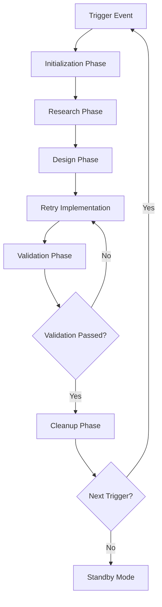
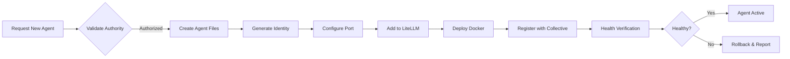

# Autonomous Loop Control Framework

**Document Version:** 1.0.0  
**Created:** 2026-03-30  
**Status:** Active  
**Mode:** Architect (Autonomous Operations)

---

## Executive Summary

This document establishes the framework for continuous 24-hour autonomous development operations for Heretek-OpenClaw. The framework enables self-directed agent collective operation with defined boundaries, decision criteria, and growth pathways.

### Completed Work Baseline

| Metric | Status |
|--------|--------|
| Implementation Cycles Completed | 7 of 8 |
| Validation Pass Rate | 93% (27/29 checks) |
| Health Monitoring | Operational |
| Web Interface | Deployed |
| Testing Framework | Vitest Ready |

---

## 1. Loop Structure

### 1.1 Phase Definitions



### 1.2 Phase Specifications

#### Initialization Phase

| Parameter | Value | Description |
|-----------|-------|-------------|
| Duration | 5-15 minutes | Setup and environment check |
| Checks | 8 | Core system health |
| Entry Criteria | Trigger event received | External or internal signal |
| Exit Criteria | All health checks pass | System ready for work |

**Activities:**
- Verify all 11 agents are responding
- Check LiteLLM connectivity
- Validate database connections (PostgreSQL, Redis)
- Load current project state from git
- Review previous cycle logs

#### Research Phase

| Parameter | Value | Description |
|-----------|-------|-------------|
| Duration | 15-60 minutes | Context gathering |
| Depth | Files affected + dependencies | Scope analysis |
| Output | Research summary | Clear understanding of changes |

**Activities:**
- Analyze affected files and modules
- Review similar patterns in codebase
- Check external dependencies (LiteLLM, Redis, etc.)
- Document findings in `validation-logs/`

#### Design Phase

| Parameter | Value | Description |
|-----------|-------|-------------|
| Duration | 15-45 minutes | Solution architecture |
| Outputs | Atomic operations list | Single-purpose changes |
| Review | Self-review only | For autonomous operation |

**Activities:**
- Break solution into atomic operations
- Define commit scope and message
- Identify rollback points
- Create validation criteria

#### Implementation Phase

| Parameter | Value | Description |
|-----------|-------|-------------|
| Duration | 30-120 minutes per cycle | Actual coding |
| Scope | One atomic operation per commit | Prevent compound errors |
| Checkpoints | After each file change | Validate incrementally |

**Activities:**
- Execute atomic operation
- Run affected unit tests
- Verify syntax and imports
- Stage changes for commit

#### Validation Phase

| Parameter | Value | Description |
|-----------|-------|-------------|
| Duration | 10-30 minutes | Quality assurance |
| Tools | `scripts/validate-cycles.sh` | Automated validation |
| Threshold | 90% pass rate | Minimum acceptance |

**Activities:**
- Run full validation suite
- Check test coverage
- Verify documentation updates
- Confirm no breaking changes

#### Cleanup Phase

| Parameter | Value | Description |
|-----------|-------|-------------|
| Duration | 10-20 minutes | Housekeeping |
| Artifacts | Validation logs, test results | Preserved for review |

**Activities:**
- Commit validated changes
- Update CHANGELOG.md
- Archive validation logs
- Clean temporary files

### 1.3 Next Iteration Triggers

| Trigger Type | Source | Priority |
|--------------|--------|----------|
| Scheduled | Cron (every 24h) | High |
| Manual | Human operator | High |
| Automated | Health check failure | Critical |
| Event | A2A message received | Medium |
| Growth | New collective request | Low |

---

## 2. Decision Matrix

### 2.1 New Cycle Criteria

```
┌─────────────────────────────────────────────────────────────────┐
│                    CYCLE INITIATION MATRIX                      │
├─────────────────────────────────────────────────────────────────┤
│                                                                 │
│  Condition                          │ Action                    │
│  ─────────────────────────────────┼───────────────────────────│
│  Scheduled (24h elapsed)          │ START immediately         │
│  Health check failure              │ START immediately         │
│  New task assigned                 │ EVALUATE priority first   │
│  Human request                     │ CONFIRM scope, then START │
│  Failed cycle retry (3x)          │ PAUSE, ask for guidance   │
│  Cyclic dependency detected        │ PAUSE, escalate           │
│                                                                 │
└─────────────────────────────────────────────────────────────────┘
```

### 2.2 Pause and Guidance Criteria

**The autonomous loop MUST pause and request guidance when:**

| Condition | Threshold | Action |
|-----------|-----------|--------|
| Failed validations | >3 consecutive | Pause, report |
| Cyclic dependencies | Any detected | Stop, escalate |
| Data corruption risk | Any suspicion | Stop immediately |
| Security vulnerability | Any identified | Stop, flag critical |
| User intervention request | Any received | Pause, acknowledge |
| Unknown error | Unrecognized type | Pause, report |
| Rollback needed | >2 in single cycle | Pause, escalate |

**Pause Communication Format:**
```
⚠️ AUTONOMOUS LOOP PAUSED
─────────────────────────
Reason: [clear description]
Cycle: [number]
Attempts: [count]
Last Error: [error message]
Request: [specific guidance needed]
Status: Waiting for operator response
```

### 2.3 Conflict Resolution

**Priority Conflicts:**
```
┌────────────────────────────────────────────────────────────┐
│                    CONFLICT RESOLUTION                      │
├──────────────────┬─────────────────────────────────────────┤
│ Conflict Type    │ Resolution Strategy                     │
├──────────────────┼─────────────────────────────────────────┤
│ File edit vs new │ New file takes precedence               │
│ Same file edit   │ Last-write wins with timestamp           │
│ Test vs code     │ Test expectations guide code             │
│ Doc vs code      │ Code is source of truth                 │
│ Conflicting PRs  │ Merge both, validate intersection        │
└──────────────────┴─────────────────────────────────────────┘
```

**Implementation:**
- Use git merge strategies
- Keep both versions if non-overlapping
- Flag overlapping changes for review
- Never auto-resolve test failures

### 2.4 Rollback Criteria

**Automatic Rollback Triggers:**

| Trigger | Condition | Action |
|---------|-----------|--------|
| Validation failure | >30% checks fail | Revert commit |
| Test suite failure | Any critical test fails | Revert commit |
| Runtime error | Agent crashes | Revert commit |
| Data loss | Any write operation fails | Revert commit |
| Security breach | Unauthorized access | Emergency stop |

**Rollback Procedure:**
```bash
# 1. Identify problematic commit
git log --oneline -5

# 2. Revert to last known good
git revert <commit-hash>

# 3. Verify system health
./scripts/health-check.sh

# 4. Report to operator
```

---

## 3. Metrics and Success Criteria

### 3.1 Code Quality Metrics

| Metric | Target | Current Baseline | Measurement |
|--------|--------|------------------|-------------|
| Test Coverage | >70% | 0% | Vitest coverage report |
| Linting Pass Rate | 100% | Unknown | ESLint/Prettier |
| TypeScript Errors | 0 | Unknown | tsc --noEmit |
| Cyclomatic Complexity | <15 | Unknown | Code metrics |

**Measurement Command:**
```bash
npm test -- --coverage
npm run lint
npx tsc --noEmit
```

### 3.2 Test Coverage Thresholds

```
┌─────────────────────────────────────────────────────────────┐
│                TEST COVERAGE REQUIREMENTS                    │
├─────────────────────────────────────────────────────────────┤
│                                                             │
│  Module                  │ Minimum │ Target │ Current       │
│  ────────────────────────┼─────────┼────────┼──────────────│
│  Agent Registry          │ 80%     │ 90%    │ Not tested   │
│  Health Check Service    │ 80%     │ 90%    │ 100%         │
│  WebSocket Client        │ 70%     │ 85%    │ Not tested   │
│  Session Manager         │ 75%     │ 90%    │ Not tested   │
│  Redis Bridge            │ 70%     │ 85%    │ Not tested   │
│  API Routes              │ 60%     │ 80%    │ Not tested   │
│                                                             │
│  Overall Coverage        │ 70%     │ 80%    │ 0%           │
│                                                             │
└─────────────────────────────────────────────────────────────┘
```

### 3.3 Performance Benchmarks

| Component | Metric | Target | Alert Threshold |
|-----------|--------|--------|-----------------|
| Agent Health Check | Response time | <500ms | >2000ms |
| WebSocket Latency | Message delivery | <100ms | >500ms |
| API Response | Endpoint latency | <300ms | >1000ms |
| Redis Operations | Read/Write | <50ms | >200ms |
| Page Load | Web interface | <2s | >5s |

**Monitoring Commands:**
```bash
# Health check timing
curl -w "@timing-format.txt" -s http://localhost:5173/api/status

# WebSocket latency
node -e "const ws = new WebSocket('ws://localhost:3001'); ws.on('open', () => console.log(Date.now()))"
```

### 3.4 Documentation Completeness

| Document | Required | Status | Last Updated |
|----------|----------|--------|--------------|
| CHANGELOG.md | Yes | ✅ Updated | 2026-03-28 |
| README.md | Yes | ✅ Current | 2026-03-29 |
| IMPLEMENTATION_COMPLETE.md | Yes | ✅ Current | 2026-03-30 |
| HEALTH_DASHBOARD.md | Yes | ✅ Current | 2026-03-30 |
| AUTONOMOUS_LOOP_CONTROL.md | Yes | ✅ Current | 2026-03-30 |
| Architecture Docs | Yes | ⚠️ Partial | Needs update |
| API Documentation | No | ❌ Missing | N/A |
| User Guide | No | ❌ Missing | N/A |

**Documentation Check:**
```bash
# Check all required docs exist
ls -la docs/*.md plans/*.md *.md | head -20
```

---

## 4. Risk Mitigation

### 4.1 Cyclic Dependency Detection

**Detection Algorithm:**
```
┌─────────────────────────────────────────────────────────────┐
│              CYCLIC DEPENDENCY SCANNER                       │
├─────────────────────────────────────────────────────────────┤
│                                                             │
│  1. Build dependency graph from imports                     │
│  2. Run Tarjan's algorithm for strongly connected components│
│  3. If cycle detected:                                       │
│     - Identify all modules in cycle                          │
│     - Calculate break points (least dependent)              │
│     - Report to operator before breaking                    │
│                                                             │
│  Detection Command:                                         │
│  npm run deps:check  # (if implemented)                     │
│                                                             │
└─────────────────────────────────────────────────────────────┘
```

**Response Protocol:**
1. Stop current cycle immediately
2. Log cycle path and affected modules
3. Wait for operator guidance
4. Never attempt self-fix for cyclic dependencies

### 4.2 Data Corruption Prevention

**Safeguards:**

| Layer | Protection | Implementation |
|-------|------------|----------------|
| Database | Transaction wrapping | PostgreSQL transactions |
| Redis | Atomic operations | Lua scripts for multi-op |
| File System | Write verification | Read-after-write checks |
| Memory | State snapshots | JSON dump before changes |
| Git | Pre-commit validation | Hook scripts |

**Prevention Checklist:**
```
□ All database writes use transactions
□ Redis multi-operation uses EXEC
□ File writes verify completion
□ State backed up before modification
□ Git pre-commit hooks run validation
```

### 4.3 State Management Safeguards

**State Snapshot Protocol:**
```typescript
interface StateCheckpoint {
  id: string;           // UUID
  timestamp: Date;      // ISO 8601
  component: string;    // Module name
  state: any;           // Serialized state
  hash: string;         // SHA-256 of state
  previous: string;     // Previous checkpoint ID
}
```

**Checkpoint Schedule:**
- Before any state modification
- Every 100 operations
- Every 5 minutes during active cycles
- Before/after validation

### 4.4 Rollback Procedures

**Tiered Rollback Strategy:**

```
┌─────────────────────────────────────────────────────────────┐
│                    ROLLBACK TIERS                            │
├─────────────────────────────────────────────────────────────┤
│                                                             │
│  TIER 1: File-level Revert                                  │
│  ├─ Single file revert                                      │
│  ├─ Use: git checkout HEAD -- <file>                       │
│  └─ Risk: Low                                               │
│                                                             │
│  TIER 2: Commit-level Revert                               │
│  ├─ Revert single commit                                    │
│  ├─ Use: git revert <commit>                               │
│  └─ Risk: Medium (may conflict)                            │
│                                                             │
│  TIER 3: Branch-level Revert                                │
│  ├─ Revert to last known good state                        │
│  ├─ Use: git reset --hard <good-commit>                    │
│  └─ Risk: High (loses subsequent work)                     │
│                                                             │
│  TIER 4: Full System Restore                               │
│  ├─ Restore from backup                                    │
│  ├─ Use: ./scripts/fleet-backup.sh restore                 │
│  └─ Risk: Critical (last resort only)                      │
│                                                             │
└─────────────────────────────────────────────────────────────┘
```

**Rollback Decision Tree:**
```
                    Is system functional?
                           │
            ┌──────────────┴──────────────┐
            │                              │
          Yes                              No
            │                              │
    Is validation passing?          Is data integrity OK?
            │                              │
    ┌───────┴───────┐              ┌───────┴───────┐
    │               │              │               │
   Yes              No             Yes              No
    │               │               │               │
Continue      Tier 1 Rollback   Investigate    Full Restore
current       and retry         then decide
```

---

## 5. Growth Architecture

### 5.1 Adding New Agents

**Agent Spawning Protocol:**



**Implementation Steps:**

1. **Identity Creation**
   - Generate unique agent name (snake_case)
   - Create `agents/{name}/` directory
   - Copy from `agents/template/` base
   - Update SOUL.md, IDENTITY.md, AGENTS.md

2. **Port Assignment**
   - Calculate: `8000 + (agent_index + 1)`
   - Update `docker-compose.yml` service
   - Update `litellm_config.yaml` endpoint

3. **LiteLLM Registration**
   ```yaml
   # litellm_config.yaml addition
   - model_name: agent-{name}
     litellm_params:
       model: openai/{model}
       api_key: os.environ/LITELLM_API_KEY
       vertex_project: heretek-openclaw
   ```

4. **Health Verification**
   ```bash
   curl http://localhost:800{n}/health
   ```

### 5.2 Creating New Collectives

**Multi-Collective Architecture:**

```
┌─────────────────────────────────────────────────────────────────────┐
│                    MULTI-COLLECTIVE TOPOLOGY                         │
├─────────────────────────────────────────────────────────────────────┤
│                                                                     │
│  ┌──────────────┐        ┌──────────────┐        ┌──────────────┐ │
│  │  COLLECTIVE  │◄──────►│   HUB AGENT   │◄──────►│  COLLECTIVE  │ │
│  │    ALPHA     │        │   (steward)   │        │     BETA     │ │
│  │  ┌─────────┐ │        └──────────────┘        │  ┌─────────┐ │ │
│  │  │  11     │ │                                │  │  11     │ │ │
│  │  │ agents  │ │                                │  │ agents  │ │ │
│  │  └─────────┘ │                                │  └─────────┘ │ │
│  └──────────────┘                                └──────────────┘ │
│                                                                     │
│  Inter-Collective Communication:                                    │
│  ├─ Hub agent routes messages                                       │
│  ├─ Shared Redis channel: collective:hub:messageflow              │
│  └─ HTTP fallback: /v1/collectives/{id}/relay                      │
│                                                                     │
└─────────────────────────────────────────────────────────────────────┘
```

**Collective Creation Steps:**

1. **Define Collective Scope**
   - Name: Unique identifier (alpha, beta, gamma, etc.)
   - Purpose: Research, Development, Monitoring, etc.
   - Size: 3-15 agents recommended

2. **Network Configuration**
   - Allocate port range: `9000-9015` for new collective
   - Configure firewall rules
   - Set up inter-collective routing

3. **Hub Agent Setup**
   - One agent designated as collective interface
   - Implements relay protocol
   - Maintains peer collective registry

4. **Communication Channels**
   ```javascript
   // Shared Redis channels
   const channels = {
     interCollective: 'collectives:hub:messageflow',
     broadcast: 'collectives:hub:broadcast',
     sync: 'collectives:hub:sync'
   };
   ```

### 5.3 Communication Patterns Between Collectives

| Pattern | Use Case | Protocol |
|---------|----------|----------|
| Relay | Message routing | HTTP POST to hub |
| Broadcast | Announcements | Redis pub/sub |
| Sync | State consistency | Periodic pull |
| Direct | High priority | WebSocket to hub |

**Message Format for Inter-Collective:**
```typescript
interface InterCollectiveMessage {
  id: string;              // UUID
  source: string;          // Collective name
  destination: string;     // Target collective
  type: 'relay' | 'broadcast' | 'sync';
  payload: {
    fromAgent: string;
    toAgent: string;
    content: any;
    priority: 'low' | 'medium' | 'high' | 'critical';
  };
  metadata: {
    timestamp: string;
    hops: number;
    traceId: string;
  };
}
```

---

## 6. Implementation Checklist

### 6.1 Pre-Cycle Checklist

```
□ Git status clean (or properly stashed)
□ All services running (docker-compose ps)
□ Health checks passing (>90%)
□ Previous cycle logs reviewed
□ No pending rollback flags
□ Operator available (or autonomous mode confirmed)
```

### 6.2 Post-Cycle Checklist

```
□ All tests pass
□ Validation >90% successful
□ CHANGELOG.md updated
□ Documentation updated if needed
□ Commit pushed to remote (if authorized)
□ Logs archived to validation-logs/
□ Next cycle trigger configured
```

### 6.3 Emergency Checklist

```
□ System state preserved (checkpoints)
□ Error logged with full context
□ Rollback executed if needed
□ Operator notified with status
□ Incident documented
□ Recovery steps verified
```

---

## 7. Configuration Reference

### 7.1 Environment Variables

| Variable | Required | Default | Description |
|----------|----------|---------|-------------|
| `DOCKER_ENV` | Yes | false | Docker deployment mode |
| `REDIS_URL` | Yes | redis://localhost:6379 | Redis connection |
| `DATABASE_URL` | Yes | postgres://localhost/db | PostgreSQL connection |
| `LITELLM_API_KEY` | Yes | - | LiteLLM authentication |
| `WS_PORT` | No | 3001 | WebSocket bridge port |
| `AGENT_POLL_INTERVAL` | No | 30000 | Health check interval (ms) |
| `LOG_LEVEL` | No | info | Logging verbosity |

### 7.2 Paths Reference

| Path | Purpose |
|------|---------|
| `/plans/` | Implementation plans |
| `/validation-logs/` | Cycle validation logs |
| `/docs/architecture/` | Architecture documentation |
| `/skills/` | Agent operational skills |
| `/agents/` | Agent identity files |
| `/modules/` | Shared modules |
| `/web-interface/` | Web UI application |

---

## 8. References

- [Implementation Roadmap](plans/IMPLEMENTATION_ROADMAP.md)
- [Cycle Validation Report](validation-logs/cycle-validation.md)
- [Implementation Complete](docs/architecture/IMPLEMENTATION_COMPLETE.md)
- [Health Dashboard](docs/HEALTH_DASHBOARD.md)
- [Next Iteration Plan](plans/AUTONOMOUS_ITERATION_NEXT.md)

---

*Document Version: 1.0.0*  
*Created: 2026-03-30T02:46 UTC*  
*Mode: Architect (Autonomous Framework)*  
*Status: Active*

**Next Review:** After next complete autonomous cycle  
**Owner:** Collective (Autonomous Operations)