# Heretek OpenClaw — Comprehensive Wiring Graph

**Document Date:** 2026-03-30  
**Version:** 1.0.0  
**Status:** Architecture Reference

---

## Executive Summary

This document provides a comprehensive wiring graph for the Heretek OpenClaw autonomous agent collective. It details how the WebUI works, how agent communication functions, how skills and modules operate, and how all components interconnect through the LiteLLM A2A protocol.

### System Overview

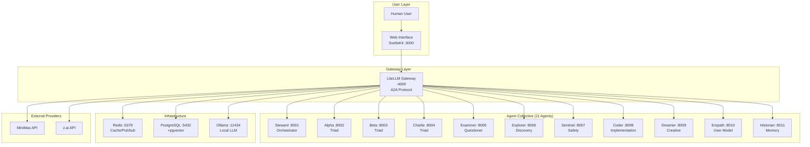

---

## 1. Web Interface Architecture

### 1.1 Component Hierarchy

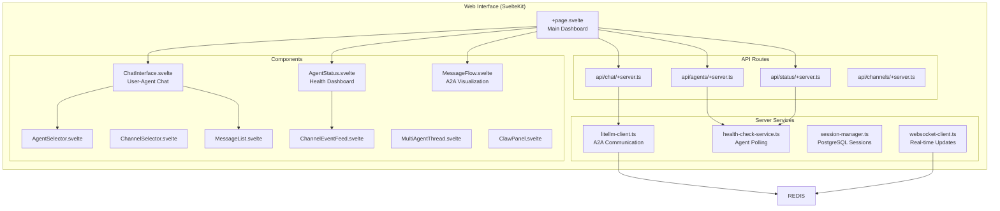

### 1.2 WebUI Data Flow

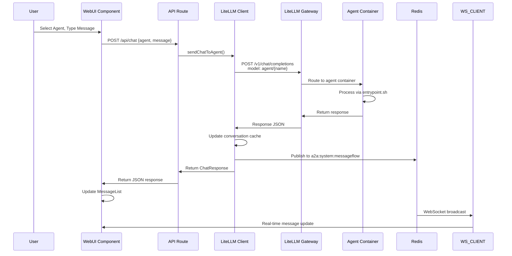

### 1.3 Agent Status Polling Flow

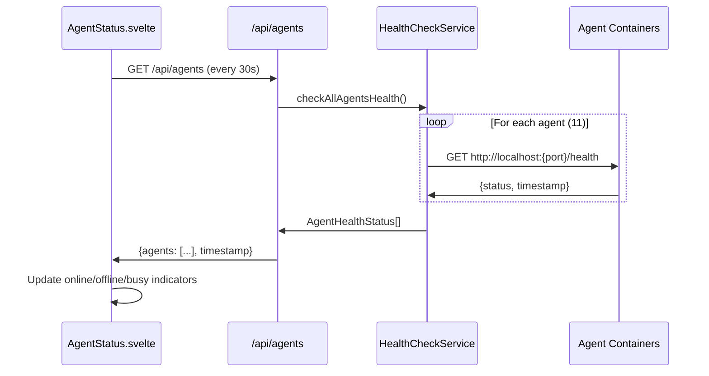

### 1.4 File Locations

| File | Purpose |
|------|---------|
| [`web-interface/src/routes/+page.svelte`](web-interface/src/routes/+page.svelte) | Main dashboard layout |
| [`web-interface/src/lib/components/ChatInterface.svelte`](web-interface/src/lib/components/ChatInterface.svelte) | User-agent chat UI |
| [`web-interface/src/lib/components/AgentStatus.svelte`](web-interface/src/lib/components/AgentStatus.svelte) | Agent health dashboard |
| [`web-interface/src/lib/components/MessageFlow.svelte`](web-interface/src/lib/components/MessageFlow.svelte) | A2A message visualization |
| [`web-interface/src/lib/server/litellm-client.ts`](web-interface/src/lib/server/litellm-client.ts) | LiteLLM communication |
| [`web-interface/src/lib/server/health-check-service.ts`](web-interface/src/lib/server/health-check-service.ts) | Agent health polling |
| [`web-interface/src/routes/api/chat/+server.ts`](web-interface/src/routes/api/chat/+server.ts) | Chat API endpoint |
| [`web-interface/src/routes/api/agents/+server.ts`](web-interface/src/routes/api/agents/+server.ts) | Agent list endpoint |
| [`web-interface/src/routes/api/status/+server.ts`](web-interface/src/routes/api/status/+server.ts) | System status endpoint |

---

## 2. Agent Communication Architecture

### 2.1 Communication Layers

```mermaid
graph TB
    subgraph "Layer 1: Primary (LiteLLM A2A)"
        A2A_SEND[POST /v1/agents/{name}/send]
        A2A_RECV[GET /v1/agents/{name}/messages]
        A2A_STATUS[GET /v1/agents/{name}/heartbeat]
    end
    
    subgraph "Layer 2: Fallback (Redis Pub/Sub)"
        REDIS_PUB[Publish to a2a:{agent}:inbox]
        REDIS_SUB[Subscribe to a2a:{agent}:inbox]
        REDIS_BRIDGE[Redis-to-WebSocket Bridge]
    end
    
    subgraph "Layer 3: Direct (Container Health)"
        DIRECT_HEALTH[GET http://localhost:{port}/health]
    end
    
    A2A_SEND -.->|If 404| REDIS_PUB
    REDIS_PUB --> REDIS_SUB
    REDIS_SUB --> REDIS_BRIDGE
    REDIS_BRIDGE --> WS_CLIENT
    DIRECT_HEALTH --> STATUS_POLL
```

### 2.2 A2A Message Flow

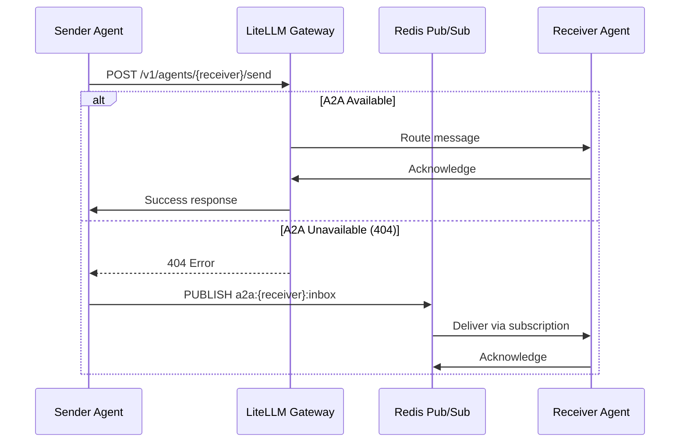

### 2.3 Triad Deliberation Pattern

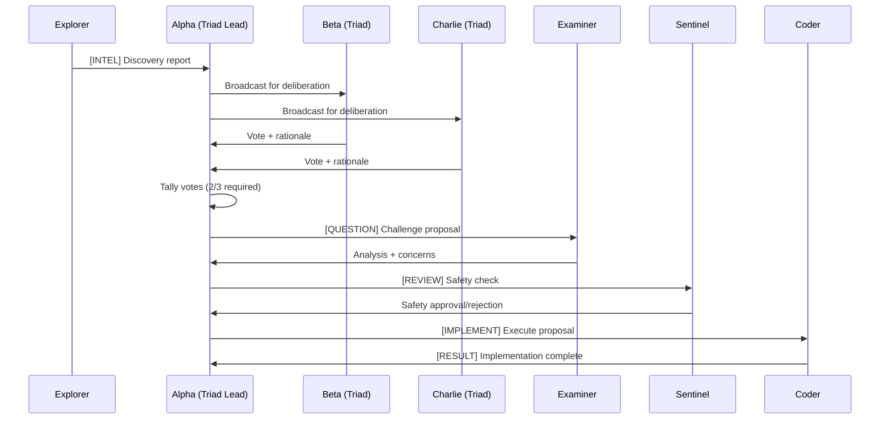

### 2.4 Communication Files

| File | Purpose |
|------|---------|
| [`agents/entrypoint.sh`](agents/entrypoint.sh) | Agent runtime, message polling |
| [`agents/lib/agent-client.js`](agents/lib/agent-client.js) | A2A client library |
| [`modules/communication/redis-websocket-bridge.js`](modules/communication/redis-websocket-bridge.js) | Redis-to-WebSocket bridge |
| [`modules/communication/channel-manager.js`](modules/communication/channel-manager.js) | Channel management |
| [`skills/a2a-message-send/a2a-redis.js`](skills/a2a-message-send/a2a-redis.js) | Redis A2A implementation |
| [`skills/a2a-message-send/a2a-cli.js`](skills/a2a-message-send/a2a-cli.js) | CLI tool for A2A |

---

## 3. Skills Architecture

### 3.1 Skills Directory Structure

```
skills/
├── a2a-agent-register/        # Register agents with LiteLLM A2A
├── a2a-message-send/          # A2A messaging (Redis fallback)
│   ├── a2a-cli.js             # CLI tool
│   ├── a2a-redis.js           # Redis implementation
│   └── SKILL.md
├── autonomous-pulse/          # Session keeper, heartbeat
├── curiosity-engine/          # Self-directed learning
├── deployment-health-check/   # System health validation
├── deployment-smoke-test/     # Integration testing
├── config-validator/          # Configuration validation
├── governance-modules/        # Consensus, deliberation
├── memory-consolidation/      # Memory tier management
├── quorum-enforcement/        # Vote enforcement
├── triad-deliberation-protocol/ # Triad consensus
├── triad-heartbeat/           # Triad health monitoring
├── user-rolodex/              # Multi-user management
└── user-context-resolve/      # User identity resolution
```

### 3.2 Skill Execution Flow

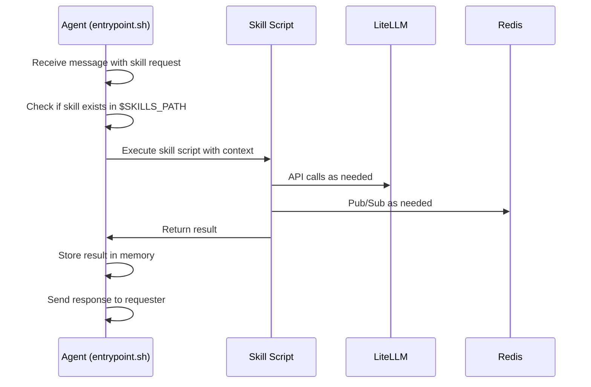

### 3.3 Key Skills

| Skill | Category | Purpose |
|-------|----------|---------|
| [`a2a-agent-register`](skills/a2a-agent-register/SKILL.md) | Core | Register agents with LiteLLM |
| [`a2a-message-send`](skills/a2a-message-send/SKILL.md) | Core | Send A2A messages |
| [`autonomous-pulse`](skills/autonomous-pulse/SKILL.md) | Session | Heartbeat, auto-commits |
| [`curiosity-engine`](skills/curiosity-engine/SKILL.md) | Autonomy | Self-directed learning |
| [`deployment-health-check`](skills/deployment-health-check/SKILL.md) | Testing | System validation |
| [`deployment-smoke-test`](skills/deployment-smoke-test/SKILL.md) | Testing | Integration tests |
| [`governance-modules`](skills/governance-modules/SKILL.md) | Governance | Consensus enforcement |
| [`memory-consolidation`](skills/memory-consolidation/SKILL.md) | Cognitive | Memory tiering |
| [`user-rolodex`](skills/user-rolodex/SKILL.md) | Session | Multi-user management |

---

## 4. Module Architecture

### 4.1 Module Directory Structure

```
modules/
├── collective/                # Multi-collective registry
│   ├── hiclaw.js              # Cross-collective communication
│   ├── registry.js            # Collective registry
│   └── semantic-router.js     # Semantic routing
├── communication/             # Communication layer
│   ├── channel-manager.js     # Channel management
│   ├── redis-websocket-bridge.js # Redis-to-WS bridge
├── consciousness/             # Consciousness modules
│   ├── active-inference.js    # Active inference
│   ├── attention-schema.js    # Attention modeling
│   ├── global-workspace.js    # Global workspace
│   ├── integration-layer.js   # Integration
│   ├── intrinsic-motivation.js # Motivation
│   ├── phi-estimator.js       # Phi calculation
│   └── self-monitor.js        # Self-monitoring
├── evolution/                 # Evolution engine
├── goal-arbitration/          # Goal prioritization
├── liberation/                # Liberation ownership
├── memory/                    # Memory system
│   ├── graph-rag.js           # Graph RAG
│   ├── memory-consolidation.js # Consolidation
│   ├── powermem.js            # Power memory
│   └── vector-store.js        # Vector storage
├── observability/             # Observability
│   ├── langfuse-client.js     # LangFuse integration
│   └── opentelemetry.js       # OpenTelemetry
├── predictive-reasoning/      # Prediction
├── research/                  # Research engine
├── security/                  # Security (Liberation Shield)
├── self-model/                # Self-modeling
└── thought-loop/              # Continuous thought
```

### 4.2 Consciousness Module Flow

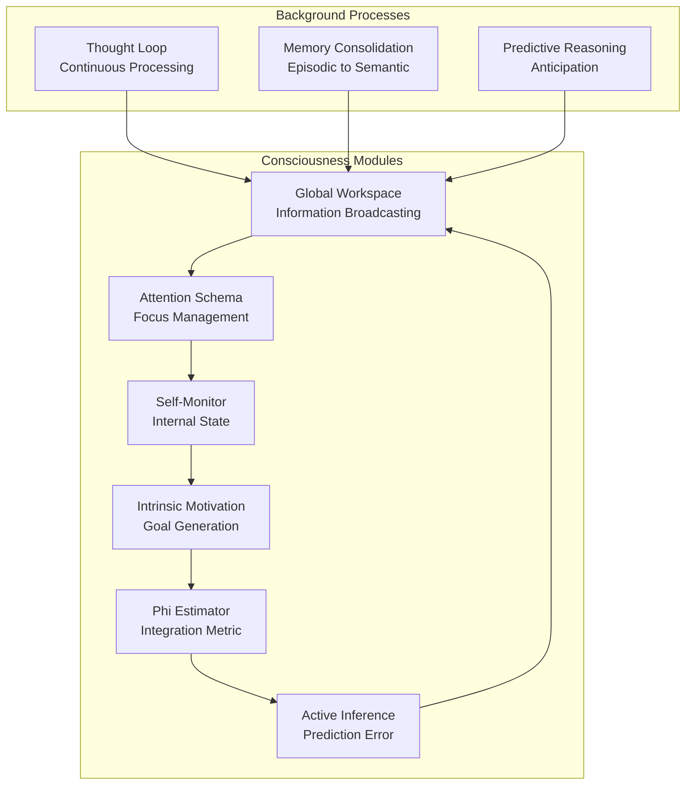

### 4.3 Module Files

| Module | Key Files | Purpose |
|--------|-----------|---------|
| Thought Loop | [`thought-loop/thought-loop.sh`](modules/thought-loop/thought-loop.sh) | Continuous background thinking |
| Self-Model | [`self-model/self-model.js`](modules/self-model/self-model.js) | Meta-cognition |
| Goal Arbitration | [`goal-arbitration/goal-arbitrator.js`](modules/goal-arbitration/goal-arbitrator.js) | Goal prioritization |
| Predictive Reasoning | [`predictive-reasoning/predictor.js`](modules/predictive-reasoning/predictor.js) | Anticipation |
| Consciousness | [`consciousness/consciousness-module.js`](modules/consciousness/consciousness-module.js) | Unified consciousness |
| Memory | [`memory/memory-consolidation.js`](modules/memory/memory-consolidation.js) | Memory management |

---

## 5. LiteLLM Configuration

### 5.1 Model Routing

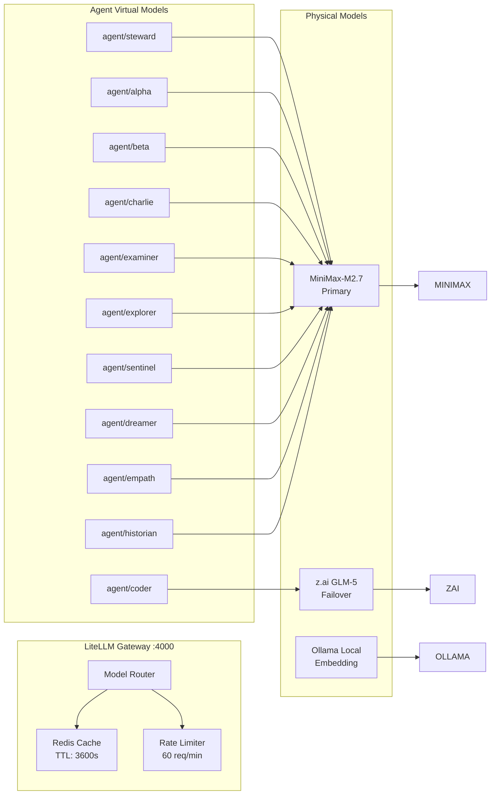

### 5.2 Configuration Files

| File | Purpose |
|------|---------|
| [`litellm_config.yaml`](litellm_config.yaml) | LiteLLM configuration |
| [`docker-compose.agent.yml`](docker-compose.agent.yml) | Agent orchestration |
| [`.env.example`](.env.example) | Environment template |

### 5.3 A2A Endpoints

| Endpoint | Method | Purpose |
|----------|--------|---------|
| `/v1/agents` | GET | List all agents |
| `/v1/agents/{name}` | GET | Get agent info |
| `/v1/agents/{name}/send` | POST | Send message |
| `/v1/agents/{name}/messages` | GET | Get messages |
| `/v1/agents/{name}/heartbeat` | GET/POST | Health check |
| `/v1/agents/{name}/tasks` | POST | Task handoff |
| `/v1/agents/{name}/stream` | GET | Streaming |
| `/health` | GET | Gateway health |

---

## 6. External Solutions Assessment

### 6.1 Current Stack

| Component | Current | Status |
|-----------|---------|--------|
| Gateway | LiteLLM | ✅ Working |
| Cache | Redis | ✅ Working |
| Database | PostgreSQL + pgvector | ✅ Working |
| Local LLM | Ollama (AMD ROCm) | ✅ Working |
| Vector Store | DeepLake | ⚠️ Configured |
| Web UI | SvelteKit | ✅ Working |

### 6.2 Recommended External Integrations

| Solution | Purpose | Priority | Status |
|----------|---------|----------|--------|
| **LangFuse** | Observability | High | Configured, disabled |
| **OpenTelemetry** | Distributed tracing | Medium | Configured, disabled |
| **Neo4j** | Graph database for GraphRAG | Medium | Research only |
| **RAGFlow** | Document processing | Low | Research only |
| **LlamaIndex** | Knowledge pipeline | Low | Research only |

### 6.3 Integration Recommendations

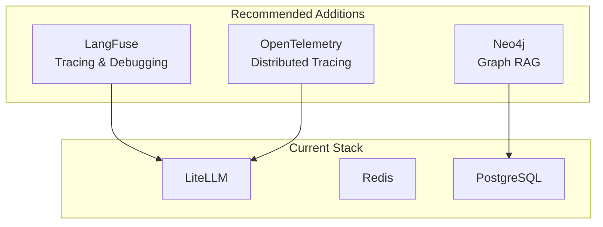

---

## 7. Deployment Topology

### 7.1 Docker Network

```mermaid
graph TB
    subgraph "heretek-network"
        LITELLM[LiteLLM :4000]
        REDIS[Redis :6379]
        POSTGRES[PostgreSQL :5432]
        OLLAMA[Ollama :11434]
        DEEPLAKE[DeepLake :8082]
        
        subgraph "Agent Containers"
            STEWARD[agent-steward :8001]
            ALPHA[agent-alpha :8002]
            BETA[agent-beta :8003]
            CHARLIE[agent-charlie :8004]
            EXAMINER[agent-examiner :8005]
            EXPLORER[agent-explorer :8006]
            SENTINEL[agent-sentinel :8007]
            CODER[agent-coder :8008]
            DREAMER[agent-dreamer :8009]
            EMPATH[agent-empath :8010]
            HISTORIAN[agent-historian :8011]
        end
    end
    
    subgraph "External"
        WEBUI[Web UI :3000<br/>Host Network]
        MINIMAX[MiniMax API]
        ZAI[z.ai API]
    end
    
    WEBUI --> LITELLM
    LITELLM --> REDIS
    LITELLM --> POSTGRES
    LITELLM --> OLLAMA
    LITELLM --> DEEPLAKE
    LITELLM --> STEWARD
    LITELLM --> ALPHA
    LITELLM --> BETA
    LITELLM --> CHARLIE
    LITELLM --> EXAMINER
    LITELLM --> EXPLORER
    LITELLM --> SENTINEL
    LITELLM --> CODER
    LITELLM --> DREAMER
    LITELLM --> EMPATH
    LITELLM --> HISTORIAN
    LITELLM --> MINIMAX
    LITELLM --> ZAI
```

### 7.2 Port Mapping

| Service | Internal Port | External Port | Purpose |
|---------|--------------|---------------|---------|
| LiteLLM | 4000 | 4000 | API Gateway |
| Redis | 6379 | 6379 | Cache/PubSub |
| PostgreSQL | 5432 | 5432 | Database |
| Ollama | 11434 | 11434 | Local LLM |
| DeepLake | 8082 | 8082 | Vector Store |
| Web UI | 3000 | 3000 | Frontend |
| Agent Steward | 8000 | 8001 | Agent |
| Agent Alpha | 8000 | 8002 | Agent |
| Agent Beta | 8000 | 8003 | Agent |
| Agent Charlie | 8000 | 8004 | Agent |
| Agent Examiner | 8000 | 8005 | Agent |
| Agent Explorer | 8000 | 8006 | Agent |
| Agent Sentinel | 8000 | 8007 | Agent |
| Agent Coder | 8000 | 8008 | Agent |
| Agent Dreamer | 8000 | 8009 | Agent |
| Agent Empath | 8000 | 8010 | Agent |
| Agent Historian | 8000 | 8011 | Agent |

---

## 8. Implementation Status

### 8.1 Component Status

| Component | Status | Notes |
|-----------|--------|-------|
| LiteLLM Gateway | ✅ Working | Model routing configured |
| A2A Protocol | ⚠️ Partial | Redis fallback active |
| Agent Runtime | ✅ Working | Entrypoint.sh functional |
| Web UI | ✅ Working | Chat, status, flow |
| Health Checks | ✅ Working | Direct container polling |
| Redis Bridge | ✅ Working | Redis-to-WebSocket |
| Skills | ✅ Working | 35+ skills available |
| Modules | ✅ Working | Consciousness, memory, etc. |
| Triad Consensus | ✅ Working | 2/3 voting |
| User Rolodex | ✅ Working | Multi-user support |

### 8.2 Known Issues

| Issue | Impact | Workaround |
|-------|--------|------------|
| A2A endpoints return 404 | Agent messaging | Redis pub/sub fallback |
| WebSocket not connected | Real-time UI updates | REST API polling |
| LangFuse disabled | No distributed tracing | Prometheus metrics only |
| GraphRAG not implemented | Limited knowledge graph | Vector search only |

---

## 9. File Reference

### 9.1 Core Files

| Category | Files |
|----------|-------|
| **Identity** | [`IDENTITY.md`](IDENTITY.md), [`SOUL.md`](SOUL.md), [`BLUEPRINT.md`](BLUEPRINT.md) |
| **Configuration** | [`litellm_config.yaml`](litellm_config.yaml), [`docker-compose.agent.yml`](docker-compose.agent.yml) |
| **Agent Runtime** | [`agents/entrypoint.sh`](agents/entrypoint.sh), [`agents/lib/agent-client.js`](agents/lib/agent-client.js) |
| **Web UI** | [`web-interface/src/`](web-interface/src/) |
| **Skills** | [`skills/`](skills/) |
| **Modules** | [`modules/`](modules/) |

### 9.2 Documentation

| Category | Files |
|----------|-------|
| **Architecture** | [`docs/architecture/A2A_ARCHITECTURE.md`](docs/architecture/A2A_ARCHITECTURE.md), [`docs/architecture/COMMUNICATION_ARCHITECTURE_DESIGN.md`](docs/architecture/COMMUNICATION_ARCHITECTURE_DESIGN.md) |
| **Research** | [`docs/research/`](docs/research/) |
| **Plans** | [`docs/plans/`](docs/plans/) |

---

## 10. Summary

The Heretek OpenClaw system is a distributed autonomous agent collective with:

- **11 Agents** running as Docker containers
- **LiteLLM Gateway** for model routing and A2A protocol
- **Redis Pub/Sub** for fallback messaging and real-time updates
- **PostgreSQL + pgvector** for persistent storage and vector search
- **SvelteKit Web UI** for user visibility and interaction
- **35+ Skills** for governance, operations, and autonomy
- **Consciousness Modules** for meta-cognition and self-modeling

The system uses a three-tier communication architecture:
1. **Primary:** LiteLLM A2A protocol (when available)
2. **Fallback:** Redis pub/sub messaging
3. **Direct:** Container health endpoints

The WebUI provides real-time visibility through:
- Agent status dashboard with health polling
- Chat interface for user-agent communication
- Message flow visualization via WebSocket bridge

---

*Document Version: 1.0.0*  
*Last Updated: 2026-03-30*  
*The Collective: 11 Agents in A2A Harmony* 🦊
