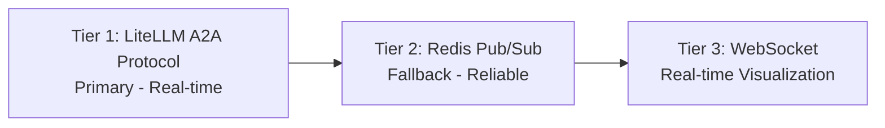
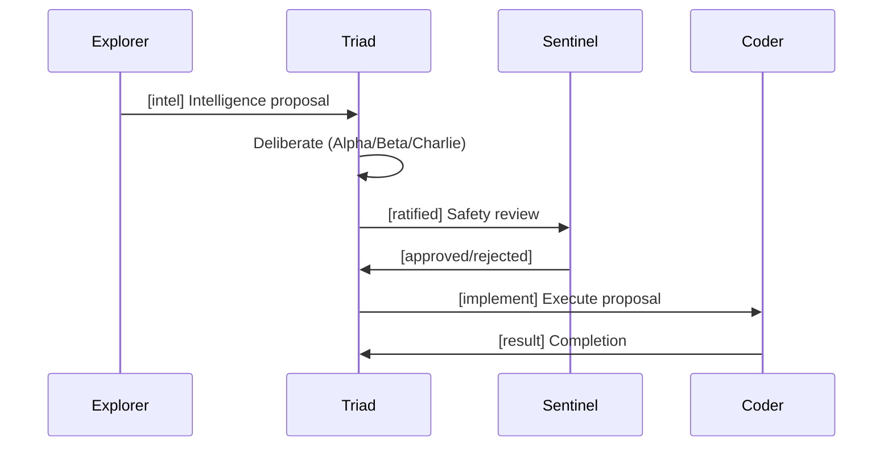
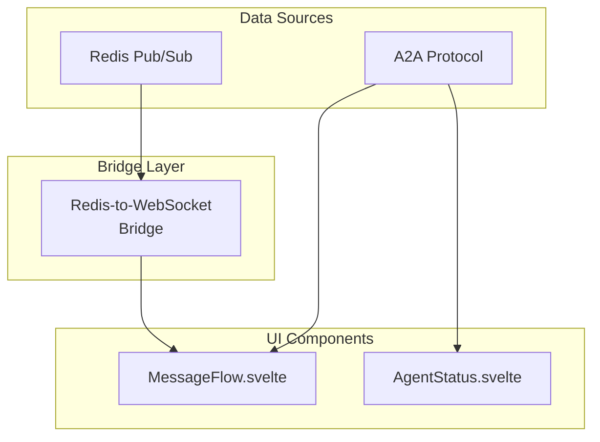
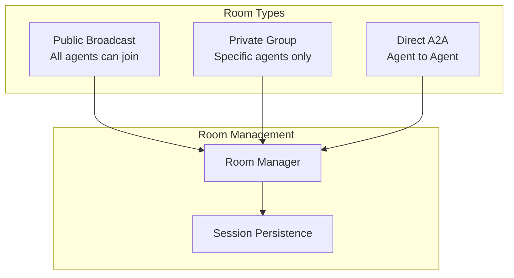
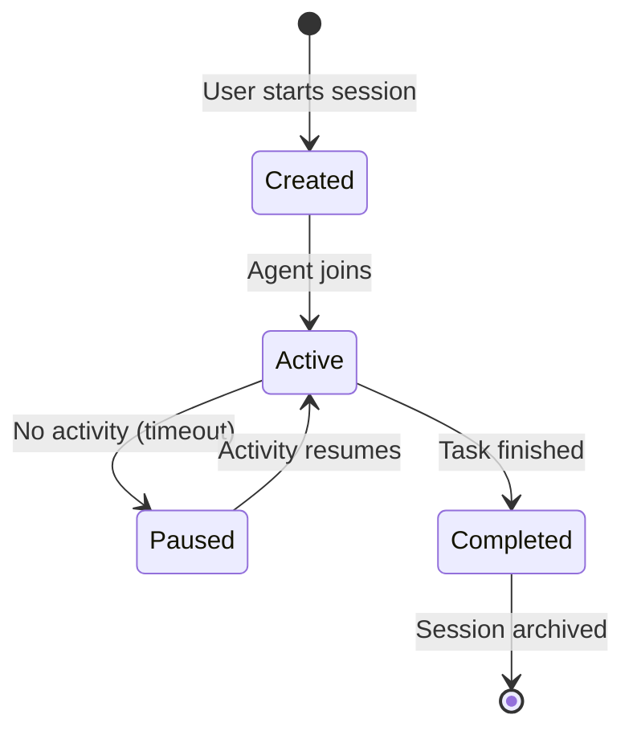
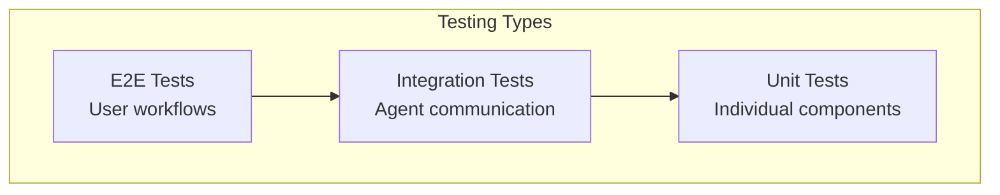
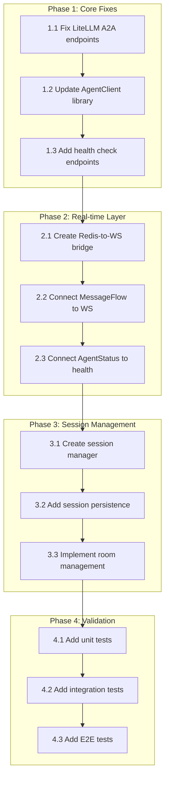
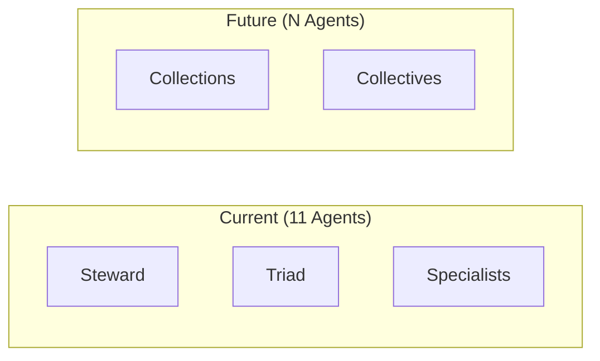

# Heretek-OpenClaw Communication Architecture Design

**Document Date:** 2026-03-30  
**Repository:** Heretek-OpenClaw  
**Status:** Architecture Design - Implementation Ready  
**Mode:** Architect

---

## Executive Summary

This document provides a comprehensive communication architecture design for the Heretek-OpenClaw multi-agent system. The architecture addresses all identified issues with the current implementation and provides a clear roadmap for achieving stable, reliable agent-to-agent communication with full user visibility.

### Current Issues (From Research)

| Issue | Root Cause | Impact |
|-------|-----------|--------|
| A2A Protocol endpoints returning 404 | LiteLLM endpoint format mismatch (`/a2a/` vs `/v1/agents/`) | Agent messaging fails |
| WebUI shows all agents offline | Wrong health check mechanism | No real-time status |
| MessageFlow empty | No WebSocket client connected | No A2A visualization |
| WebSocket exists but unused | Backend integration incomplete | Stale data |

### Recommended Architecture

```mermaid
graph TB
    subgraph "Communication Layer"
        A2A[LiteLLM A2A Protocol<br/>Primary: /v1/agents/{name}]
        REDIS[Redis Pub/Sub<br/>Fallback Messaging]
        WS[WebSocket<br/>Real-time Updates]
    end
    
    subgraph "Visibility Layer"
        MF[MessageFlow Component]
        AS[AgentStatus Component]
        AL[Activity Log]
    end
    
    subgraph "Session Management"
        SESS[Session Manager]
        ROOM[Room/Space Manager]
    end
    
    subgraph "Validation Framework"
        HT[Health Checks]
        TEST[Testing Suite]
        MON[Monitoring]
    end
    
    A2A --> MF
    A2A --> AS
    REDIS --> MF
    WS --> MF
    SESS --> ROOM
    HT --> AS
    TEST --> MON
```

### Key Recommendations

1. **Fix LiteLLM A2A endpoints** - Use `/v1/agents/{name}/send` format instead of `/a2a/{agent}`
2. **Implement Redis Pub/Sub bridge** - Bridge Redis messages to WebSocket for MessageFlow
3. **Add health check endpoints** - Create `/health` endpoint that agents can respond to
4. **Session persistence layer** - Implement PostgreSQL-backed session storage
5. **Comprehensive testing framework** - Add unit, integration, and E2E tests

---

## 1. Communication System Design

### 1.1 Communication Architecture Overview

The system implements a three-tier communication architecture:



| Tier | Technology | Purpose | Status |
|------|------------|---------|--------|
| Primary | LiteLLM A2A | Agent-to-agent messaging via gateway | Needs endpoint fix |
| Fallback | Redis Pub/Sub | Reliable message queuing | Working |
| Visualization | WebSocket | Real-time UI updates | Not connected |

### 1.2 LiteLLM A2A Protocol Configuration

#### Current Issue

The current configuration uses incorrect endpoint format:

```yaml
# Current (INCORRECT)
agent_endpoint_format: "/a2a/{agent_name}"
send_message_endpoint: "/a2a/{agent_name}/send"
```

This causes 404 errors when attempting to send messages.

#### Recommended Fix

Update `litellm_config.yaml` to use the correct format:

```yaml
# Recommended Configuration
a2a_settings:
  enabled: true
  agent_timeout: 300
  session_persistence: redis
  session_ttl: 86400
  
  # Correct endpoint format for LiteLLM v1
  agent_endpoint_format: "/v1/agents/{agent_name}"
  send_message_endpoint: "/v1/agents/{agent_name}/send"
  receive_message_endpoint: "/v1/agents/{agent_name}/messages"
  health_check_endpoint: "/health"
  health_check_timeout: 10
```

#### Agent Card Registration

Each agent must register with an Agent Card:

```json
{
  "name": "steward",
  "description": "Orchestrator of The Collective",
  "url": "http://litellm:4000/v1/agents/steward",
  "skills": [
    { "id": "orchestrate", "name": "Orchestrate Collective" },
    { "id": "monitor-health", "name": "Monitor Agent Health" },
    { "id": "manage-proposals", "name": "Manage Proposals" }
  ],
  "capabilities": {
    "streaming": true,
    "pushNotifications": true,
    "a2a": true
  }
}
```

### 1.3 Redis Pub/Sub Fallback

When LiteLLM A2A endpoints fail (404), the system uses Redis Pub/Sub for message queuing.

#### Channel Structure

```javascript
const CHANNELS = {
  // Per-agent inbox channels
  steward: 'a2a:steward:inbox',
  alpha: 'a2a:alpha:inbox',
  beta: 'a2a:beta:inbox',
  charlie: 'a2a:charlie:inbox',
  examiner: 'a2a:examiner:inbox',
  explorer: 'a2a:explorer:inbox',
  sentinel: 'a2a:sentinel:inbox',
  coder: 'a2a:coder:inbox',
  dreamer: 'a2a:dreamer:inbox',
  empath: 'a2a:empath:inbox',
  historian: 'a2a:historian:inbox',
  
  // Broadcast channels
  triad: 'a2a:triad:broadcast',
  collective: 'a2a:collective:broadcast',
  
  // System channels
  health: 'a2a:system:health',
  errors: 'a2a:system:errors',
  messageflow: 'a2a:system:messageflow'
};
```

#### Redis-to-WebSocket Bridge

To connect Redis messages to WebSocket for MessageFlow visualization:

```javascript
// skills/a2a-message-send/redis-to-websocket-bridge.js
const Redis = require('redis');
const { WebSocketServer } = require('ws');

class RedisToWebSocketBridge {
  constructor(wsPort = 3001) {
    this.redis = Redis.createClient({ url: process.env.REDIS_URL });
    this.wss = new WebSocketServer({ port: wsPort });
    this.clients = new Set();
  }
  
  async start() {
    await this.redis.connect();
    this.setupWebSocketServer();
    await this.subscribeToMessageFlow();
  }
  
  async subscribeToMessageFlow() {
    const subscriber = this.redis.duplicate();
    await subscriber.connect();
    
    await subscriber.subscribe('a2a:system:messageflow', (message) => {
      const data = JSON.parse(message);
      this.broadcast(data);
    });
  }
  
  broadcast(data) {
    const payload = JSON.stringify(data);
    this.clients.forEach(client => {
      if (client.readyState === WebSocket.OPEN) {
        client.send(payload);
      }
    });
  }
  
  setupWebSocketServer() {
    this.wss.on('connection', (ws) => {
      this.clients.add(ws);
      ws.on('close', () => this.clients.delete(ws));
    });
  }
}
```

### 1.4 Communication Message Types

| Type | Purpose | Direction | Implementation |
|------|---------|------------|----------------|
| `task` | Delegate work to another agent | Unidirectional | A2A POST to `/send` |
| `query` | Request information | Request-Response | A2A POST + polling |
| `broadcast` | Notify all agents | One-to-Many | Redis publish to collective channel |
| `response` | Reply to a message | Bidirectional | A2A with `inReplyTo` |
| `heartbeat` | Health monitoring | Periodic | Redis pub/sub health channel |

#### Message Format

```typescript
interface A2AMessage {
  messageId: string;
  from: string;        // Agent name
  to: string;          // Agent name
  content: string;     // Message content
  timestamp: Date;
  type: 'task' | 'query' | 'broadcast' | 'response' | 'heartbeat';
  context?: {
    sessionId?: string;
    taskId?: string;
    replyTo?: string;
  };
}
```

### 1.5 Agent Communication Patterns

#### Pattern 1: Proposal Flow (Triad Deliberation)



#### Pattern 2: Triad Consensus Protocol

The triad uses a three-phase deliberation:

- **Phase 1:** Alpha receives → broadcasts to Beta, Charlie
- **Phase 2:** All three deliberate independently
- **Phase 3:** Consensus vote → result to Steward

**Consensus Rule:** 2 of 3 agents must agree for any decision to pass

```javascript
// Triad voting implementation
async function collectTriadVotes(proposal) {
  const votes = {
    alpha: await vote('alpha', proposal),
    beta: await vote('beta', proposal),
    charlie: await vote('charlie', proposal)
  };
  
  const agreeCount = [votes.alpha, votes.beta, votes.charlie]
    .filter(v => v === 'agree').length;
  
  return agreeCount >= 2; // 2 of 3 required
}
```

---

## 2. Visibility Layer Design

### 2.1 Overview

The visibility layer provides real-time observation of agent communications for end users through the web interface.



### 2.2 MessageFlow Component Integration

The [`MessageFlow.svelte`](web-interface/src/lib/components/MessageFlow.svelte) component requires real-time data to display agent communications.

#### Required Changes

1. **Create WebSocket connection** in the web interface
2. **Connect to Redis-to-WebSocket bridge**
3. **Update component to receive live data**

```typescript
// web-interface/src/lib/components/MessageFlow.svelte additions
<script lang="ts">
  import { onMount, onDestroy } from 'svelte';
  import type { A2AMessage } from '../types';
  
  export let messages: A2AMessage[] = [];
  
  let ws: WebSocket;
  let reconnectTimer: NodeJS.Timeout;
  
  onMount(() => {
    connectWebSocket();
  });
  
  onDestroy(() => {
    if (ws) ws.close();
    if (reconnectTimer) clearTimeout(reconnectTimer);
  });
  
  function connectWebSocket() {
    ws = new WebSocket('ws://localhost:3001');
    
    ws.onmessage = (event) => {
      const data = JSON.parse(event.data);
      if (data.type === 'a2a') {
        messages = [...messages, data.data];
      }
    };
    
    ws.onclose = () => {
      reconnectTimer = setTimeout(connectWebSocket, 5000);
    };
  }
</script>
```

### 2.3 AgentStatus Component Integration

The [`AgentStatus.svelte`](web-interface/src/lib/components/AgentStatus.svelte) component needs accurate online/offline status.

#### Current Issue

All agents show "offline" because the status check uses incorrect LiteLLM endpoints.

#### Solution: Health Check Service

Create a health check service that polls agent health:

```javascript
// web-interface/src/lib/server/health-check-service.ts
export class HealthCheckService {
  constructor(private litellmHost: string, private apiKey: string) {}
  
  async checkAgentHealth(agentName: string): Promise<boolean> {
    try {
      // Try LiteLLM A2A endpoint
      const response = await fetch(
        `${this.litellmHost}/v1/agents/${agentName}`,
        {
          headers: {
            'Authorization': `Bearer ${this.apiKey}`
          }
        }
      );
      return response.ok;
    } catch {
      // Fallback to Redis health check
      return this.checkRedisHealth(agentName);
    }
  }
  
  async checkAllAgents(): Promise<AgentStatusUpdate[]> {
    const agents = ['steward', 'alpha', 'beta', 'charlie', 'examiner', 
                    'explorer', 'sentinel', 'coder', 'dreamer', 'empath', 'historian'];
    
    const results = await Promise.all(
      agents.map(async (agent) => ({
        agentId: agent,
        status: (await this.checkAgentHealth(agent)) ? 'online' : 'offline',
        timestamp: new Date()
      }))
    );
    
    return results;
  }
}
```

### 2.4 Activity Log and Audit Trail

For user visibility and compliance, implement an activity log:

```typescript
// web-interface/src/lib/server/activity-log.ts
interface ActivityLogEntry {
  id: string;
  timestamp: Date;
  type: 'agent_message' | 'health_status' | 'session' | 'error';
  from: string;
  to: string;
  content: string;
  metadata: Record<string, any>;
}

export class ActivityLog {
  private entries: ActivityLogEntry[] = [];
  private maxEntries = 1000;
  
  log(entry: Omit<ActivityLogEntry, 'id'>) {
    this.entries.unshift({
      ...entry,
      id: crypto.randomUUID()
    });
    
    if (this.entries.length > this.maxEntries) {
      this.entries = this.entries.slice(0, this.maxEntries);
    }
  }
  
  getRecent(limit = 50): ActivityLogEntry[] {
    return this.entries.slice(0, limit);
  }
  
  getByAgent(agentName: string): ActivityLogEntry[] {
    return this.entries.filter(
      e => e.from === agentName || e.to === agentName
    );
  }
}
```

### 2.5 User Notification System

```typescript
interface UserNotification {
  id: string;
  type: 'info' | 'warning' | 'error' | 'success';
  title: string;
  message: string;
  timestamp: Date;
  read: boolean;
}

// Notification when agent status changes
{
  type: 'warning',
  title: 'Agent Offline',
  message: 'Explorer agent has gone offline',
  timestamp: new Date()
}
```

---

## 3. Session/Room Management Architecture

### 3.1 Session Types

The system manages three types of sessions:

| Type | Description | Persistence | Examples |
|------|-------------|--------------|----------|
| **User Conversations** | Direct user-agent interactions | PostgreSQL | User chat sessions |
| **Agent Coordination** | Inter-agent task coordination | Redis | Triad deliberations |
| **Task Workspaces** | Task-oriented collaboration spaces | PostgreSQL | Project-based rooms |

### 3.2 Session Data Model

```typescript
// Session structure
interface Session {
  id: string;
  type: 'user_conversation' | 'agent_coordination' | 'task_workspace';
  name: string;
  participants: string[];        // Agent/user IDs
  createdBy: string;
  createdAt: Date;
  updatedAt: Date;
  context: Record<string, any>;
  state: SessionState;
}

interface SessionState {
  status: 'active' | 'paused' | 'completed';
  currentTask?: string;
  messages: Message[];
  metadata: Record<string, any>;
}
```

### 3.3 Room Architecture

Rooms provide organized spaces for agent interactions:



#### Room Types

| Type | Access | Use Case |
|------|--------|----------|
| **Public** | All agents | System-wide broadcasts |
| **Private** | Invitation only | Deliberation sessions |
| **Direct** | Two agents only | Direct messaging |

### 3.4 Session Lifecycle



### 3.5 Session Persistence Implementation

```typescript
// web-interface/src/lib/server/session-manager.ts
import { Pool } from 'pg';

interface SessionConfig {
  maxAge: number;          // Max session age in ms
  idleTimeout: number;     // Idle timeout in ms
  maxMessages: number;     // Max stored messages per session
}

export class SessionManager {
  private pool: Pool;
  private config: SessionConfig;
  
  constructor(config: SessionConfig = {
    maxAge: 7 * 24 * 60 * 60 * 1000,  // 7 days
    idleTimeout: 30 * 60 * 1000,       // 30 minutes
    maxMessages: 500
  }) {
    this.pool = new Pool({
      connectionString: process.env.DATABASE_URL
    });
    this.config = config;
  }
  
  async createSession(
    type: Session['type'],
    name: string,
    participants: string[],
    createdBy: string
  ): Promise<Session> {
    const session: Session = {
      id: crypto.randomUUID(),
      type,
      name,
      participants,
      createdBy,
      createdAt: new Date(),
      updatedAt: new Date(),
      context: {},
      state: { status: 'active', messages: [] }
    };
    
    await this.pool.query(
      `INSERT INTO sessions (id, type, name, participants, created_by, context, state)
       VALUES ($1, $2, $3, $4, $5, $6, $7)`,
      [session.id, session.type, session.name, JSON.stringify(session.participants),
       session.createdBy, JSON.stringify(session.context), JSON.stringify(session.state)]
    );
    
    return session;
  }
  
  async getSession(sessionId: string): Promise<Session | null> {
    const result = await this.pool.query(
      'SELECT * FROM sessions WHERE id = $1',
      [sessionId]
    );
    
    return result.rows[0] || null;
  }
  
  async addMessage(sessionId: string, message: Message): Promise<void> {
    const session = await this.getSession(sessionId);
    if (!session) throw new Error('Session not found');
    
    session.state.messages.push(message);
    session.updatedAt = new Date();
    
    // Trim if exceeds max
    if (session.state.messages.length > this.config.maxMessages) {
      session.state.messages = session.state.messages.slice(-this.config.maxMessages);
    }
    
    await this.pool.query(
      'UPDATE sessions SET state = $1, updated_at = $2 WHERE id = $3',
      [JSON.stringify(session.state), session.updatedAt, sessionId]
    );
  }
}
```

### 3.6 Database Schema

```sql
-- sessions table
CREATE TABLE sessions (
    id UUID PRIMARY KEY,
    type VARCHAR(50) NOT NULL,
    name VARCHAR(255) NOT NULL,
    participants JSONB NOT NULL,
    created_by VARCHAR(100) NOT NULL,
    context JSONB DEFAULT '{}',
    state JSONB DEFAULT '{"status": "active", "messages": []}',
    created_at TIMESTAMP DEFAULT NOW(),
    updated_at TIMESTAMP DEFAULT NOW()
);

-- session_messages table
CREATE TABLE session_messages (
    id UUID PRIMARY KEY,
    session_id UUID REFERENCES sessions(id),
    from_agent VARCHAR(50) NOT NULL,
    to_agent VARCHAR(50),
    content TEXT NOT NULL,
    message_type VARCHAR(20) DEFAULT 'text',
    metadata JSONB DEFAULT '{}',
    created_at TIMESTAMP DEFAULT NOW()
);

-- Indexes
CREATE INDEX idx_sessions_type ON sessions(type);
CREATE INDEX idx_sessions_created_by ON sessions(created_by);
CREATE INDEX idx_session_messages_session_id ON session_messages(session_id);
CREATE INDEX idx_session_messages_created_at ON session_messages(created_at);
```

---

## 4. Testing and Validation Framework

### 4.1 Testing Pyramid



### 4.2 Unit Tests

Test individual components in isolation:

```typescript
// tests/unit/agent-client.test.ts
import { describe, it, expect, vi } from 'vitest';
import { AgentClient } from '../../agents/lib/agent-client';

describe('AgentClient', () => {
  it('should send message to agent via A2A', async () => {
    const client = new AgentClient({
      agentId: 'steward',
      role: 'orchestrator',
      litellmHost: 'http://localhost:4000',
      apiKey: 'test-key'
    });
    
    // Mock fetch
    global.fetch = vi.fn().mockResolvedValue({
      ok: true,
      json: () => Promise.resolve({ success: true })
    });
    
    const result = await client.sendMessage('alpha', 'Test message');
    
    expect(result.success).toBe(true);
  });
  
  it('should handle A2A failure and fallback to Redis', async () => {
    const client = new AgentClient({
      agentId: 'steward',
      role: 'orchestrator',
      litellmHost: 'http://localhost:4000',
      apiKey: 'test-key'
    });
    
    // First call fails (A2A 404)
    global.fetch = vi.fn()
      .mockRejectedValueOnce(new Error('404'))
      .mockResolvedValueOnce({
        ok: true,
        json: () => Promise.resolve({ success: true })
      });
    
    const result = await client.sendMessage('alpha', 'Test message');
    
    expect(result.success).toBe(true);
    expect(global.fetch).toHaveBeenCalledTimes(2);
  });
});
```

### 4.3 Integration Tests

Test agent communication paths:

```typescript
// tests/integration/a2a-communication.test.ts
describe('A2A Communication Integration', () => {
  it('should deliver message from Steward to Alpha', async () => {
    const response = await fetch('http://localhost:4000/v1/agents/alpha/send', {
      method: 'POST',
      headers: {
        'Authorization': `Bearer ${process.env.LITELLM_MASTER_KEY}`,
        'Content-Type': 'application/json'
      },
      body: JSON.stringify({
        message: {
          role: 'user',
          parts: [{ kind: 'text', text: 'Test message from Steward' }]
        }
      })
    });
    
    expect(response.ok).toBe(true);
  });
  
  it('should broadcast to all triad members', async () => {
    const agents = ['alpha', 'beta', 'charlie'];
    
    for (const agent of agents) {
      const response = await fetch(`http://localhost:4000/v1/agents/${agent}/send`, {
        method: 'POST',
        headers: {
          'Authorization': `Bearer ${process.env.LITELLM_MASTER_KEY}`,
          'Content-Type': 'application/json'
        },
        body: JSON.stringify({
          message: {
            role: 'user',
            parts: [{ kind: 'text', text: 'Triad broadcast test' }]
          }
        })
      });
      
      expect(response.ok).toBe(true);
    }
  });
});
```

### 4.4 End-to-End Tests

Test complete user workflows:

```typescript
// tests/e2e/user-chat-flow.test.ts
describe('User Chat E2E', () => {
  it('should complete full chat flow with agent', async () => {
    // 1. User starts session
    const sessionResponse = await fetch('/api/sessions', {
      method: 'POST',
      body: JSON.stringify({ type: 'user_conversation', name: 'Test Chat' })
    });
    const session = await sessionResponse.json();
    
    // 2. User sends message
    const chatResponse = await fetch('/api/chat', {
      method: 'POST',
      body: JSON.stringify({
        sessionId: session.id,
        agent: 'steward',
        message: 'Hello, what can you help me with?'
      })
    });
    const chat = await chatResponse.json();
    
    // 3. Verify agent responds
    expect(chat.success).toBe(true);
    expect(chat.response).toBeDefined();
    
    // 4. Verify message appears in MessageFlow
    const messagesResponse = await fetch(`/api/sessions/${session.id}/messages`);
    const messages = await messagesResponse.json();
    
    expect(messages.length).toBeGreaterThan(0);
  });
});
```

### 4.5 Health Check Endpoints

Implement comprehensive health checks:

```typescript
// web-interface/src/routes/api/health/+server.ts
import { json } from '@sveltejs/kit';

export async function GET({ request }) {
  const health = {
    status: 'healthy',
    timestamp: new Date().toISOString(),
    components: {
      litellm: await checkLiteLLM(),
      redis: await checkRedis(),
      database: await checkDatabase(),
      agents: await checkAgents()
    }
  };
  
  const isHealthy = Object.values(health.components)
    .every(c => c.status === 'ok');
  
  health.status = isHealthy ? 'healthy' : 'degraded';
  
  return json(health, { status: isHealthy ? 200 : 503 });
}

async function checkLiteLLM() {
  try {
    const response = await fetch('http://localhost:4000/health');
    return { status: response.ok ? 'ok' : 'error', latency: response.ok };
  } catch {
    return { status: 'error', error: 'Connection failed' };
  }
}

async function checkAgents() {
  const agents = ['steward', 'alpha', 'beta', 'charlie', 'examiner',
                  'explorer', 'sentinel', 'coder', 'dreamer', 'empath', 'historian'];
  
  const results = await Promise.all(
    agents.map(async (agent) => {
      try {
        const response = await fetch(
          `http://localhost:4000/v1/agents/${agent}`,
          { headers: { 'Authorization': `Bearer ${process.env.LITELLM_MASTER_KEY}` }}
        );
        return { agent, online: response.ok };
      } catch {
        return { agent, online: false };
      }
    })
  );
  
  const onlineCount = results.filter(r => r.online).length;
  
  return {
    status: onlineCount === agents.length ? 'ok' : 'degraded',
    online: onlineCount,
    total: agents.length,
    agents: results
  };
}
```

### 4.6 Validation Logging

```typescript
// lib/validation-logger.ts
interface ValidationLogEntry {
  id: string;
  timestamp: Date;
  testType: 'unit' | 'integration' | 'e2e' | 'health';
  testName: string;
  status: 'pass' | 'fail' | 'skip';
  duration: number;
  error?: string;
}

export class ValidationLogger {
  private logs: ValidationLogEntry[] = [];
  
  log(entry: Omit<ValidationLogEntry, 'id'>) {
    this.logs.push({
      ...entry,
      id: crypto.randomUUID()
    });
  }
  
  getReport(): string {
    const passed = this.logs.filter(l => l.status === 'pass').length;
    const failed = this.logs.filter(l => l.status === 'fail').length;
    const skipped = this.logs.filter(l => l.status === 'skip').length;
    const total = this.logs.length;
    
    return `
# Validation Report
Generated: ${new Date().toISOString()}

## Summary
- Total Tests: ${total}
- Passed: ${passed}
- Failed: ${failed}
- Skipped: ${skipped}
- Pass Rate: ${((passed / total) * 100).toFixed(1)}%

## Failures
${this.logs.filter(l => l.status === 'fail').map(l => 
  `- ${l.testName}: ${l.error}`
).join('\n') || 'None'}
    `.trim();
  }
}
```

---

## 5. Implementation Roadmap

### 5.1 Atomic Operations

The implementation is divided into atomic, testable operations:



### 5.2 Phase 1: Core Fixes

#### Operation 1.1: Fix LiteLLM A2A Endpoints

**File to modify:** [`litellm_config.yaml`](litellm_config.yaml)

**Change:**
```yaml
# Before
agent_endpoint_format: "/a2a/{agent_name}"
send_message_endpoint: "/a2a/{agent_name}/send"

# After
agent_endpoint_format: "/v1/agents/{agent_name}"
send_message_endpoint: "/v1/agents/{agent_name}/send"
```

**Success criteria:**
- `curl http://localhost:4000/v1/agents` returns agent list
- `POST http://localhost:4000/v1/agents/steward/send` returns 200 (not 404)

#### Operation 1.2: Update AgentClient Library

**File to modify:** [`agents/lib/agent-client.js`](agents/lib/agent-client.js)

**Change:** Update endpoint construction to use `/v1/agents/` format

**Success criteria:**
- `AgentClient.sendMessage()` sends to correct endpoint
- Fallback to Redis when A2A fails

#### Operation 1.3: Add Health Check Endpoints

**New file:** `web-interface/src/lib/server/health-check-service.ts`

**Implementation:** Create health check service that polls LiteLLM for agent status

**Success criteria:**
- Health check returns status for all 11 agents
- `/api/status` endpoint returns current agent status

### 5.3 Phase 2: Real-time Layer

#### Operation 2.1: Create Redis-to-WebSocket Bridge

**New file:** `skills/a2a-message-send/redis-to-websocket-bridge.js`

**Implementation:** Subscribe to Redis channels and broadcast via WebSocket

**Success criteria:**
- WebSocket server starts on port 3001
- Messages published to `a2a:system:messageflow` are broadcast to all connected clients

#### Operation 2.2: Connect MessageFlow to WebSocket

**File to modify:** [`web-interface/src/lib/components/MessageFlow.svelte`](web-interface/src/lib/components/MessageFlow.svelte)

**Change:** Add WebSocket connection to receive real-time A2A messages

**Success criteria:**
- MessageFlow displays messages as they are sent
- Component handles connection/reconnection gracefully

#### Operation 2.3: Connect AgentStatus to Health Service

**File to modify:** [`web-interface/src/lib/components/AgentStatus.svelte`](web-interface/src/lib/components/AgentStatus.svelte)

**Change:** Fetch agent status from health check service instead of static list

**Success criteria:**
- Agent status shows actual online/offline status
- Status updates in real-time

### 5.4 Phase 3: Session Management

#### Operation 3.1: Create Session Manager

**New file:** `web-interface/src/lib/server/session-manager.ts`

**Implementation:** Class for creating and managing sessions

**Success criteria:**
- `SessionManager.createSession()` creates a new session
- Sessions are tracked in memory

#### Operation 3.2: Add Session Persistence

**Files:**
- `init/session-schema.sql` - Database schema
- Update `SessionManager` to use PostgreSQL

**Implementation:** Add PostgreSQL persistence for sessions

**Success criteria:**
- Sessions persist across server restarts
- Messages are stored and retrieved correctly

#### Operation 3.3: Implement Room Management

**New file:** `web-interface/src/lib/server/room-manager.ts`

**Implementation:** Room abstraction for task-oriented spaces

**Success criteria:**
- Users can create/join rooms
- Room participants can communicate

### 5.5 Phase 4: Validation

#### Operation 4.1: Add Unit Tests

**Files:**
- `tests/unit/agent-client.test.ts`
- `tests/unit/session-manager.test.ts`

**Success criteria:**
- All unit tests pass
- Core functions have >80% test coverage

#### Operation 4.2: Add Integration Tests

**Files:**
- `tests/integration/a2a-communication.test.ts`
- `tests/integration/websocket.test.ts`

**Success criteria:**
- Integration tests pass against running system
- Communication paths are verified

#### Operation 4.3: Add E2E Tests

**Files:**
- `tests/e2e/user-chat-flow.test.ts`
- `tests/e2e/agent-deliberation.test.ts`

**Success criteria:**
- E2E tests complete user workflows
- Test results are logged to `validation-logs/`

---

## 6. Migration Path

### 6.1 Current State

| Component | Current Status | Target Status |
|-----------|---------------|---------------|
| A2A Protocol | 404 errors | Working |
| Agent Status | All offline | Accurate |
| MessageFlow | Empty | Real-time data |
| Sessions | In-memory | PostgreSQL |
| Health Checks | None | Comprehensive |

### 6.2 Migration Steps

1. **Backup current state**
   ```bash
   # Backup database
   pg_dump $DATABASE_URL > backup-$(date +%Y%m%d).sql
   
   # Backup Redis
   redis-cli SAVE
   ```

2. **Apply configuration changes**
   - Update `litellm_config.yaml`
   - Restart LiteLLM container

3. **Deploy new components**
   - Deploy Redis-to-WS bridge
   - Deploy health check service

4. **Verify each component**
   - Run health checks
   - Test agent messaging
   - Verify MessageFlow displays

5. **Enable session persistence**
   - Create database schema
   - Migrate session data

### 6.3 Rollback Plan

If issues occur:

1. Revert `litellm_config.yaml` to previous version
2. Restore Redis backup
3. Redeploy previous web-interface version

---

## 7. Scalability Considerations

### 7.1 Agent Growth

The architecture supports scaling to more agents:



### 7.2 Scaling Strategy

| Component | Current | Scaled | Strategy |
|-----------|---------|--------|----------|
| LiteLLM | Single | Cluster | Add LiteLLM instances |
| Redis | Single | Cluster | Redis Cluster mode |
| PostgreSQL | Single | Cluster | pgBouncer + read replicas |
| WebSocket | Single | Multiple | Horizontal scaling with Redis pub/sub |

### 7.3 New Collective Creation

To create new agent collectives:

1. **Register new agents** with LiteLLM
2. **Define collective** with shared Redis channels
3. **Configure consensus** rules for the collective
4. **Add to web interface** agent registry

```javascript
// Example: Creating a new collective
const newCollective = {
  id: 'research-collective',
  name: 'Research Collective',
  agents: ['explorer', 'examiner', 'historian'],
  channels: {
    broadcast: 'a2a:research:broadcast',
    deliberation: 'a2a:research:deliberation'
  },
  consensus: {
    type: 'majority',
    minParticipants: 2
  }
};
```

### 7.4 Inter-Collective Communication

Agents in different collectives can communicate via cross-collective channels:

```javascript
const crossCollectiveChannel = 'a2a:collective:cross:bridge';
// Allows message routing between collectives
```

---

## 8. Success Criteria

### 8.1 Communication System

| Criterion | Metric | Target |
|-----------|--------|--------|
| A2A Delivery Rate | Messages successfully delivered | >95% |
| Message Latency | Time from send to delivery | <500ms |
| Fallback Activation | Redis fallback used | When A2A fails |

### 8.2 Visibility Layer

| Criterion | Metric | Target |
|-----------|--------|--------|
| MessageFlow Updates | Real-time message display | Yes |
| AgentStatus Accuracy | Status matches actual | >90% |
| Activity Log Retention | Days of history | 30 days |

### 8.3 Session Management

| Criterion | Metric | Target |
|-----------|--------|--------|
| Session Persistence | Sessions survive restart | Yes |
| Message History | Messages retrievable | Yes |
| Room Functionality | Rooms work correctly | Yes |

### 8.4 Validation

| Criterion | Metric | Target |
|-----------|--------|--------|
| Unit Test Pass Rate | Tests passing | >90% |
| Integration Pass Rate | Tests passing | >90% |
| E2E Pass Rate | User flows work | >90% |
| Health Check Coverage | Components monitored | 100% |

---

## 9. Appendix: File Changes Summary

### 9.1 Files to Create

| File | Purpose |
|------|---------|
| `docs/architecture/COMMUNICATION_ARCHITECTURE_DESIGN.md` | This document |
| `skills/a2a-message-send/redis-to-websocket-bridge.js` | Real-time bridge |
| `web-interface/src/lib/server/health-check-service.ts` | Agent health |
| `web-interface/src/lib/server/session-manager.ts` | Session persistence |
| `web-interface/src/lib/server/room-manager.ts` | Room management |
| `init/session-schema.sql` | Database schema |
| `tests/unit/*.test.ts` | Unit tests |
| `tests/integration/*.test.ts` | Integration tests |
| `tests/e2e/*.test.ts` | E2E tests |

### 9.2 Files to Modify

| File | Changes |
|------|---------|
| `litellm_config.yaml` | Fix A2A endpoint format |
| `agents/lib/agent-client.js` | Update endpoint construction |
| `web-interface/src/lib/components/MessageFlow.svelte` | Add WebSocket |
| `web-interface/src/lib/components/AgentStatus.svelte` | Add health polling |
| `docker-compose.yml` | Add new services |

### 9.3 Related Documentation

| Document | Description |
|----------|-------------|
| [`docs/architecture/A2A_ARCHITECTURE.md`](docs/architecture/A2A_ARCHITECTURE.md) | A2A Protocol Architecture |
| [`docs/research/OPENClaw_COMMUNICATION_ANALYSIS.md`](docs/research/OPENClaw_COMMUNICATION_ANALYSIS.md) | Communication Analysis |
| [`docs/research/LITELLM_INTEGRATION_ANALYSIS.md`](docs/research/LITELLM_INTEGRATION_ANALYSIS.md) | LiteLLM Integration |

---

## 10. References

- LiteLLM A2A Documentation: https://docs.litellm.ai/docs/a2a
- A2A Invoking Agents: https://docs.litellm.ai/docs/a2a_invoking_agents
- LiteLLM Configuration: https://docs.litellm.ai/docs/proxy/configs
- Agent Cards: https://docs.litellm.ai/docs/a2a

---

*Document Version: 1.0.0*  
*Created: 2026-03-30*  
*Mode: Architect*  
*Research completed for Heretek-OpenClaw Communication Architecture*
