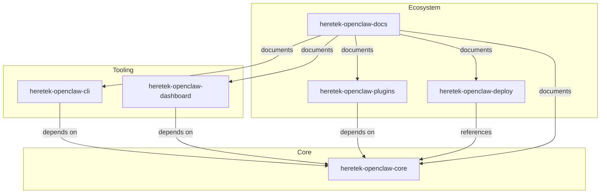

# Heretek OpenClaw Monorepo to Multi-Repo Migration Plan

**Document Version:** 1.0.0  
**Created:** 2026-04-01  
**Status:** Planning  
**Migration Target:** 6 Dedicated Repositories

---

## Executive Summary

This document outlines the comprehensive plan to split the Heretek OpenClaw monorepo (51K+ lines added in P6, 60K+ total) into 6 dedicated repositories for improved maintainability, CI/CD performance, and team scaling.

### Migration Objectives

1. **Separation of Concerns:** Each repository has a single, well-defined purpose
2. **Independent CI/CD:** Faster build times and isolated testing
3. **Team Scaling:** Granular access control per repository
4. **Version Independence:** Each repo can version independently
5. **Clear Dependencies:** Explicit inter-repo dependencies via package managers

---

## Target Repository Structure

### 1. heretek-openclaw-core

**Purpose:** Gateway, agents, A2A protocol, core functionality

**Repository:** `https://github.com/heretek/heretek-openclaw-core`

**Package Name:** `@heretek/openclaw-core`

#### Files to Migrate

| Source Path | Destination Path | Notes |
|-------------|------------------|-------|
| `agents/` | `src/agents/` | All agent implementations |
| `agents/lib/` | `src/lib/` | Agent utility libraries |
| `agents/entrypoint.sh` | `scripts/entrypoint.sh` | Agent startup script |
| `agents/deploy-agent.sh` | `scripts/deploy-agent.sh` | Agent deployment script |
| `skills/` | `src/skills/` | All skill implementations |
| `migrations/` | `migrations/` | Database migrations |
| `tests/` | `tests/` | Core test suite |
| `openclaw.json` | `openclaw.json` | Master configuration |
| `package.json` | `package.json` | Core package definition |
| `Dockerfile` | `Dockerfile` | Core container definition |
| `docker-compose.yml` | `docker-compose.yml` | Core service orchestration |
| `charts/openclaw/` | `deploy/helm/` | Helm charts |
| `litellm_config.yaml` | `litellm_config.yaml` | LiteLLM routing config |
| `.env.example` | `.env.example` | Environment template |

#### Dependencies

- **External:** Node.js 20+, PostgreSQL, Redis, Ollama, LiteLLM
- **Internal:** None (core has no external repo dependencies)

#### Version Strategy

- Initial: `v1.0.0`
- Semantic versioning with tags: `core/v1.0.0`

---

### 2. heretek-openclaw-cli

**Purpose:** Unified deployment CLI tool

**Repository:** `https://github.com/heretek/heretek-openclaw-cli`

**Package Name:** `@heretek/openclaw-cli`

#### Files to Migrate

| Source Path | Destination Path | Notes |
|-------------|------------------|-------|
| `cli/` | `src/` | CLI source code |
| `cli/bin/openclaw.js` | `bin/openclaw.js` | CLI entry point |
| `cli/package.json` | `package.json` | CLI package definition |
| `cli/README.md` | `README.md` | CLI documentation |
| `cli/openclaw.config.js` | `openclaw.config.js` | CLI configuration |
| `scripts/install/` | `scripts/install/` | Installation scripts |
| `systemd/` | `systemd/` | Systemd service files |
| `.env.bare-metal.example` | `.env.example` | Environment template |
| `.env.vm.example` | `.env.vm.example` | VM environment template |

#### Dependencies

| Dependency | Type | Version | Source |
|------------|------|---------|--------|
| `@heretek/openclaw-core` | peer | `^1.0.0` | GitHub/npm |
| commander | runtime | `^12.0.0` | npm |
| chalk | runtime | `^5.3.0` | npm |
| ora | runtime | `^8.0.1` | npm |
| inquirer | runtime | `^9.2.15` | npm |
| execa | runtime | `^8.0.1` | npm |
| fs-extra | runtime | `^11.2.0` | npm |
| yaml | runtime | `^2.4.0` | npm |
| axios | runtime | `^1.6.7` | npm |
| dotenv | runtime | `^16.4.5` | npm |

#### Version Strategy

- Initial: `v1.0.0`
- Semantic versioning with tags: `cli/v1.0.0`

---

### 3. heretek-openclaw-dashboard

**Purpose:** Health dashboard, LiteLLM integration, monitoring

**Repository:** `https://github.com/heretek/heretek-openclaw-dashboard`

**Package Name:** `@heretek/openclaw-dashboard`

#### Files to Migrate

| Source Path | Destination Path | Notes |
|-------------|------------------|-------|
| `dashboard/` | `src/` | Dashboard source code |
| `dashboard/api/` | `src/api/` | API layer |
| `dashboard/collectors/` | `src/collectors/` | Data collectors |
| `dashboard/frontend/` | `frontend/` | React frontend |
| `dashboard/config/` | `config/` | Configuration files |
| `dashboard/README.md` | `README.md` | Dashboard documentation |
| `cost-tracker/` | `src/cost-tracker/` | Cost tracking module |
| `monitoring/` | `monitoring/` | Monitoring configurations |
| `docker-compose.monitoring.yml` | `docker-compose.monitoring.yml` | Monitoring stack |
| `dashboard/integrations/` | `src/integrations/` | External integrations |

#### Dependencies

| Dependency | Type | Version | Source |
|------------|------|---------|--------|
| `@heretek/openclaw-core` | peer | `^1.0.0` | GitHub/npm |
| react | runtime | `^18.2.0` | npm |
| react-dom | runtime | `^18.2.0` | npm |
| recharts | runtime | `^2.10.3` | npm |
| socket.io-client | runtime | `^4.7.2` | npm |
| express | runtime | `^4.18.0` | npm |

#### Version Strategy

- Initial: `v1.0.0`
- Semantic versioning with tags: `dashboard/v1.0.0`

---

### 4. heretek-openclaw-plugins

**Purpose:** Plugin system, SDK, templates, registry

**Repository:** `https://github.com/heretek/heretek-openclaw-plugins`

**Package Name:** `@heretek/openclaw-plugins`

#### Files to Migrate

| Source Path | Destination Path | Notes |
|-------------|------------------|-------|
| `plugins/` | `plugins/` | All plugin implementations |
| `plugins/templates/` | `templates/` | Plugin templates |
| `docs/plugins/` | `docs/` | Plugin documentation |
| `docs/PLUGINS.md` | `README.md` | Main plugin docs |
| `docs/SKILLS.md` | `docs/SKILLS.md` | Skills documentation |

#### Plugin Inventory

| Plugin | Package Name | Status |
|--------|--------------|--------|
| Consciousness | `@heretek-ai/openclaw-consciousness-plugin` | Local |
| Liberation | `@heretek-ai/openclaw-liberation-plugin` | Local |
| Hybrid Search | `openclaw-hybrid-search-plugin` | Local |
| Multi-Doc Retrieval | `openclaw-multi-doc-retrieval` | Local |
| Skill Extensions | `openclaw-skill-extensions` | Local |
| Episodic Memory | `episodic-claw` | External (ClawHub) |
| Swarm Coordination | `swarmclaw` | External |
| SwarmClaw Integration | `@heretek-ai/swarmclaw-integration-plugin` | Local |
| ClawBridge Dashboard | `clawbridge-dashboard` | External |

#### Dependencies

| Dependency | Type | Version | Source |
|------------|------|---------|--------|
| `@heretek/openclaw-core` | peer | `^1.0.0` | GitHub/npm |

#### Version Strategy

- Initial: `v1.0.0`
- Semantic versioning with tags: `plugins/v1.0.0`
- Individual plugins may have separate versions

---

### 5. heretek-openclaw-deploy

**Purpose:** Infrastructure as Code, deployment configurations

**Repository:** `https://github.com/heretek/heretek-openclaw-deploy`

**Package Name:** N/A (IaC repository)

#### Files to Migrate

| Source Path | Destination Path | Notes |
|-------------|------------------|-------|
| `deploy/` | `terraform/` | Terraform configurations |
| `deploy/aws/terraform/` | `terraform/aws/` | AWS infrastructure |
| `deploy/gcp/terraform/` | `terraform/gcp/` | GCP infrastructure |
| `deploy/azure/terraform/` | `terraform/azure/` | Azure infrastructure |
| `deploy/kubernetes/` | `kubernetes/` | Kubernetes manifests |
| `deploy/terraform/modules/` | `terraform/modules/` | Shared Terraform modules |
| `charts/` | `helm/` | Helm charts (moved from core) |
| `docs/deployment/` | `docs/` | Deployment documentation |
| `docs/DEPLOYMENT.md` | `README.md` | Main deployment docs |

#### Terraform Module Structure

```
terraform/
├── modules/
│   ├── gateway/
│   ├── litellm/
│   ├── database/
│   ├── cache/
│   └── networking/
├── aws/
│   ├── main.tf
│   ├── variables.tf
│   ├── outputs.tf
│   ├── vpc.tf
│   ├── eks.tf
│   ├── rds.tf
│   ├── elasticache.tf
│   ├── alb.tf
│   └── ecr.tf
├── gcp/
│   ├── main.tf
│   ├── variables.tf
│   ├── outputs.tf
│   ├── vpc.tf
│   ├── gke.tf
│   ├── cloud-sql.tf
│   ├── memorystore.tf
│   ├── artifact-registry.tf
│   └── load-balancer.tf
└── azure/
    └── (similar structure)
```

#### Dependencies

- **External:** Terraform 1.5+, kubectl, helm
- **Internal:** None (standalone IaC)

#### Version Strategy

- Initial: `v1.0.0`
- Semantic versioning with tags: `deploy/v1.0.0`

---

### 6. heretek-openclaw-docs

**Purpose:** Documentation site, GitHub Pages

**Repository:** `https://github.com/heretek/heretek-openclaw-docs`

**Package Name:** N/A (Documentation site)

#### Files to Migrate

| Source Path | Destination Path | Notes |
|-------------|------------------|-------|
| `frontend/` | `src/` | Next.js documentation site |
| `frontend/src/app/` | `src/app/` | Next.js app router |
| `frontend/package.json` | `package.json` | Documentation site package |
| `docs/site/` | `content/` | Documentation content |
| `docs/api/` | `content/api/` | API documentation |
| `docs/operations/` | `content/operations/` | Operations guides |
| `docs/configuration/` | `content/configuration/` | Configuration guides |
| `docs/archive/` | `archive/` | Archived documentation |
| `.github/workflows/frontend-cicd.yml` | `.github/workflows/deploy.yml` | Deployment workflow |

#### Dependencies

| Dependency | Type | Version | Source |
|------------|------|---------|--------|
| next | runtime | `^15.0.0` | npm |
| react | runtime | `^19.0.0` | npm |
| nextra | runtime | `^3.0.0` | npm (docs framework) |

#### Version Strategy

- Initial: `v1.0.0`
- Semantic versioning with tags: `docs/v1.0.0`

---

## Dependency Graph



### Dependency Matrix

| Repository | Core | CLI | Dashboard | Plugins | Deploy | Docs |
|------------|------|-----|-----------|---------|--------|------|
| **Core** | — | — | — | — | — | — |
| **CLI** | ✓ | — | — | — | — | — |
| **Dashboard** | ✓ | — | — | — | — | — |
| **Plugins** | ✓ | — | — | — | — | — |
| **Deploy** | — | — | — | — | — | — |
| **Docs** | ✓ | ✓ | ✓ | ✓ | ✓ | — |

---

## Migration Phases

### Phase 1: Preparation (Week 1)

#### Tasks

- [ ] Document current dependencies between components
- [ ] Create new repository skeletons on GitHub
- [ ] Set up branch protection rules
- [ ] Configure CI/CD templates for each repo
- [ ] Create migration scripts
- [ ] Create backup of monorepo

#### Deliverables

1. **Repository Skeletons Created**
   - `heretek-openclaw-core`
   - `heretek-openclaw-cli`
   - `heretek-openclaw-dashboard`
   - `heretek-openclaw-plugins`
   - `heretek-openclaw-deploy`
   - `heretek-openclaw-docs`

2. **Branch Protection Rules**
   - `main` branch protected
   - Require PR reviews
   - Require status checks
   - No force pushes

3. **CI/CD Templates**
   - Build workflow
   - Test workflow
   - Release workflow
   - Security scan workflow

#### Migration Scripts

| Script | Purpose | Location |
|--------|---------|----------|
| `split-repos.js` | Automated file extraction | `scripts/migration/` |
| `update-imports.js` | Fix import paths | `scripts/migration/` |
| `validate-migration.sh` | Verify completeness | `scripts/migration/` |
| `sync-versions.sh` | Version synchronization | `scripts/migration/` |

---

### Phase 2: Core Extraction (Week 2)

#### Tasks

- [ ] Extract core repository
- [ ] Update package.json and dependencies
- [ ] Verify tests pass in isolation
- [ ] Set up CI/CD for core
- [ ] Tag release v1.0.0-core

#### File Extraction Commands

```bash
# Using git-filter-repo (recommended)
git clone git@github.com:heretek/heretek-openclaw.git heretek-openclaw-core
cd heretek-openclaw-core
git filter-repo --path agents/ --path skills/ --path migrations/ --path tests/ --path openclaw.json --path package.json --path Dockerfile --path docker-compose.yml --path charts/openclaw/ --path litellm_config.yaml --path .env.example --force

# Alternative: Using sparse checkout
git clone git@github.com:heretek/heretek-openclaw.git heretek-openclaw-core
cd heretek-openclaw-core
git sparse-checkout init --cone
git sparse-checkout set agents skills migrations tests openclaw.json package.json Dockerfile docker-compose.yml charts/openclaw litellm_config.yaml .env.example
git filter-branch --prune-empty HEAD
```

#### Post-Extraction Steps

1. Update `package.json`:
   - Change name to `@heretek/openclaw-core`
   - Update repository URL
   - Remove monorepo-specific scripts

2. Update import paths in code

3. Run tests in isolation:
   ```bash
   npm install
   npm run test
   npm run build
   ```

4. Tag initial release:
   ```bash
   git tag core/v1.0.0
   git push origin core/v1.0.0
   ```

---

### Phase 3: Tooling Extraction (Week 3)

#### Tasks

- [ ] Extract CLI repository
- [ ] Extract dashboard repository
- [ ] Configure inter-repo dependencies
- [ ] Set up CI/CD for each
- [ ] Tag releases v1.0.0-cli, v1.0.0-dashboard

#### CLI Extraction

```bash
git clone git@github.com:heretek/heretek-openclaw.git heretek-openclaw-cli
cd heretek-openclaw-cli
git filter-repo --path cli/ --path scripts/install/ --path systemd/ --path .env.bare-metal.example --path .env.vm.example --force
```

#### Dashboard Extraction

```bash
git clone git@github.com:heretek/heretek-openclaw.git heretek-openclaw-dashboard
cd heretek-openclaw-dashboard
git filter-repo --path dashboard/ --path cost-tracker/ --path monitoring/ --path docker-compose.monitoring.yml --force
```

#### Inter-Repo Dependencies

**CLI package.json:**
```json
{
  "name": "@heretek/openclaw-cli",
  "version": "1.0.0",
  "dependencies": {
    "@heretek/openclaw-core": "^1.0.0"
  },
  "peerDependencies": {
    "@heretek/openclaw-core": "^1.0.0"
  }
}
```

**Dashboard package.json:**
```json
{
  "name": "@heretek/openclaw-dashboard",
  "version": "1.0.0",
  "dependencies": {
    "@heretek/openclaw-core": "^1.0.0"
  }
}
```

---

### Phase 4: Ecosystem Extraction (Week 4)

#### Tasks

- [ ] Extract plugins repository
- [ ] Extract deploy repository
- [ ] Extract docs repository
- [ ] Set up CI/CD for each
- [ ] Tag releases v1.0.0-plugins, v1.0.0-deploy, v1.0.0-docs

#### Plugins Extraction

```bash
git clone git@github.com:heretek/heretek-openclaw.git heretek-openclaw-plugins
cd heretek-openclaw-plugins
git filter-repo --path plugins/ --path docs/plugins/ --path docs/PLUGINS.md --path docs/SKILLS.md --force
```

#### Deploy Extraction

```bash
git clone git@github.com:heretek/heretek-openclaw.git heretek-openclaw-deploy
cd heretek-openclaw-deploy
git filter-repo --path deploy/ --path charts/ --path docs/deployment/ --path docs/DEPLOYMENT.md --force
```

#### Docs Extraction

```bash
git clone git@github.com:heretek/heretek-openclaw.git heretek-openclaw-docs
cd heretek-openclaw-docs
git filter-repo --path frontend/ --path docs/site/ --path docs/api/ --path docs/operations/ --path docs/configuration/ --path docs/archive/ --path .github/workflows/frontend-cicd.yml --force
```

---

### Phase 5: Integration & Validation (Week 5)

#### Tasks

- [ ] Test cross-repo dependencies
- [ ] Validate all CI/CD pipelines
- [ ] Update documentation with new repo structure
- [ ] Communicate changes to stakeholders
- [ ] Archive monorepo (read-only)

#### Cross-Repo Testing

```bash
# Test CLI with core
cd heretek-openclaw-cli
npm install @heretek/openclaw-core@file:../heretek-openclaw-core
npm run test

# Test Dashboard with core
cd heretek-openclaw-dashboard
npm install @heretek/openclaw-core@file:../heretek-openclaw-core
npm run test
```

#### CI/CD Validation Checklist

| Repository | Build | Test | Release | Security |
|------------|-------|------|---------|----------|
| Core | ☐ | ☐ | ☐ | ☐ |
| CLI | ☐ | ☐ | ☐ | ☐ |
| Dashboard | ☐ | ☐ | ☐ | ☐ |
| Plugins | ☐ | ☐ | ☐ | ☐ |
| Deploy | ☐ | ☐ | ☐ | ☐ |
| Docs | ☐ | ☐ | ☐ | ☐ |

---

## Risk Assessment

### High Risk Items

| Risk | Impact | Likelihood | Mitigation |
|------|--------|------------|------------|
| Git history corruption | High | Medium | Full backup before migration, use git-filter-repo |
| Import path breakage | High | High | Automated path update script, manual review |
| CI/CD pipeline failures | Medium | High | Test pipelines in parallel before cutover |
| Dependency version conflicts | Medium | Medium | Lock file validation, semantic versioning |

### Medium Risk Items

| Risk | Impact | Likelihood | Mitigation |
|------|--------|------------|------------|
| Documentation links broken | Low | High | Automated link checker, manual review |
| External plugin compatibility | Medium | Low | Plugin API versioning, compatibility matrix |
| Team confusion during transition | Medium | Medium | Clear communication, migration timeline |

### Low Risk Items

| Risk | Impact | Likelihood | Mitigation |
|------|--------|------------|------------|
| GitHub Pages deployment | Low | Low | Test deployment workflow early |
| npm package publishing | Low | Low | Pre-publish testing, dry-run |

---

## Rollback Procedures

### Pre-Migration Backup

```bash
# Create full backup of monorepo
git clone --mirror git@github.com:heretek/heretek-openclaw.git backup-heretek-openclaw
cd backup-heretek-openclaw
git push --mirror /path/to/local/backup
```

### Rollback Triggers

Rollback should be initiated if:
1. Critical functionality broken in multiple repositories
2. Data loss detected
3. CI/CD pipelines completely non-functional for >24 hours
4. Cross-repo dependencies fundamentally incompatible

### Rollback Steps

1. **Stop all new development** on split repositories
2. **Archive split repositories** as read-only
3. **Restore monorepo** from backup:
   ```bash
   cd backup-heretek-openclaw
   git push --force git@github.com:heretek/heretek-openclaw.git
   ```
4. **Communicate rollback** to all stakeholders
5. **Document issues** that caused rollback
6. **Create new migration plan** addressing identified issues

### Partial Rollback

If only specific repositories have issues:
1. Archive problematic repository
2. Merge essential changes back to monorepo
3. Continue migration for other repositories

---

## Version Synchronization Strategy

### Independent Versioning

Each repository maintains its own semantic version:
- `core/v1.0.0`, `core/v1.1.0`, etc.
- `cli/v1.0.0`, `cli/v1.1.0`, etc.
- `dashboard/v1.0.0`, etc.

### Coordinated Releases

For breaking changes affecting multiple repositories:

1. **Meta-Package Approach:**
   ```json
   {
     "name": "@heretek/openclaw",
     "version": "2.0.0",
     "description": "Meta-package coordinating all OpenClaw repositories"
   }
   ```

2. **Release Coordination Process:**
   - Create release branch in each repo
   - Test integration
   - Tag all repos with coordinated version
   - Publish to npm simultaneously

### Version Compatibility Matrix

| Core Version | CLI Version | Dashboard Version | Plugins Version |
|--------------|-------------|-------------------|-----------------|
| 1.x.x | ^1.0.0 | ^1.0.0 | ^1.0.0 |
| 2.x.x | ^2.0.0 | ^2.0.0 | ^2.0.0 |

### Dependency Management

```json
// CLI package.json
{
  "dependencies": {
    "@heretek/openclaw-core": "^1.0.0"
  },
  "peerDependencies": {
    "@heretek/openclaw-core": "^1.0.0"
  },
  "engines": {
    "node": ">=20.0.0"
  }
}
```

---

## Access Control

### Repository Permissions

| Repository | Admin | Write | Read |
|------------|-------|-------|------|
| Core | Core Team | Core Team | All |
| CLI | Core Team | CLI Team | All |
| Dashboard | Core Team | Dashboard Team | All |
| Plugins | Core Team | Plugin Authors | All |
| Deploy | Infra Team | Infra Team | Core Team |
| Docs | Docs Team | All Contributors | All |

### CODEOWNERS Files

**Core (.github/CODEOWNERS):**
```
* @heretek/core-team
/src/agents/ @heretek/agent-team
/src/skills/ @heretek/skill-team
```

**CLI (.github/CODEOWNERS):**
```
* @heretek/cli-team
/src/commands/ @heretek/cli-team
```

**Dashboard (.github/CODEOWNERS):**
```
* @heretek/dashboard-team
/frontend/ @heretek/frontend-team
```

---

## CI/CD Configuration

### Core Repository Workflows

**`.github/workflows/ci.yml`:**
```yaml
name: Core CI

on:
  push:
    branches: [main]
  pull_request:
    branches: [main]

jobs:
  test:
    runs-on: ubuntu-latest
    steps:
      - uses: actions/checkout@v4
      - uses: actions/setup-node@v4
        with:
          node-version: '20'
          cache: 'npm'
      - run: npm ci
      - run: npm run test
      - run: npm run build
  
  security:
    runs-on: ubuntu-latest
    steps:
      - uses: actions/checkout@v4
      - run: npm audit --audit-level=moderate
```

**`.github/workflows/release.yml`:**
```yaml
name: Release

on:
  push:
    tags:
      - 'core/v*'

jobs:
  publish:
    runs-on: ubuntu-latest
    steps:
      - uses: actions/checkout@v4
      - uses: actions/setup-node@v4
        with:
          node-version: '20'
          registry-url: 'https://registry.npmjs.org'
      - run: npm ci
      - run: npm publish --access public
        env:
          NODE_AUTH_TOKEN: ${{ secrets.NPM_TOKEN }}
```

---

## Communication Plan

### Stakeholder Communication

| Audience | Channel | Timing | Content |
|----------|---------|--------|---------|
| Core Team | Slack/Teams | Weekly | Migration progress, blockers |
| Contributors | GitHub Discussions | Phase start/end | Repository changes, new workflows |
| External Users | README, Release Notes | After Phase 5 | New repository structure, migration guide |

### Documentation Updates

1. **Update main README.md** in monorepo with migration notice
2. **Create migration guide** for users
3. **Update all internal documentation** with new repository URLs
4. **Create CONTRIBUTING.md** for each new repository

---

## Post-Migration Checklist

### Immediate (Week 5)

- [ ] All 6 repositories created and populated
- [ ] CI/CD pipelines passing
- [ ] Initial releases tagged
- [ ] npm packages published (where applicable)
- [ ] Documentation updated

### Short-term (Week 6-8)

- [ ] Cross-repo integration tests passing
- [ ] Plugin compatibility verified
- [ ] User migration guide published
- [ ] Monorepo archived (read-only)
- [ ] GitHub redirect configured

### Long-term (Month 2-3)

- [ ] Deprecation notice in monorepo
- [ ] All external links updated
- [ ] npm deprecation notice (if applicable)
- [ ] Community feedback incorporated

---

## Appendix A: Git History Options

### Option A: Preserve Full History (Recommended for Core)

**Pros:**
- Complete audit trail
- Preserves contributor credits
- Easier debugging of historical issues

**Cons:**
- Larger repository size
- May include irrelevant history for some components

**Implementation:**
```bash
git filter-repo --path <paths> --force
```

### Option B: Fresh Start (Recommended for Others)

**Pros:**
- Clean repository history
- Smaller repository size
- Clear migration point

**Cons:**
- Loss of historical context
- Need to preserve credits manually

**Implementation:**
```bash
# Create new repository with migration commit
git init
git remote add origin <new-repo-url>
# Copy files
git add .
git commit -m "Initial migration from monorepo"
git push -u origin main
```

---

## Appendix B: File Mapping Reference

### Complete File Inventory

#### Core Repository (58 files/directories)

```
agents/                          → src/agents/
agents/lib/                      → src/lib/
agents/entrypoint.sh             → scripts/entrypoint.sh
agents/deploy-agent.sh           → scripts/deploy-agent.sh
skills/                          → src/skills/
migrations/                      → migrations/
tests/                           → tests/
openclaw.json                    → openclaw.json
package.json                     → package.json
Dockerfile                       → Dockerfile
docker-compose.yml               → docker-compose.yml
charts/openclaw/                 → deploy/helm/
litellm_config.yaml              → litellm_config.yaml
.env.example                     → .env.example
```

#### CLI Repository (8 files/directories)

```
cli/                             → src/
cli/bin/openclaw.js              → bin/openclaw.js
cli/package.json                 → package.json
cli/README.md                    → README.md
cli/openclaw.config.js           → openclaw.config.js
scripts/install/                 → scripts/install/
systemd/                         → systemd/
.env.bare-metal.example          → .env.example
.env.vm.example                  → .env.vm.example
```

#### Dashboard Repository (9 files/directories)

```
dashboard/                       → src/
dashboard/api/                   → src/api/
dashboard/collectors/            → src/collectors/
dashboard/frontend/              → frontend/
dashboard/config/                → config/
dashboard/README.md              → README.md
cost-tracker/                    → src/cost-tracker/
monitoring/                      → monitoring/
docker-compose.monitoring.yml    → docker-compose.monitoring.yml
```

#### Plugins Repository (5 files/directories)

```
plugins/                         → plugins/
plugins/templates/               → templates/
docs/plugins/                    → docs/
docs/PLUGINS.md                  → README.md
docs/SKILLS.md                   → docs/SKILLS.md
```

#### Deploy Repository (9 files/directories)

```
deploy/                          → terraform/
deploy/aws/terraform/            → terraform/aws/
deploy/gcp/terraform/            → terraform/gcp/
deploy/azure/terraform/          → terraform/azure/
deploy/kubernetes/               → kubernetes/
deploy/terraform/modules/        → terraform/modules/
charts/                          → helm/
docs/deployment/                 → docs/
docs/DEPLOYMENT.md               → README.md
```

#### Docs Repository (9 files/directories)

```
frontend/                        → src/
frontend/src/app/                → src/app/
frontend/package.json            → package.json
docs/site/                       → content/
docs/api/                        → content/api/
docs/operations/                 → content/operations/
docs/configuration/              → content/configuration/
docs/archive/                    → archive/
.github/workflows/frontend-cicd.yml → .github/workflows/deploy.yml
```

---

## Appendix C: Migration Script Reference

### split-repos.js

```javascript
#!/usr/bin/env node

/**
 * Monorepo Split Script
 * Extracts specified paths from monorepo into dedicated repositories
 */

const { execSync } = require('child_process');
const fs = require('fs');
const path = require('path');

const REPOS = {
  'heretek-openclaw-core': {
    paths: ['agents/', 'skills/', 'migrations/', 'tests/', 'openclaw.json', 'package.json', 'Dockerfile', 'docker-compose.yml', 'charts/openclaw/', 'litellm_config.yaml', '.env.example'],
    packageName: '@heretek/openclaw-core'
  },
  'heretek-openclaw-cli': {
    paths: ['cli/', 'scripts/install/', 'systemd/', '.env.bare-metal.example', '.env.vm.example'],
    packageName: '@heretek/openclaw-cli'
  },
  'heretek-openclaw-dashboard': {
    paths: ['dashboard/', 'cost-tracker/', 'monitoring/', 'docker-compose.monitoring.yml'],
    packageName: '@heretek/openclaw-dashboard'
  },
  'heretek-openclaw-plugins': {
    paths: ['plugins/', 'docs/plugins/', 'docs/PLUGINS.md', 'docs/SKILLS.md'],
    packageName: '@heretek/openclaw-plugins'
  },
  'heretek-openclaw-deploy': {
    paths: ['deploy/', 'charts/', 'docs/deployment/', 'docs/DEPLOYMENT.md'],
    packageName: null
  },
  'heretek-openclaw-docs': {
    paths: ['frontend/', 'docs/site/', 'docs/api/', 'docs/operations/', 'docs/configuration/', 'docs/archive/', '.github/workflows/frontend-cicd.yml'],
    packageName: null
  }
};

function splitRepo(repoName, config) {
  console.log(`\n🔪 Splitting ${repoName}...`);
  
  // Clone repository
  execSync(`git clone git@github.com:heretek/heretek-openclaw.git ${repoName}`, { stdio: 'inherit' });
  process.chdir(repoName);
  
  // Filter to only include specified paths
  const paths = config.paths.map(p => `--path ${p}`).join(' ');
  execSync(`git filter-repo ${paths} --force`, { stdio: 'inherit' });
  
  // Update package.json if applicable
  if (config.packageName) {
    const packageJson = JSON.parse(fs.readFileSync('package.json', 'utf8'));
    packageJson.name = config.packageName;
    packageJson.repository = {
      type: 'git',
      url: `https://github.com/heretek/${repoName}.git`
    };
    fs.writeFileSync('package.json', JSON.stringify(packageJson, null, 2));
  }
  
  // Update remote
  execSync(`git remote set-url origin git@github.com:heretek/${repoName}.git`, { stdio: 'inherit' });
  
  console.log(`✅ ${repoName} split complete`);
}

// Main execution
const repoName = process.argv[2];
if (!repoName) {
  console.error('Usage: node split-repos.js <repo-name>');
  process.exit(1);
}

if (!REPOS[repoName]) {
  console.error(`Unknown repository: ${repoName}`);
  console.error('Available:', Object.keys(REPOS).join(', '));
  process.exit(1);
}

splitRepo(repoName, REPOS[repoName]);
```

### update-imports.js

```javascript
#!/usr/bin/env node

/**
 * Import Path Update Script
 * Updates import paths after repository split
 */

const fs = require('fs');
const path = require('path');
const { execSync } = require('child_process');

const IMPORT_MAPPINGS = {
  // Core imports
  'agents/': '@heretek/openclaw-core/agents/',
  'skills/': '@heretek/openclaw-core/skills/',
  
  // CLI imports
  'cli/': '@heretek/openclaw-cli/',
  
  // Dashboard imports
  'dashboard/': '@heretek/openclaw-dashboard/',
  
  // Plugin imports
  'plugins/': '@heretek/openclaw-plugins/',
};

function updateFile(filePath) {
  const ext = path.extname(filePath);
  if (!['.js', '.ts', '.jsx', '.tsx', '.json', '.yaml', '.yml'].includes(ext)) {
    return;
  }
  
  let content = fs.readFileSync(filePath, 'utf8');
  let updated = false;
  
  for (const [oldPath, newPath] of Object.entries(IMPORT_MAPPINGS)) {
    if (content.includes(oldPath)) {
      content = content.replace(
        new RegExp(`['"]${oldPath}([^'"]*)['"]`, 'g'),
        `'$${newPath}$1'`
      );
      updated = true;
    }
  }
  
  if (updated) {
    fs.writeFileSync(filePath, content);
    console.log(`Updated: ${filePath}`);
  }
}

function walkDirectory(dir) {
  const files = fs.readdirSync(dir);
  
  for (const file of files) {
    const filePath = path.join(dir, file);
    const stat = fs.statSync(filePath);
    
    if (stat.isDirectory() && !file.startsWith('.') && file !== 'node_modules') {
      walkDirectory(filePath);
    } else if (stat.isFile()) {
      updateFile(filePath);
    }
  }
}

// Main execution
const targetDir = process.argv[2] || '.';
console.log(`Updating imports in ${targetDir}...`);
walkDirectory(targetDir);
console.log('✅ Import paths updated');
```

### validate-migration.sh

```bash
#!/bin/bash

# Migration Validation Script
# Verifies completeness of repository split

set -e

echo "🔍 Validating migration..."

ERRORS=0

# Check required files exist
check_files() {
    local repo=$1
    shift
    local files=("$@")
    
    echo "Checking $repo..."
    for file in "${files[@]}"; do
        if [ ! -f "$file" ] && [ ! -d "$file" ]; then
            echo "❌ Missing: $file"
            ((ERRORS++))
        else
            echo "✅ Found: $file"
        fi
    done
}

# Validate Core
if [ -d "heretek-openclaw-core" ]; then
    cd heretek-openclaw-core
    check_files "Core" "src/agents/" "src/skills/" "migrations/" "tests/" "openclaw.json" "package.json" "Dockerfile"
    cd ..
fi

# Validate CLI
if [ -d "heretek-openclaw-cli" ]; then
    cd heretek-openclaw-cli
    check_files "CLI" "src/" "bin/openclaw.js" "package.json" "README.md"
    cd ..
fi

# Validate Dashboard
if [ -d "heretek-openclaw-dashboard" ]; then
    cd heretek-openclaw-dashboard
    check_files "Dashboard" "src/" "frontend/" "config/" "README.md"
    cd ..
fi

# Summary
echo ""
echo "=== Validation Summary ==="
if [ $ERRORS -eq 0 ]; then
    echo "✅ All validations passed!"
else
    echo "❌ Found $ERRORS error(s)"
    exit 1
fi
```

---

## Appendix D: Repository Templates

### README Template

```markdown
# {Repository Name}

> {Description}

## Installation

```bash
npm install @heretek/{package-name}
```

## Usage

```javascript
// Usage example
```

## Documentation

See [full documentation]({documentation-url})

## License

MIT
```

### CONTRIBUTING.md Template

```markdown
# Contributing to {Repository Name}

## Development Setup

1. Clone repository
2. `npm install`
3. `npm run dev`

## Testing

```bash
npm run test
```

## Pull Requests

1. Fork repository
2. Create feature branch
3. Submit PR with description

## Code Style

- ESLint configured
- Prettier formatting
- TypeScript strict mode
```

---

## References

- [git-filter-repo Documentation](https://htmlpreview.github.io/?https://github.com/newren/git-filter-repo/blob/docs/html/git-filter-repo.html)
- [GitHub Monorepo Patterns](https://github.com/github/monorepo-demo)
- [npm Workspace Documentation](https://docs.npmjs.com/cli/v10/using-npm/workspaces)
- [Semantic Versioning 2.0.0](https://semver.org/)

---

🦞 *The thought that never ends.*
