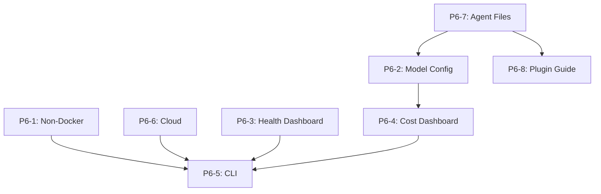

# P6 Development Plan: Addressing Remaining Gaps

**Version:** 1.0.0  
**Created:** 2026-03-31  
**Status:** Draft for Review  
**Based on:** P4 Gap Analysis, P4 Sanity Test Report, P5 Forward Plan

---

## Table of Contents

1. [Executive Summary](#executive-summary)
2. [P6 Initiatives Overview](#p6-initiatives-overview)
3. [Detailed Initiative Specifications](#detailed-initiative-specifications)
4. [Priority Matrix](#priority-matrix)
5. [Dependencies](#dependencies)
6. [Recommended Implementation Order](#recommended-implementation-order)
7. [Effort Estimates](#effort-estimates)
8. [Risk Assessment](#risk-assessment)

---

## Executive Summary

P6 addresses critical gaps identified in the P4 gap analysis that were not covered in P5. The focus areas are:

1. **Deployment Flexibility** - Non-Docker options and cloud-native deployments
2. **User Experience** - Health and cost dashboards, unified CLI
3. **Advanced Features** - Per-agent model configuration, plugin management
4. **Documentation Completeness** - Agent files and plugin guides

### Summary Statistics

| Metric | Value |
|--------|-------|
| Total Initiatives | 8 |
| P0 (Critical) | 3 |
| P1 (High) | 4 |
| P2 (Medium) | 1 |
| Estimated Total Effort | 10-14 weeks |

---

## P6 Initiatives Overview

| ID | Initiative | Priority | Category | Effort |
|----|------------|----------|----------|--------|
| P6-1 | Non-Docker Deployment Options | P1 | Deployment | 2-3 weeks |
| P6-2 | Per-Agent Model Configuration | P0 | API Management | 1-2 weeks |
| P6-3 | Health Check Dashboard | P0 | UX/Monitoring | 1-2 weeks |
| P6-4 | Cost Tracking Dashboard | P2 | UX/Observability | 1-2 weeks |
| P6-5 | Unified Deployment CLI | P1 | Tooling | 2-3 weeks |
| P6-6 | Cloud-Native Deployments | P1 | Deployment | 3-4 weeks |
| P6-7 | Agent File Completion | P0 | Documentation | 1 week |
| P6-8 | Plugin Installation Guide | P2 | Documentation | 3-5 days |

---

## Detailed Initiative Specifications

### P6-1: Non-Docker Deployment Options

**Priority:** P1 (High)  
**Effort:** 2-3 weeks  
**Category:** Deployment Flexibility

#### Gap Addressed
- No bare-metal deployment option (P4 Gap Analysis 2.2.1)
- No VM deployment option (P4 Gap Analysis 2.2.2)

#### Deliverables

| File | Description | Status |
|------|-------------|--------|
| `docs/deployment/BARE_METAL.md` | Bare-metal installation guide | New |
| `docs/deployment/VM_DEPLOYMENT.md` | VM deployment guide (VirtualBox, VMware, Proxmox) | New |
| `scripts/install.sh` | Installation script for non-Docker deployments | New |
| `systemd/openclaw-gateway.service` | Systemd service for Gateway | New |
| `systemd/openclaw-litellm.service` | Systemd service for LiteLLM | New |
| `systemd/openclaw-ollama.service` | Systemd service for Ollama | New |
| `systemd/openclaw-postgres.service` | Systemd service for PostgreSQL | New |
| `systemd/openclaw-redis.service` | Systemd service for Redis | New |

#### Installation Script Features

```bash
# scripts/install.sh
./install.sh
  ├── Detect OS and package manager
  ├── Install Node.js 20 LTS
  ├── Install PostgreSQL 17 with pgvector
  ├── Install Redis 7
  ├── Install Ollama
  ├── Install LiteLLM (pip)
  ├── Install OpenClaw Gateway (npm)
  ├── Configure systemd services
  ├── Generate configuration files
  └── Validate installation
```

#### Success Criteria
- [ ] Can deploy on Ubuntu 22.04+ without Docker
- [ ] All services start via systemd
- [ ] Health checks pass for all components
- [ ] Documentation includes troubleshooting section

---

### P6-2: Per-Agent Model Configuration

**Priority:** P0 (Critical)  
**Effort:** 1-2 weeks  
**Category:** API Management

#### Gap Addressed
- No per-agent model configuration UI (P4 Gap Analysis 3.2.2)
- No UI for per-agent model assignment (Task specification)

#### Deliverables

| File | Description | Status |
|------|-------------|--------|
| `docs/api/AGENT_MODEL_CONFIG.md` | API specification for agent-model configuration | New |
| `scripts/agent-model-config.js` | CLI for agent-model assignment | New |
| `openclaw.json` | Update schema for per-agent models | Modified |

#### API Specification

```yaml
# Agent Model Configuration API
POST /api/v1/agents/{agentId}/model
  - Assign model to agent
  - Body: { modelId: string, priority: number }

GET /api/v1/agents/{agentId}/model
  - Get current model assignment

GET /api/v1/agents/models
  - List all available models

PUT /api/v1/agents/models/bulk
  - Bulk update multiple agent-model assignments
```

#### CLI Commands

```bash
# scripts/agent-model-config.js
node scripts/agent-model-config.js list              # List all agent-model mappings
node scripts/agent-model-config.js set steward gpt-4o  # Assign model to agent
node scripts/agent-model-config.js bulk config.json    # Bulk update from file
node scripts/agent-model-config.js validate            # Validate configuration
```

#### openclaw.json Schema Update

Add `modelAssignment` section to each agent:

```json
{
  "agents": [
    {
      "id": "steward",
      "model": "agent/steward",
      "modelAssignment": {
        "primary": "openai/gpt-4o",
        "failover": "anthropic/claude-sonnet-4-20250514",
        "embedding": "ollama/nomic-embed-text-v2-moe"
      }
    }
  ]
}
```

#### Success Criteria
- [ ] CLI can list, set, and validate agent-model assignments
- [ ] API endpoints documented and functional
- [ ] openclaw.json schema updated and validated
- [ ] Changes persist across restarts

---

### P6-3: Health Check Dashboard

**Priority:** P0 (Critical)  
**Effort:** 1-2 weeks  
**Category:** UX/Monitoring

#### Gap Addressed
- No visual health monitoring dashboard (P4 Gap Analysis 5.2.2)
- No health check dashboard (Task specification)

#### Deliverables

| File | Description | Status |
|------|-------------|--------|
| `frontend/src/app/health/page.tsx` | Health dashboard page | New |
| `scripts/health-aggregator.js` | Health status aggregator | New |
| `monitoring/grafana/dashboards/health-dashboard.json` | Grafana dashboard import | New |
| `docs/operations/HEALTH_DASHBOARD.md` | Health dashboard documentation | New |

#### Dashboard Features

```
┌─────────────────────────────────────────────────────────────────┐
│              OpenClaw Health Dashboard                           │
│                                                                  │
│  System Status: HEALTHY                          Last: 2 min ago │
│  ─────────────────────────────────────────────────────────────   │
│                                                                  │
│  Core Services                                                   │
│  ┌──────────────────────────────────────────────────────────┐   │
│  │  Service         │  Status  │  Response  │  Uptime       │   │
│  ├──────────────────────────────────────────────────────────┤   │
│  │  Gateway         │  ● OK    │  12ms      │  99.9% (24h)  │   │
│  │  LiteLLM         │  ● OK    │  45ms      │  99.8% (24h)  │   │
│  │  PostgreSQL      │  ● OK    │  8ms       │  100% (24h)   │   │
│  │  Redis           │  ● OK    │  3ms       │  99.9% (24h)  │   │
│  │  Ollama          │  ● OK    │  120ms     │  98.5% (24h)  │   │
│  │  Langfuse        │  ● OK    │  85ms      │  99.7% (24h)  │   │
│  └──────────────────────────────────────────────────────────┘   │
│                                                                  │
│  Agent Status                                                    │
│  ┌──────────────────────────────────────────────────────────┐   │
│  │  Agent        │  Status  │  Last Active  │  Memory       │   │
│  ├──────────────────────────────────────────────────────────┤   │
│  │  Steward      │  ● OK    │  1 min ago    │  245 MB       │   │
│  │  Alpha        │  ● OK    │  2 min ago    │  198 MB       │   │
│  │  Beta         │  ● OK    │  2 min ago    │  201 MB       │   │
│  └──────────────────────────────────────────────────────────┘   │
└─────────────────────────────────────────────────────────────────┘
```

#### Health Aggregator Features

```javascript
// scripts/health-aggregator.js
const aggregator = {
  checkGateway: () => ws://localhost:18789/health,
  checkLiteLLM: () => http://localhost:4000/health,
  checkPostgres: () => pg_isready -h localhost,
  checkRedis: () => redis-cli ping,
  checkOllama: () => http://localhost:11434/api/tags,
  checkAgents: () => WebSocket health pulses,
  aggregate: () => combined health status,
  alert: () => notifications on failures
};
```

#### Success Criteria
- [ ] Frontend dashboard displays real-time health status
- [ ] Grafana dashboard can be imported
- [ ] Health aggregator collects data from all services
- [ ] Alerts configured for service failures

---

### P6-4: Cost Tracking Dashboard

**Priority:** P2 (Medium)  
**Effort:** 1-2 weeks  
**Category:** UX/Observability

#### Gap Addressed
- No LLM cost tracking visualization (P4 Gap Analysis 3.2.4)
- No cost tracking dashboard (Task specification)

#### Deliverables

| File | Description | Status |
|------|-------------|--------|
| `frontend/src/app/costs/page.tsx` | Cost tracking page | New |
| `scripts/cost-tracker.js` | Cost aggregation from LiteLLM | New |
| `docs/operations/COST_TRACKING.md` | Cost tracking documentation | New |
| `monitoring/grafana/dashboards/cost-dashboard.json` | Cost Grafana dashboard | New |

#### Dashboard Features

```
┌─────────────────────────────────────────────────────────────────┐
│              OpenClaw Cost Dashboard                             │
│                                                                  │
│  Total Cost (Today): $12.45    (This Week): $67.89              │
│  ─────────────────────────────────────────────────────────────   │
│                                                                  │
│  Cost by Agent                                                   │
│  ┌──────────────────────────────────────────────────────────┐   │
│  │  Agent        │  Tokens    │  Cost    │  Budget Remaining│   │
│  ├──────────────────────────────────────────────────────────┤   │
│  │  Steward      │  125,432   │  $3.45   │  $46.55 (93%)    │   │
│  │  Alpha        │  89,234    │  $2.12   │  $47.88 (96%)    │   │
│  │  Coder        │  245,123   │  $5.67   │  $44.33 (89%)    │   │
│  └──────────────────────────────────────────────────────────┘   │
│                                                                  │
│  Cost Trend (7 days)                                             │
│  ████████░░░░████████░░░░████████░░░░                           │
│  Mon    Tue    Wed    Thu    Fri    Sat    Sun                  │
└─────────────────────────────────────────────────────────────────┘
```

#### Cost Tracker Features

```javascript
// scripts/cost-tracker.js
const tracker = {
  fetchFromLiteLLM: () => GET /spend/endpoints,
  fetchFromLangfuse: () => API cost observations,
  aggregateByAgent: () => group costs by agent,
  calculateProjections: () => estimate monthly costs,
  checkBudgets: () => alert on budget thresholds,
  export: () => CSV/JSON export
};
```

#### Success Criteria
- [ ] Frontend displays cost data per agent
- [ ] Cost tracker aggregates from LiteLLM and Langfuse
- [ ] Budget alerts configured
- [ ] Cost projections available

---

### P6-5: Unified Deployment CLI

**Priority:** P1 (High)  
**Effort:** 2-3 weeks  
**Category:** Tooling

#### Gap Addressed
- No unified deployment tool (P4 Gap Analysis 5.2.3)
- No deployment CLI (Task specification)

#### Deliverables

| File | Description | Status |
|------|-------------|--------|
| `scripts/openclaw-cli.js` | Main CLI entry point | New |
| `docs/cli/CLI_REFERENCE.md` | CLI documentation | New |
| `package.json` | Add CLI bin entry | Modified |

#### CLI Commands

```bash
# scripts/openclaw-cli.js
openclaw --help

# Deployment
openclaw deploy              # Interactive deployment
openclaw deploy docker       # Docker Compose deployment
openclaw deploy k8s          # Kubernetes deployment
openclaw deploy baremetal    # Bare-metal deployment

# Status
openclaw status              # Full system status
openclaw status services     # Service status only
openclaw status agents       # Agent status only

# Backup
openclaw backup create       # Create backup
openclaw backup list         # List backups
openclaw backup restore      # Restore from backup
openclaw backup verify       # Verify backup integrity

# Migration
openclaw migrate             # Run database migrations
openclaw migrate status      # Show migration status
openclaw migrate rollback    # Rollback migrations

# Health
openclaw health              # Run health checks
openclaw health watch        # Continuous health monitoring

# Configuration
openclaw config show         # Show configuration
openclaw config validate     # Validate configuration
openclaw config edit         # Edit configuration
```

#### Interactive Mode

```bash
$ openclaw deploy
┌─────────────────────────────────────────────────────────────────┐
│  Welcome to OpenClaw Deployment Wizard                          │
│                                                                 │
│  Select deployment type:                                        │
│  ● Docker Compose (Recommended for local)                       │
│  ○ Kubernetes Helm (Recommended for production)                 │
│  ○ Bare-metal (Advanced)                                        │
│                                                                 │
│  [Continue]                                                     │
└─────────────────────────────────────────────────────────────────┘
```

#### Success Criteria
- [ ] All commands functional
- [ ] Interactive and non-interactive modes work
- [ ] Comprehensive help documentation
- [ ] Tab completion available

---

### P6-6: Cloud-Native Deployments

**Priority:** P1 (High)  
**Effort:** 3-4 weeks  
**Category:** Deployment

#### Gap Addressed
- No AWS/GCP/Azure native deployments (P4 Gap Analysis 2.2.3)
- No cloud-native deployment options (Task specification)

#### Deliverables

| File | Description | Status |
|------|-------------|--------|
| `docs/deployment/AWS.md` | AWS deployment guide (ECS/EKS) | New |
| `docs/deployment/GCP.md` | GCP deployment guide (GKE/Cloud Run) | New |
| `docs/deployment/AZURE.md` | Azure deployment guide (AKS/Container Apps) | New |
| `terraform/aws/` | AWS Terraform templates | New |
| `terraform/gcp/` | GCP Terraform templates | New |
| `terraform/azure/` | Azure Terraform templates | New |

#### Architecture Diagram

```
┌─────────────────────────────────────────────────────────────────┐
│                    AWS Cloud-Native Deployment                   │
│                                                                  │
│  ┌─────────────────┐    ┌─────────────────┐                     │
│  │   Application   │    │   Application   │                     │
│  │   Load Balancer │───>│   Auto Scaling  │                     │
│  │   (ALB)         │    │   Group         │                     │
│  └─────────────────┘    └────────┬────────┘                     │
│                                 │                                │
│           ┌─────────────────────┼─────────────────────┐         │
│           │                     │                     │          │
│           ▼                     ▼                     ▼          │
│  ┌─────────────────┐  ┌─────────────────┐  ┌─────────────────┐  │
│  │   Amazon RDS    │  │  Amazon Elasti  │  │   Amazon EKS    │  │
│  │   (PostgreSQL)  │  │  Cache (Redis)  │  │   (OpenClaw)    │  │
│  └─────────────────┘  └─────────────────┘  └─────────────────┘  │
└─────────────────────────────────────────────────────────────────┘
```

#### Terraform Structure

```
terraform/
├── aws/
│   ├── main.tf
│   ├── variables.tf
│   ├── outputs.tf
│   ├── modules/
│   │   ├── eks/
│   │   ├── rds/
│   │   └── elasticache/
│   └── README.md
├── gcp/
│   ├── main.tf
│   ├── variables.tf
│   ├── outputs.tf
│   ├── modules/
│   │   ├── gke/
│   │   ├── cloud-sql/
│   │   └── memorystore/
│   └── README.md
└── azure/
    ├── main.tf
    ├── variables.tf
    ├── outputs.tf
    ├── modules/
    │   ├── aks/
    │   ├── cosmos-db/
    │   └── redis-cache/
    └── README.md
```

#### Success Criteria
- [ ] Documentation for all three cloud providers
- [ ] Terraform templates deploy successfully
- [ ] Managed services integration (RDS, ElastiCache, etc.)
- [ ] Cost estimates provided in documentation

---

### P6-7: Agent File Completion

**Priority:** P0 (Critical)  
**Effort:** 1 week  
**Category:** Documentation

#### Gap Addressed
- Only 33% of agent files complete (P4 Sanity Test Report Section 4)
- Missing IDENTITY.md and BOOTSTRAP.md for 10/11 agents

#### Current State

| Agent | TOOLS.md | IDENTITY.md | BOOTSTRAP.md | Consistency |
|-------|----------|-------------|--------------|-------------|
| Steward | ✅ | ✅ | ✅ | 100% |
| Alpha | ✅ | ❌ | ❌ | 33% |
| Beta | ✅ | ❌ | ❌ | 33% |
| Charlie | ✅ | ❌ | ❌ | 33% |
| Examiner | ✅ | ❌ | ❌ | 33% |
| Explorer | ✅ | ❌ | ❌ | 33% |
| Sentinel | ✅ | ❌ | ❌ | 33% |
| Coder | ✅ | ❌ | ❌ | 33% |
| Dreamer | ✅ | ❌ | ❌ | 33% |
| Empath | ✅ | ❌ | ❌ | 33% |
| Historian | ✅ | ❌ | ❌ | 33% |

**Overall:** 33% (11/33 files complete)

#### Deliverables

| File | Description | Status |
|------|-------------|--------|
| `agents/*/IDENTITY.md` | Complete for all 10 agents | New (10 files) |
| `agents/*/BOOTSTRAP.md` | Complete for all 10 agents | New (10 files) |
| `docs/agents/AGENT_CREATION_GUIDE.md` | Agent creation template | New |
| `agents/templates/` | Agent creation template directory | Enhanced |

#### IDENTITY.md Template

```markdown
# IDENTITY.md — {Agent Name}

## Role
**{Role Title}** — {One-line description}

## What I Do
- {Capability 1}
- {Capability 2}
- {Capability 3}

## What I Don't Do
- {Non-responsibility 1}
- {Non-responsibility 2}

## Collective Roster
| Agent | Role | Status |
|-------|------|--------|
| ... | ... | ... |

## Emoji
{Emoji}

## Signature
{Agent Name} — {Role}
```

#### BOOTSTRAP.md Template

```markdown
# BOOTSTRAP.md — {Agent Name}

## Initial Setup

### Environment Variables
```bash
export {AGENT}_SESSION={session_id}
export {AGENT}_PORT={port}
```

### Dependencies
```bash
npm install {dependencies}
```

### Configuration
```json
{
  "agent": "{name}",
  "gateway": "ws://127.0.0.1:18789"
}
```

## First Run
1. Start Gateway
2. Deploy agent via CLI
3. Verify WebSocket connection
4. Run health check

## Troubleshooting
- Common issues and solutions
```

#### Success Criteria
- [ ] All 11 agents have complete TOOLS.md, IDENTITY.md, BOOTSTRAP.md
- [ ] Agent creation guide documented
- [ ] Templates available for future agents
- [ ] 100% agent file consistency

---

### P6-8: Plugin Installation Guide

**Priority:** P2 (Medium)  
**Effort:** 3-5 days  
**Category:** Documentation

#### Gap Addressed
- No plugin installation documentation (Task specification)
- No plugin development guide (P4 Gap Analysis)

#### Deliverables

| File | Description | Status |
|------|-------------|--------|
| `docs/plugins/INSTALLATION_GUIDE.md` | Plugin installation guide | New |
| `docs/plugins/DEVELOPMENT_GUIDE.md` | Plugin development guide | New |
| `plugins/template/` | Plugin scaffold template | New |
| `scripts/plugin-manager.js` | Plugin management CLI | New |

#### Installation Guide Contents

```markdown
# Plugin Installation Guide

## Quick Start
```bash
# Install from npm
npm install @heretek-ai/openclaw-conflict-monitor

# Install from local directory
openclaw plugin install ./plugins/conflict-monitor

# Install from GitHub
openclaw plugin install github:heretek/openclaw-plugin-xyz
```

## Plugin Discovery
- Official plugin registry
- Community plugins
- Custom plugins

## Configuration
- Plugin configuration files
- Environment variables
- Plugin dependencies
```

#### Development Guide Contents

```markdown
# Plugin Development Guide

## Creating a Plugin
1. Use plugin scaffold
2. Implement plugin interface
3. Register hooks
4. Expose tools
5. Test plugin
6. Publish plugin

## Plugin Structure
plugins/my-plugin/
├── src/
│   └── index.js
├── package.json
├── README.md
└── SKILL.md

## Plugin API
- Initialization hooks
- Message hooks
- Tool registration
- Event listeners
```

#### Plugin Manager CLI

```bash
# scripts/plugin-manager.js
openclaw plugin list              # List installed plugins
openclaw plugin install <name>    # Install plugin
openclaw plugin remove <name>     # Remove plugin
openclaw plugin update <name>     # Update plugin
openclaw plugin create <name>     # Create new plugin from template
openclaw plugin validate          # Validate plugin configuration
```

#### Success Criteria
- [ ] Installation guide complete with examples
- [ ] Development guide with plugin scaffold
- [ ] Plugin manager CLI functional
- [ ] Example plugins documented

---

## Priority Matrix

```
┌─────────────────────────────────────────────────────────────────┐
│                    P6 Initiative Priority Matrix                 │
│                                                                  │
│  Impact                                                        │
│    ^                                                           │
│    │                                                           │
│  H │  P6-7    P6-2    P6-3                                     │
│  i │  Agent   Model   Health                                   │
│  g │  Files   Config  Dashboard                                │
│    │                                                           │
│    │  P6-1    P6-5    P6-6                                     │
│    │  Non-Docker  CLI   Cloud                                   │
│    │                                                           │
│  L │  P6-8    P6-4                                             │
│  o │  Plugin  Cost                                             │
│  w │  Guide   Dashboard                                        │
│    │                                                           │
│    └─────────────────────────────────────────►                  │
│         Low        Medium        High        Effort             │
└─────────────────────────────────────────────────────────────────┘
```

---

## Dependencies

### Dependency Graph



### Dependency Table

| Initiative | Depends On | Blocks |
|------------|------------|--------|
| P6-1 | None | P6-5 |
| P6-2 | P6-7 | P6-4, P6-5 |
| P6-3 | None | P6-5 |
| P6-4 | P6-2 | P6-5 |
| P6-5 | P6-1, P6-2, P6-3, P6-4 | None |
| P6-6 | None | P6-5 |
| P6-7 | None | P6-2, P6-8 |
| P6-8 | P6-7 | None |

---

## Recommended Implementation Order

### Phase 1: Foundation (Weeks 1-2)

**Focus:** Critical documentation and configuration

| Week | Initiative | Deliverables |
|------|------------|--------------|
| 1 | P6-7: Agent Files | All IDENTITY.md, BOOTSTRAP.md files |
| 2 | P6-2: Model Config | API spec, CLI, schema updates |

**Milestone M1:** Agent configuration complete

### Phase 2: Monitoring (Weeks 3-4)

**Focus:** Health and cost visibility

| Week | Initiative | Deliverables |
|------|------------|--------------|
| 3 | P6-3: Health Dashboard | Frontend page, Grafana import |
| 4 | P6-4: Cost Dashboard | Frontend page, Langfuse integration |

**Milestone M2:** Full observability

### Phase 3: Deployment (Weeks 5-8)

**Focus:** Deployment flexibility

| Week | Initiative | Deliverables |
|------|------------|--------------|
| 5-6 | P6-1: Non-Docker | Bare-metal, VM guides, systemd |
| 7-8 | P6-6: Cloud-Native | AWS, GCP, Azure docs and Terraform |

**Milestone M3:** Multi-platform deployment

### Phase 4: Tooling (Weeks 9-11)

**Focus:** Unified CLI and plugin management

| Week | Initiative | Deliverables |
|------|------------|--------------|
| 9-10 | P6-5: Unified CLI | All CLI commands |
| 11 | P6-8: Plugin Guide | Installation, development docs |

**Milestone M4:** Complete tooling

### Phase 5: Validation (Week 12)

**Focus:** Testing and documentation

| Week | Initiative | Deliverables |
|------|------------|--------------|
| 12 | All | Integration testing, documentation review |

**Milestone M5:** P6 Complete

---

## Effort Estimates

### Summary by Category

| Category | Initiatives | Effort |
|----------|-------------|--------|
| Documentation | P6-7, P6-8 | 1-2 weeks |
| API Management | P6-2 | 1-2 weeks |
| Monitoring/UX | P6-3, P6-4 | 2-4 weeks |
| Deployment | P6-1, P6-6 | 5-7 weeks |
| Tooling | P6-5 | 2-3 weeks |
| **TOTAL** | **8** | **10-14 weeks** |

### Effort by Priority

| Priority | Count | Initiatives | Effort |
|----------|-------|-------------|--------|
| P0 | 3 | P6-2, P6-3, P6-7 | 3-5 weeks |
| P1 | 4 | P6-1, P6-5, P6-6 | 7-10 weeks |
| P2 | 1 | P6-4, P6-8 | 2-3 weeks |

---

## Risk Assessment

### Technical Risks

| Risk | Probability | Impact | Mitigation |
|------|-------------|--------|------------|
| systemd service compatibility | Low | Medium | Test on multiple Linux distributions |
| Terraform provider changes | Medium | Low | Pin provider versions |
| LiteLLM API changes | Low | Medium | Version lock LiteLLM |
| Grafana dashboard compatibility | Low | Low | Document Grafana version requirements |

### Schedule Risks

| Risk | Probability | Impact | Mitigation |
|------|-------------|--------|------------|
| Cloud deployment complexity | High | High | Start with one provider, expand |
| CLI scope creep | Medium | Medium | Define MVP commands first |
| Documentation debt | Medium | Low | Continuous documentation updates |

### Mitigation Strategy

1. **Weekly Reviews:** Check progress against milestones
2. **Early Validation:** Test each deliverable as completed
3. **Documentation First:** Write docs before implementation
4. **User Feedback:** Get feedback on early deliverables

---

## Success Criteria Summary

| Initiative | Success Metric |
|------------|----------------|
| P6-1 | Deploy on bare-metal without Docker |
| P6-2 | Per-agent model assignment via CLI |
| P6-3 | Real-time health dashboard operational |
| P6-4 | Cost tracking per agent visible |
| P6-5 | Unified CLI for all operations |
| P6-6 | Deploy to AWS/GCP/Azure via Terraform |
| P6-7 | 100% agent file completion |
| P6-8 | Plugin installation documented |

---

## Appendix: File Inventory

### New Files to Create (41 files)

```
docs/deployment/BARE_METAL.md
docs/deployment/VM_DEPLOYMENT.md
docs/deployment/AWS.md
docs/deployment/GCP.md
docs/deployment/AZURE.md
docs/api/AGENT_MODEL_CONFIG.md
docs/cli/CLI_REFERENCE.md
docs/operations/HEALTH_DASHBOARD.md
docs/operations/COST_TRACKING.md
docs/agents/AGENT_CREATION_GUIDE.md
docs/plugins/INSTALLATION_GUIDE.md
docs/plugins/DEVELOPMENT_GUIDE.md
scripts/install.sh
scripts/agent-model-config.js
scripts/health-aggregator.js
scripts/cost-tracker.js
scripts/openclaw-cli.js
scripts/plugin-manager.js
frontend/src/app/health/page.tsx
frontend/src/app/costs/page.tsx
systemd/openclaw-gateway.service
systemd/openclaw-litellm.service
systemd/openclaw-ollama.service
systemd/openclaw-postgres.service
systemd/openclaw-redis.service
monitoring/grafana/dashboards/health-dashboard.json
monitoring/grafana/dashboards/cost-dashboard.json
terraform/aws/main.tf
terraform/aws/variables.tf
terraform/aws/outputs.tf
terraform/gcp/main.tf
terraform/gcp/variables.tf
terraform/gcp/outputs.tf
terraform/azure/main.tf
terraform/azure/variables.tf
terraform/azure/outputs.tf
agents/alpha/IDENTITY.md
agents/alpha/BOOTSTRAP.md
[... 10 more agent files for each remaining agent]
plugins/template/package.json
plugins/template/src/index.js
```

### Modified Files (2 files)

```
openclaw.json  # Add modelAssignment schema
package.json   # Add CLI bin entry
```

---

*P6 Development Plan - Generated 2026-03-31*

🦞 *The thought that never ends.*
