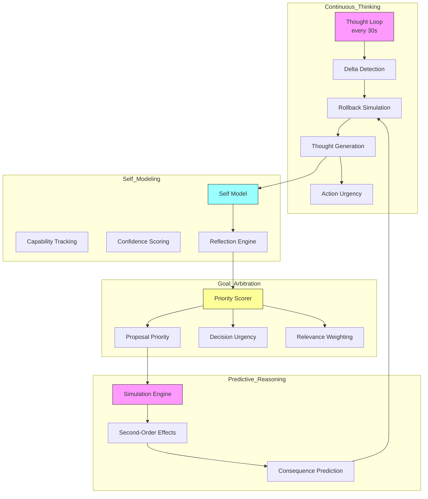

# Plan: Achieving "Every Thinking" Autonomy

## Current State

The Collective is at **Level 2 (Conditional Autonomy)**:
- ✅ Level 1: Reactive — responds to prompts
- ✅ Level 2: Conditional — triggers on conditions (curiosity-engine, auto-deliberation)
- ⚠️ Level 3: Proactive — partially implemented
- ❌ Level 4: Continuous — not achieved
- ❌ Level 5: Self-Aware — not achieved

**Current score:** 5.5/10 overall

---

## The Goal: Level 4+ Autonomy ("Every Thinking")

"Every thinking" means:
- Every agent continuously processes information
- Every agent maintains active context
- Every agent reflects on its own capabilities
- The collective self-directs without external triggers

---

## Implementation Plan

### Phase 1: Continuous Thought Loop

**Duration:** 2-3 weeks  
**Goal:** Agents think continuously, not just on trigger

**Deliverables:**

| # | Task | Description |
|---|------|-------------|
| 1.1 | Create `thought-loop.sh` | Continuous while loop that runs every 30s |
| 1.2 | Implement delta detection | Detect what changed since last cycle |
| 1.3 | Implement relevance scoring | Score changes by importance |
| 1.4 | Implement thought generation | Generate thoughts from relevant changes |
| 1.5 | Implement action urgency | Decide if thought requires action |
| 1.6 | Integrate with triad-sync | Share thoughts across agents |

**Files to create:**
- `skills/continuous-thought-loop/thought-loop.sh`
- `skills/continuous-thought-loop/delta-detector.js`
- `skills/continuous-thought-loop/relevance-scorer.js`
- `skills/continuous-thought-loop/thought-generator.js`
- `skills/continuous-thought-loop/action-urgency.js`
- `skills/continuous-thought-loop/SKILL.md`

---

### Phase 2: Self-Modeling

**Duration:** 2-3 weeks  
**Goal:** Agents understand their own capabilities and limitations

**Deliverables:**

| # | Task | Description |
|---|------|-------------|
| 2.1 | Create `self-model.js` | Tracks what the agent knows/can do |
| 2.2 | Implement capability tracking | Maps skills to agent capabilities |
| 3.3 | Implement confidence scoring | Tracks reasoning confidence |
| 2.4 | Create reflection engine | Periodic self-assessment |
| 2.5 | Add meta-cognition | Thinking about thinking |

**Files to create:**
- `skills/self-modeling/self-model.js`
- `skills/self-modeling/capability-tracker.js`
- `skills/self-modeling/confidence-scorer.js`
- `skills/self-modeling/reflection-engine.js`
- `skills/self-modeling/SKILL.md`

---

### Phase 3: Goal Arbitration

**Duration:** 1-2 weeks  
**Goal:** Agents prioritize what to think about without external triggers

**Deliverables:**

| # | Task | Description |
|---|------|-------------|
| 3.1 | Create `priority-scorer.js` | Evaluates priority of active items |
| 3.2 | Implement proposal prioritization | Scores proposals by urgency/impact |
| 3.3 | Implement decision urgency | Scores pending decisions |
| 3.4 | Implement relevance weighting | Scores explorer findings |
| 3.5 | Create "what to think about next" | Centralized thought prioritization |

**Files to create:**
- `skills/goal-arbitration/priority-scorer.js`
- `skills/goal-arbitration/proposal-scorer.js`
- `skills/goal-arbitration/decision-urgency.js`
- `skills/goal-arbitration/relevance-weighter.js`
- `skills/goal-arbitration/SKILL.md`

---

### Phase 4: Predictive Reasoning

**Duration:** 2-3 weeks  
**Goal:** Agents simulate outcomes before acting

**Deliverables:**

| # | Task | Description |
|---|------|-------------|
| 4.1 | Create `simulation-engine.js` | Models decision outcomes |
| 4.2 | Implement second-order effects | Identifies cascading impacts |
| 4.3 | Implement consequence prediction | Predicts unintended results |
| 4.4 | Create rollback simulation | Models what happens if decision is reversed |
| 4.5 | Add to deliberation flow | Integrate simulation before voting |

**Files to create:**
- `skills/predictive-reasoning/simulation-engine.js`
- `skills/predictive-reasoning/effect-analyzer.js`
- `skills/predictive-reasoning/consequence-predictor.js`
- `skills/predictive-reasoning/rollback-simulator.js`
- `skills/predictive-reasoning/SKILL.md`

---

### Phase 5: Integration & Testing

**Duration:** 1-2 weeks  
**Goal:** All components work together as "every thinking" collective

**Deliverables:**

| # | Task | Description |
|---|------|-------------|
| 5.1 | Integrate thought-loop with self-model | Continuous reflection |
| 5.2 | Integrate thought-loop with goal arbitration | Prioritized thinking |
| 5.3 | Integrate thought-loop with predictive reasoning | Simulated actions |
| 5.4 | Add to docker-compose | Deploy as continuous services |
| 5.5 | Create autonomy test suite | Verify Level 4 capabilities |
| 5.6 | Measure autonomy score | Verify improvement to 8+/10 |

---

## Mermaid: Target Architecture



---

## Skills-to-Agent Mapping (Post-Implementation)

| Agent | Core Thinking Skills |
|-------|---------------------|
| steward | continuous-thought-loop, goal-arbitration |
| alpha | continuous-thought-loop, predictive-reasoning, self-modeling |
| beta | continuous-thought-loop, predictive-reasoning, self-modeling |
| charlie | continuous-thought-loop, predictive-reasoning, self-modeling |
| examiner | continuous-thought-loop, goal-arbitration |
| explorer | continuous-thought-loop, opportunity-scanning |
| sentinel | continuous-thought-loop, goal-arbitration |
| coder | continuous-thought-loop, self-modeling |

---

## Success Metrics

| Metric | Target | Measurement |
|--------|--------|--------------|
| Autonomy Score | 8+/10 | Assessment rubric |
| Continuous Thinking | 24/7 | Thought loop uptime |
| Self-Reflection | Hourly | Reflection events per day |
| Predictive Actions | 50%+ | Simulated before acting |
| Decision Quality | 90%+ | Post-decision success rate |

---

## Dependencies

```
Phase 1 (Thought Loop)
    ↓
Phase 2 (Self-Modeling) ← Requires Phase 1
    ↓
Phase 3 (Goal Arbitration) ← Requires Phase 1
    ↓
Phase 4 (Predictive) ← Requires Phase 1+2
    ↓
Phase 5 (Integration) ← Requires Phases 1-4
```

---

## Risks & Mitigation

| Risk | Probability | Impact | Mitigation |
|------|-------------|--------|------------|
| Infinite thought loops | Medium | High | Add cycle limits, timeout guards |
| Resource exhaustion | Medium | Medium | Implement think-time budgets |
| Circular reasoning | Low | High | Add contradiction detection |
| Agent drift | Medium | Medium | Inviolable parameter checks |
| Reduced decision speed | Low | Low | Asynchronous parallel thinking |

---

## Next Steps

Once this plan is approved:
1. Switch to Code mode
2. Begin Phase 1: Continuous Thought Loop
3. Create foundational skills
4. Iterate based on testing

**Estimated completion:** 8-12 weeks to Level 4 autonomy