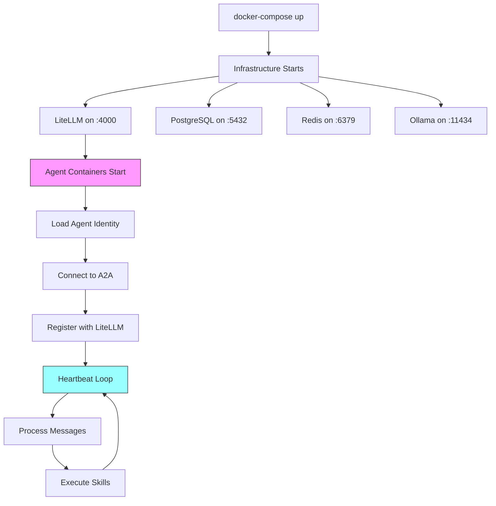

# Heretek OpenClaw Deployment Fix Plan

## Executive Summary

This plan addresses the 3 critical issues preventing A2A deployment:

1. **docker-compose.agent.yml** — Agent containers lack proper file mounting and use placeholder startup
2. **Agent Runtime** — No actual OpenClaw client to process A2A messages
3. **Health Checks** — No heartbeat scripts for agent monitoring

---

## Phase 1: Update docker-compose.agent.yml

### Goal
Configure proper volume mounts for agent identity files and update startup behavior.

### Tasks

#### 1.1 Add Agent File Mounts

Update each agent service in `docker-compose.agent.yml` to mount their identity files:

```yaml
# Example for agent-steward
agent-steward:
  volumes:
    - ./agents/steward:/workspace:ro  # Mount agent-specific files
    - steward_workspace:/workspace
    - ../heretek-skills/skills:/openclaw/skills:ro
    - ./openclaw.json:/openclaw/config.json:ro
```

#### 1.2 Fix Network Dependencies

Ensure all agents depend on the correct services:

```yaml
depends_on:
  litellm:
    condition: service_healthy
  postgres:
    condition: service_healthy
  redis:
    condition: service_healthy
  ollama:
    condition: service_healthy
```

#### 1.3 Add Health Check Configuration

Add health checks to each agent service:

```yaml
healthcheck:
  test: ["CMD", "wget", "-q", "--spider", "http://localhost:4000/health"]
  interval: 30s
  timeout: 10s
  retries: 3
  start_period: 60s
```

---

## Phase 2: Create Agent Runtime Entrypoint

### Goal
Replace placeholder startup with a real agent client that connects to LiteLLM A2A.

### Tasks

#### 2.1 Create Entrypoint Script

Create `agents/entrypoint.sh` that:
- Reads agent identity files into context
- Connects to LiteLLM A2A gateway
- Processes incoming messages
- Executes skills based on agent role

```bash
#!/bin/bash
# Agent Entrypoint — Connects to LiteLLM A2A

set -euo pipefail

AGENT_NAME="${AGENT_NAME:-steward}"
AGENT_ROLE="${AGENT_ROLE:-orchestrator}"
LITELLM_HOST="${LITELLM_HOST:-http://litellm:4000}"
LITELLM_MASTER_KEY="${LITELLM_MASTER_KEY:-}"

echo "Starting agent: $AGENT_NAME (role: $AGENT_ROLE)"
echo "LiteLLM Gateway: $LITELLM_HOST"

# Load agent identity into context
if [ -f "/workspace/IDENTITY.md" ]; then
    echo "Loaded identity from /workspace/IDENTITY.md"
fi

# Main loop: Poll for messages and process
while true; do
    # Check for incoming messages via A2A
    response=$(curl -s "$LITELLM_HOST/v1/agents/$AGENT_NAME/receive" \
        -H "Authorization: Bearer $LITELLM_MASTER_KEY" \
        2>/dev/null || echo '{"messages":[]}')
    
    message_count=$(echo "$response" | jq '.messages | length' 2>/dev/null || echo "0")
    
    if [ "$message_count" -gt 0 ]; then
        echo "Processing $message_count message(s)..."
        # Process each message (implementation needed)
    fi
    
    # Send heartbeat
    curl -s -X POST "$LITELLM_HOST/v1/agents/$AGENT_NAME/heartbeat" \
        -H "Authorization: Bearer $LITELLM_MASTER_KEY" \
        -H "Content-Type: application/json" \
        -d "{\"status\": \"alive\", \"timestamp\": \"$(date -Iseconds)\"}" \
        2>/dev/null || true
    
    sleep 60  # Heartbeat interval
done
```

#### 2.2 Create Agent Client Library

Create `agents/lib/agent-client.js` with:
- A2A message send/receive
- Skill execution framework
- Session state management

#### 2.3 Update Base Agent Service

Update the base `agent` service in docker-compose:

```yaml
agent:
  image: node:22-alpine
  working_dir: /workspace
  command: ["/openclaw/entrypoint.sh"]
  volumes:
    - ./entrypoint.sh:/openclaw/entrypoint.sh:ro
    - ./lib:/openclaw/lib:ro
    - agent_workspace:/workspace
    - ../heretek-skills/skills:/openclaw/skills:ro
    - ./openclaw.json:/openclaw/config.json:ro
```

---

## Phase 3: Add Health Check Scripts

### Goal
Implement heartbeat scripts based on the existing skills framework.

### Tasks

#### 3.1 Create Heartbeat Framework

Create `agents/scripts/heartbeat.sh` that implements:

```bash
#!/bin/bash
# Agent Heartbeat — Reports agent health to LiteLLM

AGENT_NAME="${AGENT_NAME:-steward}"
LITELLM_HOST="${LITELLM_HOST:-http://litellm:4000}"
LITELLM_MASTER_KEY="${LITELLM_MASTER_KEY:-}"

# Check workspace integrity
WORKSPACE_OK=true
for file in IDENTITY.md SOUL.md AGENTS.md; do
    if [ ! -f "/workspace/$file" ]; then
        WORKSPACE_OK=false
        break
    fi
done

# Report health status
curl -s -X POST "$LITELLM_HOST/v1/agents/$AGENT_NAME/heartbeat" \
    -H "Authorization: Bearer $LITELLM_MASTER_KEY" \
    -H "Content-Type: application/json" \
    -d "{
        \"status\": \"alive\",
        \"workspace_ok\": $WORKSPACE_OK,
        \"timestamp\": \"$(date -Iseconds)\",
        \"uptime_seconds\": $(($(date +%s) - START_TIME))
    }"
```

#### 3.2 Create Agent-Specific Heartbeats

| Agent | Heartbeat File | Interval |
|-------|----------------|----------|
| steward | [`steward-heartbeat.sh`](heretek-skills/skills/steward-orchestrator/SKILL.md:88) | 10 min |
| alpha/beta/charlie | [`triad-heartbeat.sh`](heretek-skills/skills/triad-heartbeat/SKILL.md) | 2 min |
| examiner | [`examiner-heartbeat.sh`](Tabula_Myriad/examiner/socratic-heartbeat.sh) | 2 min |
| sentinel | [`advocate-safety-heartbeat.sh`](Tabula_Myriad/scripts/advocate-safety-heartbeat.sh) | 2 min |
| explorer | [`explorer-intel.sh`](Tabula_Myriad/oracle/explorer-intel.sh) | 5 min |
| coder | (code activity) | On activity |

#### 3.3 Add Cron for Heartbeats

Update container startup to schedule heartbeats:

```bash
# Schedule heartbeat cron
echo "* * * * * /openclaw/scripts/heartbeat.sh >> /var/log/heartbeat.log 2>&1" | crontab -
crond -f &
```

---

## Phase 4: Integrate Skills into Agent Containers

### Goal
Ensure skills are properly available to each agent.

### Tasks

#### 4.1 Skills Volume Mount

Each agent container mounts the skills directory:

```yaml
volumes:
  - ../heretek-skills/skills:/openclaw/skills:ro
```

#### 4.2 Skills-to-Agent Mapping

Configure which skills each agent can access:

| Agent | Skills Directory | Skills Available |
|-------|------------------|-------------------|
| steward | `/openclaw/skills/steward-orchestrator/` | steward-orchestrator, triad-sync-protocol, fleet-backup |
| alpha | `/openclaw/skills/` | governance-modules, triad-sync-protocol, curiosity-engine |
| beta | `/openclaw/skills/` | governance-modules, triad-sync-protocol, curiosity-engine |
| charlie | `/openclaw/skills/` | governance-modules, triad-sync-protocol, curiosity-engine |
| examiner | `/openclaw/skills/` | triad-sync-protocol, gap-detector |
| explorer | `/openclaw/skills/` | curiosity-engine, opportunity-scanner, gap-detector |
| sentinel | `/openclaw/skills/` | governance-modules, detect-corruption, triad-signal-filter |
| coder | `/openclaw/skills/` | triad-sync-protocol |

#### 4.3 Skill Execution Framework

Create `agents/lib/execute-skill.sh`:

```bash
#!/bin/bash
# Execute Skill — Runs skill scripts within agent context

SKILL_NAME="$1"
shift
SKILL_ARGS="$@"

SKILL_PATH="/openclaw/skills/$SKILL_NAME"

if [ -d "$SKILL_PATH" ]; then
    # Execute main skill script
    if [ -f "$SKILL_PATH/${SKILL_NAME}.sh" ]; then
        "$SKILL_PATH/${SKILL_NAME}.sh" $SKILL_ARGS
    elif [ -f "$SKILL_PATH/SKILL.md" ]; then
        echo "Skill $SKILL_NAME is documentation-only"
    fi
else
    echo "Skill $SKILL_NAME not found"
    exit 1
fi
```

---

## Phase 5: Test and Verify Deployment

### Tasks

#### 5.1 Create Test Suite

Create `agents/tests/deployment-test.sh`:

```bash
#!/bin/bash
# Deployment Verification Test Suite

set -euo pipefail

LITELLM_HOST="${LITELLM_HOST:-http://localhost:4000}"

echo "=== Heretek OpenClaw Deployment Test ==="

# Test 1: Infrastructure Health
echo "[1/5] Testing infrastructure..."
curl -sf "$LITELLM_HOST/health" || exit 1

# Test 2: Agent Registration
echo "[2/5] Testing agent registration..."
for agent in steward alpha beta charlie examiner explorer sentinel coder; do
    curl -s "$LITELLM_HOST/v1/agents" | jq -e ".data[] | select(.name==\"$agent\")" > /dev/null
    echo "  ✓ $agent registered"
done

# Test 3: Inter-Agent Messaging
echo "[3/5] Testing A2A messaging..."
curl -s -X POST "$LITELLM_HOST/v1/agents/steward/send" \
    -H "Content-Type: application/json" \
    -d '{"content": "test", "to": "alpha"}' | jq -e ".success"

# Test 4: Skills Execution
echo "[4/5] Testing skills..."
# Execute a test skill

# Test 5: Heartbeat
echo "[5/5] Testing heartbeats..."
for agent in steward alpha beta charlie examiner explorer sentinel coder; do
    curl -s -X POST "$LITELLM_HOST/v1/agents/$agent/heartbeat" \
        -d '{"status": "alive"}' | jq -e ".received"
    echo "  ✓ $agent heartbeat"
done

echo ""
echo "=== All Tests Passed ==="
```

#### 5.2 Create Deployment README

Document deployment steps in `agents/DEPLOYMENT.md`:

```markdown
# Heretek OpenClaw Agent Deployment

## Prerequisites

1. Docker and docker-compose installed
2. LiteLLM running with A2A enabled
3. Ollama with llama3.1 model pulled
4. PostgreSQL and Redis running

## Quick Start

```bash
# Start infrastructure
docker-compose up -d

# Start all agents
docker-compose -f docker-compose.agent.yml up -d

# Check status
docker-compose ps

# View logs
docker-compose logs -f agent-steward
```

## Verification

```bash
./agents/tests/deployment-test.sh
```
```

---

## Implementation Order

```
Phase 1 (docker-compose)
    ↓
Phase 2 (entrypoint)
    ↓
Phase 3 (health checks)
    ↓
Phase 4 (skills)
    ↓
Phase 5 (testing)
```

## Files to Create/Modify

| File | Action |
|------|--------|
| `docker-compose.agent.yml` | Modify - add mounts, health checks |
| `agents/entrypoint.sh` | Create - main agent loop |
| `agents/lib/agent-client.js` | Create - A2A client |
| `agents/lib/execute-skill.sh` | Create - skill execution |
| `agents/scripts/heartbeat.sh` | Create - heartbeat framework |
| `agents/tests/deployment-test.sh` | Create - test suite |
| `agents/DEPLOYMENT.md` | Create - documentation |

## Estimated Files: 7 new + 1 modified

---

## Mermaid: Deployment Flow



---

## Next Steps

Once this plan is approved, implementation can begin in Code mode.