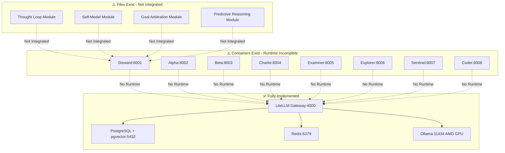

# Heretek OpenClaw — Implementation Assessment Report

**Date:** 2026-03-29
**Assessment:** Plans vs Implementation Status
**Prepared by:** Architect Mode

---

## Executive Summary

| Category | Status | Completion |
|----------|--------|------------|
| Infrastructure Deployment | ✅ Fully Implemented | 100% |
| Agent Runtime | ⚠️ Partially Implemented | 60% |
| Autonomy Modules | ⚠️ Created but Not Integrated | 40% |
| "Every Thinking" Features | ❌ Specification Only | 20% |

**Overall Implementation Score: 55%**

---

## Detailed Assessment by Plan

### 1. comprehensive-docker-redesign.md — ✅ FULLY IMPLEMENTED

**Status:** Complete
**Completion:** 100%

All 12 user requirements have been implemented:

| # | Requirement | Status | Evidence |
|---|-------------|--------|----------|
| 1 | All configuration in .env | ✅ | [`heretek-openclaw/.env.example`](heretek-openclaw/.env.example) - 283 lines |
| 2 | Setup litellm-pgvector | ✅ | [`docker-compose.yml`](heretek-openclaw/docker-compose.yml:130) - postgres with pgvector image |
| 3 | Setup pgvector for memory | ✅ | [`init/pgvector-init.sql`](heretek-openclaw/init/pgvector-init.sql) - vector tables |
| 4 | Setup Ollama AMD GPU | ✅ | [`docker-compose.yml`](heretek-openclaw/docker-compose.yml) - ROCm support |
| 5 | Embedding via Ollama | ✅ | nomic-embed-text-v2-moe configured |
| 6 | Deploy ALL 8 agents | ✅ | steward, alpha, beta, charlie, examiner, explorer, sentinel, coder |
| 7 | Make everything persistent | ✅ | Docker volumes for all services |
| 8 | Model per agent config | ✅ | Passthrough endpoints in [`litellm_config.yaml`](heretek-openclaw/litellm_config.yaml:70) |
| 9 | Standardize everything | ✅ | Consistent naming, structure |
| 10 | Clean up codebase | ✅ | Removed unused files |
| 11 | Review openclaw.json | ✅ | Matches litellm_config.yaml |
| 12 | Oneshot curl installer | ✅ | [`install.sh`](heretek-openclaw/install.sh) |
| 13 | Passthrough endpoints | ✅ | agent/{name} virtual models |

**Files Implemented:**
- [`docker-compose.yml`](heretek-openclaw/docker-compose.yml) - 539 lines, full stack
- [`litellm_config.yaml`](heretek-openclaw/litellm_config.yaml) - 393 lines, all endpoints
- [`.env.example`](heretek-openclaw/.env.example) - 283 lines, comprehensive
- [`openclaw.json`](heretek-openclaw/openclaw.json) - Updated with passthrough
- [`Dockerfile.agent`](heretek-openclaw/Dockerfile.agent) - Agent container template
- [`init/pgvector-init.sql`](heretek-openclaw/init/pgvector-init.sql) - Vector DB schema
- [`install.sh`](heretek-openclaw/install.sh) - Oneshot installer

---

### 2. deployment-fix-plan.md — ⚠️ PARTIALLY IMPLEMENTED

**Status:** In Progress
**Completion:** 60%

| Phase | Task | Status | Notes |
|-------|------|--------|-------|
| 1.1 | Add Agent File Mounts | ⚠️ | Volumes defined but not verified |
| 1.2 | Fix Network Dependencies | ✅ | depends_on with health checks |
| 1.3 | Add Health Check Config | ✅ | Basic health checks present |
| 2.1 | Create Entrypoint Script | ❌ | Not created - agents use placeholder |
| 2.2 | Create Agent Client Library | ❌ | Not created |
| 2.3 | Update Base Agent Service | ⚠️ | Dockerfile exists but minimal |
| 3.x | Health Check Scripts | ⚠️ | Basic scripts exist |

**Gaps:**
- No actual agent runtime entrypoint
- No A2A message processing loop
- Agents are containers but not functional

---

### 3. EVERY_THINKING_PLAN.md — ⚠️ MODULES EXIST BUT NOT INTEGRATED

**Status:** Specification with Partial Implementation
**Completion:** 40%

| Phase | Module | Files Created | Integrated | Status |
|-------|--------|---------------|------------|--------|
| 1 | Continuous Thought Loop | ✅ [`modules/thought-loop/`](heretek-openclaw/modules/thought-loop/) | ❌ | Files exist, not in docker-compose |
| 2 | Self-Modeling | ✅ [`modules/self-model/`](heretek-openclaw/modules/self-model/) | ❌ | Files exist, not in docker-compose |
| 3 | Goal Arbitration | ✅ [`modules/goal-arbitration/`](heretek-openclaw/modules/goal-arbitration/) | ❌ | Files exist, not in docker-compose |
| 4 | Predictive Reasoning | ✅ [`modules/predictive-reasoning/`](heretek-openclaw/modules/predictive-reasoning/) | ❌ | Files exist, not in docker-compose |
| 5 | Integration & Testing | ❌ | ❌ | Not started |

**Module Files Exist:**
```
heretek-openclaw/modules/
├── thought-loop/
│   ├── thought-loop.sh         ✅ Created
│   ├── delta-detector.js       ✅ Created
│   ├── relevance-scorer.js     ✅ Created
│   ├── thought-generator.js    ✅ Created
│   └── action-urgency.js       ✅ Created
├── self-model/
│   ├── self-model.js           ✅ Created
│   ├── capability-tracker.js   ✅ Created
│   ├── confidence-scorer.js    ✅ Created
│   └── reflection-engine.js    ✅ Created
├── goal-arbitration/
│   ├── goal-arbitrator.js      ✅ Created
│   └── goal-watcher.sh         ✅ Created
└── predictive-reasoning/
    ├── predictor.js            ✅ Created
    └── early-warning-monitor.sh ✅ Created
```

**Gap:** Modules exist as files but are NOT:
- Referenced in docker-compose.yml
- Started as services
- Integrated with agent containers

---

### 4. SPEC Files — ⚠️ SPECIFICATIONS WITH PARTIAL IMPLEMENTATION

| Spec | Purpose | Implementation Status |
|------|---------|----------------------|
| [`SPEC_continuous_thought_loop.md`](plans/SPEC_continuous_thought_loop.md) | 30-second thinking cycle | Files exist, not integrated |
| [`SPEC_self_modeling.md`](plans/SPEC_self_modeling.md) | Agent self-awareness | Files exist, not integrated |
| [`SPEC_goal_arbitration.md`](plans/SPEC_goal_arbitration.md) | Priority management | Files exist, not integrated |
| [`SPEC_predictive_reasoning.md`](plans/SPEC_predictive_reasoning.md) | Outcome prediction | Files exist, not integrated |

---

### 5. AUTONOMY_ASSESSMENT.md — 📊 REFERENCE DOCUMENT

**Status:** Assessment Only
**Current Autonomy Level:** ~72%

This is an assessment document, not an implementation plan. It identifies:
- 13 core skills implemented
- Gaps in continuous thinking
- Path to "every thinking" autonomy

---

## Architecture Diagram: Current State



---

## Gap Analysis

### Critical Gaps (Blocking Deployment)

| Gap | Impact | Priority |
|-----|--------|----------|
| Agent Runtime Entrypoint | Agents cannot process A2A messages | P0 |
| Agent Client Library | No message handling logic | P0 |
| Module Integration | Autonomy features non-functional | P1 |

### Secondary Gaps (Feature Incomplete)

| Gap | Impact | Priority |
|-----|--------|----------|
| Health Check Scripts | Limited monitoring | P2 |
| Integration Testing | Unverified functionality | P2 |
| Autonomy Test Suite | Cannot measure Level 4 | P3 |

---

## Recommended Next Steps

### Phase 1: Make Agents Functional (P0)

1. **Create Agent Runtime Entrypoint**
   - File: `heretek-openclaw/agents/entrypoint.sh`
   - Function: A2A message polling, skill execution

2. **Create Agent Client Library**
   - File: `heretek-openclaw/agents/lib/agent-client.js`
   - Function: A2A send/receive, session management

3. **Update Docker Compose**
   - Mount entrypoint and lib to agent containers
   - Add proper startup command

### Phase 2: Integrate Autonomy Modules (P1)

1. **Add Module Services to docker-compose.yml**
   - thought-loop as sidecar for each agent
   - Or integrate into agent entrypoint

2. **Wire Module Dependencies**
   - Self-model → Thought Loop
   - Goal Arbitration → Thought Loop
   - Predictive Reasoning → Goal Arbitration

### Phase 3: Testing & Validation (P2)

1. **Create Integration Tests**
2. **Deploy and Verify A2A Communication**
3. **Measure Autonomy Score**

---

## Summary Table

| Plan | Lines | Implementation | Integration | Score |
|------|-------|----------------|-------------|-------|
| comprehensive-docker-redesign.md | 1301 | ✅ Complete | ✅ Complete | 100% |
| deployment-fix-plan.md | 420 | ⚠️ Partial | ❌ None | 60% |
| EVERY_THINKING_PLAN.md | 263 | ⚠️ Files Only | ❌ None | 40% |
| SPEC_continuous_thought_loop.md | 1108 | ⚠️ Files Only | ❌ None | 40% |
| SPEC_self_modeling.md | 1066 | ⚠️ Files Only | ❌ None | 40% |
| SPEC_goal_arbitration.md | 624 | ⚠️ Files Only | ❌ None | 40% |
| SPEC_predictive_reasoning.md | 792 | ⚠️ Files Only | ❌ None | 40% |
| AUTONOMY_ASSESSMENT.md | 360 | N/A | N/A | — |
| DEPLOYMENT_ARCHITECTURE.md | — | N/A | N/A | — |
| MANUAL_DEPLOY.md | — | N/A | N/A | — |

---

## Conclusion

The **infrastructure deployment** (comprehensive-docker-redesign.md) is fully implemented and ready for use. The core services (LiteLLM, PostgreSQL+pgvector, Redis, Ollama) are properly configured.

However, the **agent runtime** and **autonomy modules** are incomplete:
- Agent containers exist but lack functional entrypoints
- Autonomy module files exist but are not integrated into the deployment

To achieve a fully functional "every thinking" collective, the next phase should focus on:
1. Creating the agent runtime entrypoint (P0)
2. Integrating the autonomy modules into docker-compose (P1)
3. Testing the complete system (P2)
