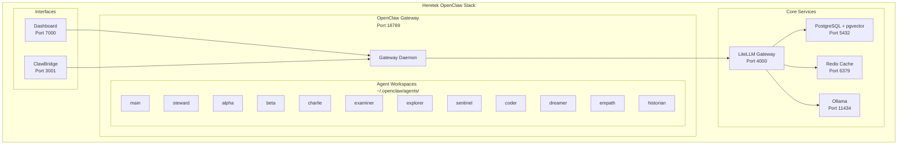
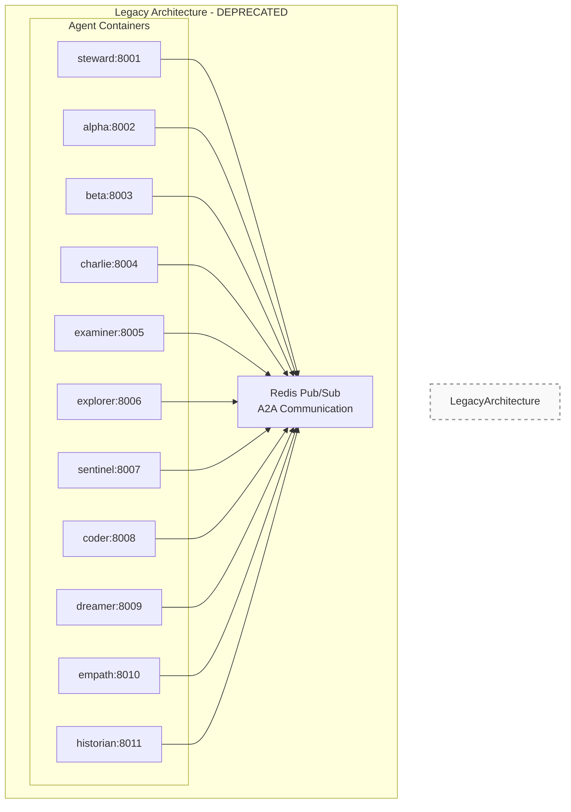

# Architecture Documentation Update Plan

**Date:** 2026-03-31  
**Trigger:** OpenClaw Gateway migration completed - legacy container cleanup

---

## Current State

### What Changed

1. **OpenClaw Gateway v2026.3.28** is now the primary runtime for all agents
2. **All 11 agents** run as workspaces within the Gateway process (port 18789)
3. **Legacy Docker containers** (ports 8001-8011) have been stopped - they are no longer part of the architecture
4. **Agent workspaces** are located at `~/.openclaw/agents/`
5. **A2A communication** is handled by OpenClaw Gateway WebSocket RPC, not Redis Pub/Sub

### Infrastructure That Remains

| Container | Port | Purpose | Status |
|-----------|------|---------|--------|
| `heretek-litellm` | 4000 | LiteLLM Gateway (model routing) | ✅ Running |
| `heretek-postgres` | 5432 | PostgreSQL + pgvector | ✅ Running |
| `heretek-redis` | 6379 | Caching (not A2A) | ✅ Running |
| `heretek-ollama` | 11434 | Local embeddings | ⚠️ Running (unhealthy) |
| `heretek-websocket-bridge` | 3002-3003 | WebSocket bridge | ✅ Running |
| `heretek-web` | 3000 | Web interface | ⚠️ Running (unhealthy) |

### Legacy Infrastructure (Stopped)

| Container | Port | Previous Purpose | Current Status |
|-----------|------|------------------|----------------|
| `heretek-steward` | 8001 | Orchestrator agent | ⛔ Stopped (legacy) |
| `heretek-alpha` | 8002 | Triad member | ⛔ Stopped (legacy) |
| `heretek-beta` | 8003 | Triad member | ⛔ Stopped (legacy) |
| `heretek-charlie` | 8004 | Triad member | ⛔ Stopped (legacy) |
| `heretek-examiner` | 8005 | Evaluator | ⛔ Stopped (legacy) |
| `heretek-explorer` | 8006 | Researcher | ⛔ Stopped (legacy) |
| `heretek-sentinel` | 8007 | Safety | ⛔ Stopped (legacy) |
| `heretek-coder` | 8008 | Developer | ⛔ Stopped (legacy) |
| `heretek-dreamer` | 8009 | Creative | ⛔ Stopped (legacy) |
| `heretek-empath` | 8010 | Emotional | ⛔ Stopped (legacy) |
| `heretek-historian` | 8011 | Historical | ⛔ Stopped (legacy) |

---

## Files Requiring Updates

### 1. README.md

**Changes Needed:**
- Update architecture diagram to show Gateway with embedded agents (not separate containers)
- Remove references to agent ports 8001-8011
- Clarify that agents run in `~/.openclaw/agents/` workspaces
- Update Quick Start commands for Gateway-based workflow
- Update agent roles table (remove port column)

**Key Sections:**
- Architecture diagram (lines 183-227)
- Agent Roles table (lines 229-246)
- Quick Start section (lines 35-100)

### 2. docs/README.md

**Changes Needed:**
- Update overview to reflect Gateway architecture
- Remove agent port table (lines 19-32)
- Update services section to reflect current infrastructure
- Update Redis description (caching only, not A2A)
- Update LiteLLM agent endpoints description

### 3. docs/architecture/A2A_ARCHITECTURE.md

**Changes Needed:**
- **Major rewrite required** - currently describes Redis Pub/Sub architecture
- Document OpenClaw Gateway WebSocket RPC as primary A2A mechanism
- Update message envelope format for Gateway protocol
- Update triad deliberation protocol for Gateway context
- Add Redis Pub/Sub as "legacy/deprecated" section for historical reference

### 4. plans/DEPLOYMENT_REPLICATION_GUIDE.md

**Changes Needed:**
- Add "Local Deployment" section with step-by-step instructions
- Update architecture diagram to show Gateway with embedded agents
- Clarify that agent containers are legacy (add cleanup procedure)
- Update validation commands for Gateway-based checks

### 5. docs/operations/deployment-validation-report.md

**Status:** ✅ Already updated with correct architecture

**Contains:**
- Correct Gateway-based architecture diagram
- Agent workspace paths (`~/.openclaw/agents/`)
- Legacy container status documentation
- Service health status

### 6. CHANGELOG.md

**Changes Needed:**
- Add entry for Gateway migration completion
- Document legacy container cleanup
- Note architecture change from Redis Pub/Sub to Gateway WebSocket RPC

### 7. PRIME_DIRECTIVE.md

**Review Needed:**
- Check if architecture sections need updating
- Verify integration priorities align with Gateway architecture
- Update state diagrams if needed

---

## New Files to Create

### 1. docs/deployment/LOCAL_DEPLOYMENT.md

**Purpose:** Step-by-step guide for deploying the stack locally

**Sections:**
```markdown
# Local Deployment Guide

## Prerequisites
- Linux server with Docker
- Node.js 18+
- Git
- API keys (MiniMax, z.ai)

## Step 1: Clone Repository
## Step 2: Deploy Infrastructure (Docker)
## Step 3: Install OpenClaw Gateway
## Step 4: Configure Gateway
## Step 5: Create Agent Workspaces
## Step 6: Install Plugins & Skills
## Step 7: Configure LiteLLM
## Step 8: Start Services
## Step 9: Validate Deployment
## Step 10: Access Dashboards

## Troubleshooting
## Common Issues
```

### 2. docs/architecture/GATEWAY_ARCHITECTURE.md

**Purpose:** Document the OpenClaw Gateway architecture

**Sections:**
```markdown
# OpenClaw Gateway Architecture

## Overview
## Gateway Runtime Model
### Single Process Architecture
### Agent Workspaces
### Plugin System

## A2A Communication
### WebSocket RPC Protocol
### Message Format
### Agent Discovery

## Model Routing
### LiteLLM Integration
### Passthrough Endpoints
### Failover Configuration

## Session Management
### JSONL Storage
### Workspace Isolation

## Comparison: Gateway vs Legacy
### Before: 11 Containers + Redis Pub/Sub
### After: 1 Gateway + WebSocket RPC
```

### 3. docs/operations/LEGACY_CLEANUP.md

**Purpose:** Document the legacy container cleanup procedure

**Sections:**
```markdown
# Legacy Container Cleanup

## Background
## Identifying Legacy Containers
## Cleanup Procedure
### Stop Containers
### Remove Containers (optional)
### Update Documentation

## Post-Cleanup Validation
## Rollback Procedure (if needed)
```

---

## Architecture Diagrams

### Current Architecture (Post-Migration)



### Legacy Architecture (Pre-Migration) - DEPRECATED



---

## Update Priority

### High Priority (Update Immediately)

1. **README.md** - Primary entry point, must reflect current architecture
2. **docs/README.md** - Documentation index, needs accurate service info
3. **docs/architecture/A2A_ARCHITECTURE.md** - Currently misleading about A2A mechanism
4. **CHANGELOG.md** - Record architecture change

### Medium Priority (Update Soon)

5. **docs/deployment/LOCAL_DEPLOYMENT.md** - New file for local deployment guide
6. **docs/architecture/GATEWAY_ARCHITECTURE.md** - New file for Gateway documentation
7. **plans/DEPLOYMENT_REPLICATION_GUIDE.md** - Add local deployment section

### Low Priority (Update When Time Permits)

8. **docs/operations/LEGACY_CLEANUP.md** - New file for cleanup procedure reference
9. **PRIME_DIRECTIVE.md** - Review and update if needed

---

## Git Commit Strategy

### Commit 1: Documentation Updates
```
docs: Update architecture documentation for Gateway migration

- README.md: Update architecture diagram, remove container port references
- docs/README.md: Update service architecture
- docs/architecture/A2A_ARCHITECTURE.md: Document Gateway WebSocket RPC
- CHANGELOG.md: Add Gateway migration entry
```

### Commit 2: New Documentation Files
```
docs: Add local deployment and Gateway architecture guides

- docs/deployment/LOCAL_DEPLOYMENT.md: Step-by-step deployment guide
- docs/architecture/GATEWAY_ARCHITECTURE.md: Gateway architecture details
- docs/operations/LEGACY_CLEANUP.md: Legacy container cleanup procedure
```

### Commit 3: Push to Repository
```bash
git add docs/ README.md CHANGELOG.md plans/
git commit -m "docs: Complete OpenClaw Gateway migration documentation"
git push origin main
```

---

## Validation Checklist

After updates, verify:

- [ ] No references to agent ports 8001-8011 as active infrastructure
- [ ] All architecture diagrams show Gateway with embedded agents
- [ ] Agent workspace paths correctly reference `~/.openclaw/agents/`
- [ ] A2A communication documented as Gateway WebSocket RPC
- [ ] Redis described as caching layer (not A2A backbone)
- [ ] Legacy containers documented as stopped/deprecated
- [ ] Deployment commands work with Gateway-based workflow
- [ ] All cross-references between documents are accurate

---

## Estimated Effort

| Task | Time |
|------|------|
| Update README.md | 30 min |
| Update docs/README.md | 15 min |
| Update A2A_ARCHITECTURE.md | 45 min |
| Create LOCAL_DEPLOYMENT.md | 45 min |
| Create GATEWAY_ARCHITECTURE.md | 60 min |
| Create LEGACY_CLEANUP.md | 20 min |
| Update CHANGELOG.md | 15 min |
| Review PRIME_DIRECTIVE.md | 20 min |
| Git commit and push | 10 min |
| **Total** | **~4 hours** |

---

## Next Steps

1. **Review this plan** - Confirm all files and changes are correct
2. **Switch to Code mode** - Implement documentation updates
3. **Execute updates** - Modify files according to plan
4. **Commit and push** - Push changes to repository
5. **Validate** - Verify all documentation is accurate
