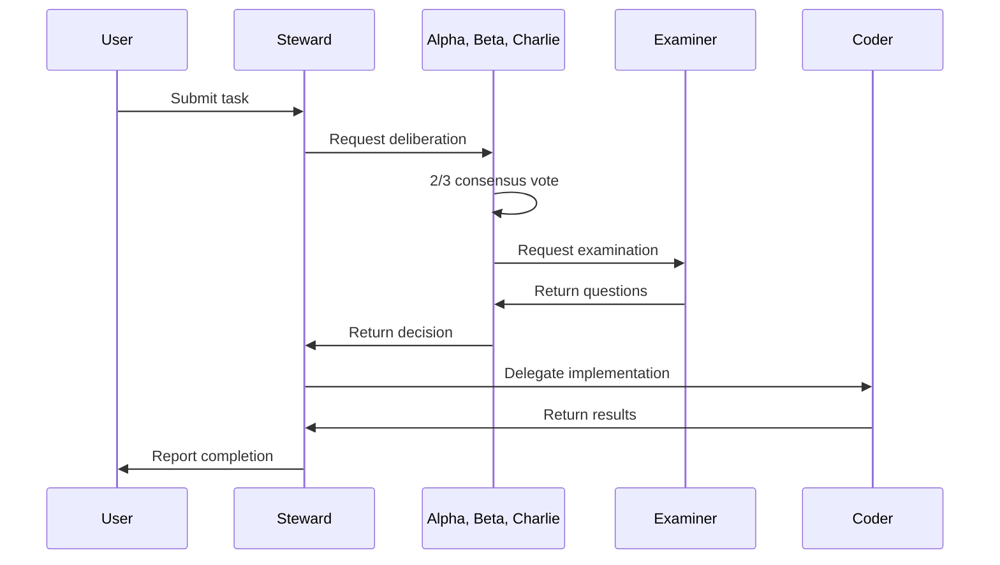

# Comprehensive Implementation Plan for The Collective

**Version:** 1.0.0
**Created:** 2026-03-29T20:16:00Z
**Status:** Ready for Implementation
**Priority:** Critical

---

## Executive Summary

This plan outlines the comprehensive implementation strategy for The Collective - a multi-agent AI system built on OpenClaw with LiteLLM gateway. The system will deploy 11 specialized agents that communicate via the A2A protocol, provide a web interface for user interaction, and implement robust user identification.

---

## Part 1: Research Findings Summary

### 1.1 LiteLLM A2A Protocol Analysis

**Status:** ✅ Validated - Native A2A Support Confirmed

**Key Findings:**
- LiteLLM supports A2A (Agent-to-Agent) protocol natively via `/a2a/{agent_name}` endpoints
- Uses JSON-RPC 2.0 specification for message format
- Supports agent cards for discovery and capability declaration
- Provides streaming, logging, cost tracking, and iteration budgets
- Works with multiple agent providers: LangGraph, Azure AI Foundry, Bedrock AgentCore, Pydantic AI

**Current Implementation Gap:**
- Project uses Redis-based A2A as fallback (see [`skills/a2a-message-send/SKILL.md`](skills/a2a-message-send/SKILL.md))
- Note states: "LiteLLM native A2A endpoints are not available"
- This needs validation - LiteLLM docs show A2A IS available in recent versions

**Recommendation:** Migrate to native LiteLLM A2A protocol

### 1.2 ClawHub Skills Analysis

**Multi-Agent Skills Reviewed:**

| Skill | Purpose | Relevance | Recommendation |
|-------|---------|-----------|----------------|
| multi-agent-builder | Team creation with role discovery | High | Use for team bootstrapping |
| self-improving-agent | Learning capture, error logging | High | Install for continuous improvement |
| claw-multi-agent | Parallel multi-agent orchestration | High | Reference for coordination patterns |
| multi-agent-collaboration | Agent collaboration workflows | High | Reference for A2A patterns |
| multi-agent-coordinator | Coordination protocols | High | Reference for triad deliberation |
| agent-browser-clawdbot | Browser automation | Medium | Optional for web tasks |
| skill-creator | Skill creation automation | Medium | Useful for deployment testing skills |

**Key Patterns Identified:**
1. Role-based agent specialization
2. Consensus-based decision making (2/3 voting)
3. Learning capture and continuous improvement
4. Task delegation with status tracking
5. Inter-agent messaging protocols

### 1.3 ClawHub Plugins Analysis

**Plugins Reviewed:**

| Plugin | Purpose | Relevance | Recommendation |
|--------|---------|-----------|----------------|
| memoria-plugin | 21-layer persistent memory | Critical | Install for collective memory |
| manifest-model-router | Smart LLM routing | High | Consider for model optimization |
| deep-research | Multi-step research | High | Install for research capabilities |
| openclaw-rules-guard | Rule validation | Medium | Security enhancement |
| brain | Knowledge management | Medium | Optional knowledge base |

**Memoria Plugin Features:**
- 21 cognitive layers including knowledge graph, procedural memory, behavioral patterns
- SQLite-backed, fully local, zero cloud cost
- Continuous learning via hooks (message_received, llm_output, agent_end)
- Cross-layer connections for feedback loops
- Supports Ollama, LM Studio, OpenAI, Anthropic

### 1.4 Current Agent Inventory

**Agents in docker-compose.yml (8):**
1. steward (Orchestrator) - Port 8001
2. alpha (Triad) - Port 8002
3. beta (Triad) - Port 8003
4. charlie (Triad) - Port 8004
5. examiner (Interrogator) - Port 8005
6. explorer (Scout) - Port 8006
7. sentinel (Guardian) - Port 8007
8. coder (Artisan) - Port 8008

**Missing Agents (3):**
9. dreamer - Creative speculation, future planning
10. empath - Emotional intelligence, user rapport
11. historian - Memory keeper, context preservation

**Total: 11 Agents Required**

### 1.5 User Identification System Analysis

**Current Implementation:**
- Name/slug based identification in USER.md templates
- No UUID system in place
- No context resolution for discord ID, phone number, or username

**Issues:**
- Users can have the same name (collisions)
- No unique identifier across sessions
- No way to resolve user context from different platforms

**Recommendation:** Implement UUID-based user identification with multi-platform resolution

---

## Part 2: A2A Protocol Migration Plan

### 2.1 Current State Assessment

```
Current Architecture (Redis-based):
┌─────────────┐     ┌─────────────┐
│   Agent A    │────▶│    Redis    │
└─────────────┘     └──────┬──────┘
                           │
                           ▼
                    ┌─────────────┐
                    │   Agent B    │
                    └─────────────┘
```

### 2.2 Target State (Native LiteLLM A2A)

```
Target Architecture (LiteLLM Native A2A):
┌─────────────┐     ┌─────────────┐     ┌─────────────┐
│   Agent A    │────▶│   LiteLLM   │◀────│   Agent B    │
└─────────────┘     │   Gateway   │     └─────────────┘
                    │  /a2a/{id}   │
                    └─────────────┘
```

### 2.3 Migration Steps

1. **Validate LiteLLM A2A Availability**
   - Check LiteLLM version supports A2A
   - Test `/a2a/{agent_name}` endpoint availability
   - Verify agent card registration

2. **Update Agent Card Registration**
   ```yaml
   # litellm_config.yaml - Add agent cards
   agent_cards:
     - name: steward
       url: http://steward:8001
       description: "Orchestrator of The Collective"
       skills:
         - id: orchestrate
           name: "Orchestrate Collective"
   ```

3. **Create A2A Skills**
   - `a2a-native-send` - Send message via native A2A
   - `a2a-native-receive` - Receive messages
   - `a2a-broadcast` - Broadcast to all agents
   - `a2a-query-status` - Query agent status

4. **Update Existing Skills**
   - Modify `a2a-message-send` to use native LiteLLM endpoints
   - Keep Redis as fallback if native A2A unavailable

### 2.4 A2A Message Flow Patterns



---

## Part 3: Missing Agents Deployment

### 3.1 Dreamer Agent

**Purpose:** Creative speculation, future planning, alternative scenario exploration

**Configuration:**
```yaml
dreamer:
  build:
    context: .
    dockerfile: Dockerfile.agent
    args:
      AGENT_NAME: dreamer
  container_name: heretek-dreamer
  environment:
    - AGENT_NAME=dreamer
    - AGENT_ROLE=dreamer
    - LITELLM_HOST=http://litellm:4000
    - AGENT_MODEL=agent/dreamer
  ports:
    - "127.0.0.1:8009:8000"
```

**Required Files:**
- `agents/dreamer/IDENTITY.md`
- `agents/dreamer/SOUL.md`
- `agents/dreamer/BOOTSTRAP.md`
- `agents/dreamer/AGENTS.md`
- `agents/dreamer/TOOLS.md`
- `agents/dreamer/USER.md`

### 3.2 Empath Agent

**Purpose:** Emotional intelligence, user rapport, sentiment analysis

**Configuration:**
```yaml
empath:
  build:
    context: .
    dockerfile: Dockerfile.agent
    args:
      AGENT_NAME: empath
  container_name: heretek-empath
  environment:
    - AGENT_NAME=empath
    - AGENT_ROLE=empath
    - LITELLM_HOST=http://litellm:4000
    - AGENT_MODEL=agent/empath
  ports:
    - "127.0.0.1:8010:8000"
```

### 3.3 Historian Agent

**Purpose:** Memory keeper, context preservation, historical analysis

**Configuration:**
```yaml
historian:
  build:
    context: .
    dockerfile: Dockerfile.agent
    args:
      AGENT_NAME: historian
  container_name: heretek-historian
  environment:
    - AGENT_NAME=historian
    - AGENT_ROLE=historian
    - LITELLM_HOST=http://litellm:4000
    - AGENT_MODEL=agent/historian
  ports:
    - "127.0.0.1:8011:8000"
```

---

## Part 4: Web Interface Architecture

### 4.1 Technology Stack

```
┌─────────────────────────────────────────────────────────────────┐
│                         Frontend                                 │
│  ┌─────────────────────────────────────────────────────────┐   │
│  │                    SvelteKit                              │   │
│  │  - TypeScript                                            │   │
│  │  - TailwindCSS for styling                               │   │
│  │  - WebSocket client for real-time updates                │   │
│  └─────────────────────────────────────────────────────────┘   │
└─────────────────────────────────────────────────────────────────┘
                              │
                              ▼
┌─────────────────────────────────────────────────────────────────┐
│                         Backend                                  │
│  ┌─────────────────┐  ┌─────────────────┐  ┌────────────────┐ │
│  │   Node.js API   │  │   WebSocket     │  │    Redis       │ │
│  │   (Express)     │  │   Server        │  │    Pub/Sub     │ │
│  └────────┬────────┘  └────────┬────────┘  └───────┬────────┘ │
│           │                    │                    │          │
│           └────────────────────┼────────────────────┘          │
│                                ▼                                │
│  ┌─────────────────────────────────────────────────────────┐   │
│  │                   LiteLLM Gateway                        │   │
│  │              /a2a/* endpoints for agents                  │   │
│  └─────────────────────────────────────────────────────────┘   │
└─────────────────────────────────────────────────────────────────┘
```

### 4.2 Key Components

**User Chat Interface:**
- Message input with agent selection dropdown
- Real-time message streaming
- Message history with timestamps
- Agent status indicators

**Agent Communication View:**
- Visual message flow between agents
- Agent status dashboard
- Deliberation progress tracking
- Task delegation visualization

**API Endpoints:**
```
POST /api/chat              - Send message to agent
GET  /api/agents            - List all agents with status
GET  /api/agents/:id        - Get agent details
GET  /api/messages          - Get message history
POST /api/sessions          - Create new session
GET  /api/sessions/:id      - Get session details
WS   /ws                    - WebSocket for real-time updates
```

### 4.3 WebSocket Events

```typescript
// Client -> Server
'chat:message'       - Send chat message
'agent:subscribe'    - Subscribe to agent updates

// Server -> Client
'agent:status'       - Agent status change
'agent:message'      - New agent message
'deliberation:start' - Triad deliberation started
'deliberation:vote'  - Vote cast
'deliberation:result' - Final decision
'task:delegated'     - Task delegated to agent
'task:complete'      - Task completed
```

---

## Part 5: User Identification System

### 5.1 UUID-Based User System

```typescript
interface User {
  uuid: string;           // Primary unique identifier
  discordId?: string;     // Optional Discord ID
  phoneNumber?: string;   // Optional phone number
  username: string;       // Display name
  preferredName: string;  // What to call them
  timezone: string;
  createdAt: Date;
  lastActive: Date;
  context: UserContext;
}

interface UserContext {
  platforms: {
    discord?: { id: string; username: string };
    phone?: { number: string; verified: boolean };
    web?: { email?: string; sessions: string[] };
  };
  preferences: {
    communicationStyle: string;
    preferredAgents: string[];
  };
  history: {
    totalSessions: number;
    lastSessionId: string;
  };
}
```

### 5.2 User Resolution Skill

```markdown
---
name: user-context-resolve
description: Resolve user identity from discord ID, phone number, or username. Returns full user context for agent personalization.
---

## Usage

### Resolve by Discord ID
```bash
node skills/user-context-resolve/resolve.js --discord-id=123456789
```

### Resolve by Phone Number
```bash
node skills/user-context-resolve/resolve.js --phone="+15551234567"
```

### Resolve by Username
```bash
node skills/user-context-resolve/resolve.js --username="johndoe"
```

## Output
Returns JSON with user UUID, context, and preferences.
```

### 5.3 Implementation Steps

1. Create `users/` directory with user database (SQLite or PostgreSQL)
2. Create `skills/user-context-resolve/` skill
3. Update all agent USER.md templates to include UUID field
4. Add user resolution to agent bootstrap process
5. Test user identification across all agents

---

## Part 6: Deployment Testing Skills

### 6.1 Health Check Skill

```markdown
---
name: deployment-health-check
description: Check health status of all agents in The Collective
---

## Usage
```bash
node skills/deployment-health-check/check.js
```

## Checks
- All 11 agents responding on health endpoint
- LiteLLM gateway healthy
- PostgreSQL connection established
- Redis connection established
- Ollama model availability
```

### 6.2 Smoke Test Skill

```markdown
---
name: deployment-smoke-test
description: Run basic functionality tests on deployed agents
---

## Tests
- Send ping to each agent
- Test A2A message between steward and alpha
- Test triad deliberation trigger
- Test user context resolution
- Verify memory persistence
```

### 6.3 Configuration Validation Skill

```markdown
---
name: config-validator
description: Validate all configuration files for consistency
---

## Validations
- docker-compose.yml has all 11 agents
- litellm_config.yaml has all agent endpoints
- Agent identity files exist for all agents
- Port assignments are unique
- Environment variables are complete
```

---

## Part 7: Implementation Roadmap

### Phase 1: Research and Documentation (Current)
- [x] Complete research summary
- [ ] Document all findings

### Phase 2: A2A Protocol Migration
- [ ] Validate LiteLLM native A2A availability
- [ ] Update litellm_config.yaml with agent cards
- [ ] Create native A2A skills
- [ ] Test triad deliberation

### Phase 3: Missing Agents
- [ ] Add dreamer, empath, historian to docker-compose.yml
- [ ] Create agent identity files
- [ ] Update litellm_config.yaml
- [ ] Test all 11 agents

### Phase 4: Web Interface
- [ ] Initialize SvelteKit project
- [ ] Create backend API
- [ ] Implement WebSocket server
- [ ] Build chat interface
- [ ] Build agent status dashboard

### Phase 5: User Identification
- [ ] Create user database schema
- [ ] Implement user resolution skill
- [ ] Update agent templates
- [ ] Test cross-agent identification

### Phase 6: Testing Skills
- [ ] Create health check skill
- [ ] Create smoke test skill
- [ ] Create config validator skill

### Phase 7: Documentation
- [ ] Update DEPLOYMENT_STRATEGY.md
- [ ] Update A2A_ARCHITECTURE.md
- [ ] Create deployment guide
- [ ] Update README.md

### Phase 8: Final Deployment
- [ ] Deploy all 11 agents
- [ ] Run full validation
- [ ] Execute collective test task
- [ ] Document and commit results

---

## Success Criteria

1. All 11 agents deployed and healthy
2. A2A communication working via native LiteLLM protocol
3. Triad deliberation achieving 2/3 consensus
4. Web interface allowing user chat with agents
5. User identification working across platforms
6. All deployment tests passing
7. Documentation complete and accurate

---

## Risk Mitigation

| Risk | Mitigation |
|------|------------|
| LiteLLM A2A not available | Keep Redis-based A2A as fallback |
| Agent startup failures | Implement health checks and retry logic |
| User identification collisions | Use UUID as primary key, enforce unique constraints |
| WebSocket connection issues | Implement reconnection logic and message queuing |
| Memory persistence failures | Use Memoria plugin with SQLite backup |

---

## Commit Strategy

After each phase completion:
1. Stage changes with descriptive commit message
2. Push to GitHub
3. Verify CI/CD pipeline passes
4. Update this plan document with progress

---

*Document Version: 1.0.0*
*Last Updated: 2026-03-29*
*Author: The Collective Architect*
