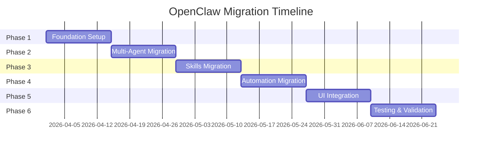

# Executive Summary: OpenClaw Migration

## Directive

**Migrate the Heretek OpenClaw collective from a custom-built agent framework to the official OpenClaw agent framework.**

This migration leverages OpenClaw's mature Gateway architecture instead of maintaining our own Redis Pub/Sub-based A2A protocol, significantly reducing maintenance burden while gaining access to 30+ messaging channels, comprehensive tool systems, and production-ready features.

---

## Current State

The Heretek OpenClaw deployment consists of:
- **15+ Docker containers** (11 agents + infrastructure + bridge + web UI)
- **Custom Redis Pub/Sub A2A protocol** for inter-agent communication
- **LiteLLM Gateway** for model routing with agent passthrough endpoints
- **20+ custom skills** for autonomy, governance, and operations
- **Custom consciousness modules** implementing Global Workspace Theory
- **SvelteKit web interface** for dashboard and chat

**Key Limitation**: Building our own framework instead of expanding on OpenClaw's work creates significant maintenance pressure and duplicates existing functionality.

---

## Target State

A single OpenClaw Gateway deployment with:
- **1 Gateway process** running multi-agent runtime
- **Native WebSocket RPC** replacing Redis Pub/Sub
- **LiteLLM as model provider** (preserving existing model routing)
- **Migrated skills** in OpenClaw SKILL.md format
- **30+ channel integrations** (WhatsApp, Telegram, Discord, Slack, etc.)
- **Built-in automation** (cron, hooks, webhooks, heartbeat)
- **Control UI + WebChat** replacing custom web interface

---

## Key Benefits

| Benefit | Impact |
|---------|--------|
| **Reduced Complexity** | 15+ containers → 4-5 services |
| **Reduced Maintenance** | Upstream OpenClaw updates vs custom development |
| **Enhanced Capabilities** | 30+ channels, comprehensive tools, plugin ecosystem |
| **Production Features** | Built-in auth, sandboxing, monitoring, exec approvals |
| **Community Support** | Access to OpenClaw community plugins and skills |
| **Better Integration** | Native LiteLLM support aligns with existing setup |

---

## Migration Overview

### 6 Phases Over 12 Weeks



### Phase Summary

| Phase | Duration | Key Deliverables |
|-------|----------|------------------|
| **1. Foundation** | Weeks 1-2 | Gateway install, LiteLLM config, workspace setup |
| **2. Multi-Agent** | Weeks 3-4 | 11 agents migrated to OpenClaw routing |
| **3. Skills** | Weeks 5-6 | 20+ skills ported to SKILL.md format |
| **4. Automation** | Weeks 7-8 | Heartbeat, cron, hooks configured |
| **5. UI** | Weeks 9-10 | Control UI or hybrid integration |
| **6. Testing** | Weeks 11-12 | Health checks, smoke tests, validation |

---

## Architecture Comparison

### Before: Custom A2A Architecture

```
┌─────────────────────────────────────────────────────────────────┐
│                    Heretek OpenClaw Stack                        │
│  ┌─────────────┐  ┌─────────────┐  ┌─────────────┐              │
│  │   LiteLLM   │  │  PostgreSQL │  │    Redis    │              │
│  │   :4000     │  │   :5432     │  │   :6379     │              │
│  │   Gateway   │  │  +pgvector  │  │   Pub/Sub   │              │
│  └─────────────┘  └─────────────┘  └─────────────┘              │
│                                                                  │
│  ┌──────────────────────────────────────────────────────────┐   │
│  │              11 Agent Containers (Ports 8001-8011)        │   │
│  │  Steward, Alpha, Beta, Charlie, Examiner, Explorer,       │   │
│  │  Sentinel, Coder, Dreamer, Empath, Historian              │   │
│  └──────────────────────────────────────────────────────────┘   │
│                                                                  │
│  ┌─────────────┐  ┌─────────────┐                               │
│  │   Web UI    │  │   WebSocket │                               │
│  │   :3000     │  │   Bridge    │                               │
│  │             │  │  :3002/3003 │                               │
│  └─────────────┘  └─────────────┘                               │
└─────────────────────────────────────────────────────────────────┘
```

### After: OpenClaw Gateway Architecture

```
┌─────────────────────────────────────────────────────────────────┐
│                    OpenClaw Gateway Stack                        │
│  ┌─────────────────────────────────────────────────────────┐   │
│  │              OpenClaw Gateway (:18789)                   │   │
│  │  ┌─────────────────────────────────────────────────┐     │   │
│  │  │         Multi-Agent Runtime (11 Agents)          │     │   │
│  │  │  Steward, Alpha, Beta, Charlie, Examiner,        │     │   │
│  │  │  Explorer, Sentinel, Coder, Dreamer, Empath,     │     │   │
│  │  │  Historian - all in single process               │     │   │
│  │  └─────────────────────────────────────────────────┘     │   │
│  │  ┌─────────────┐  ┌─────────────┐  ┌─────────────┐       │   │
│  │  │ Control UI  │  │  WebChat    │  │  Channels   │       │   │
│  │  │             │  │             │  │  (WhatsApp, │       │   │
│  │  │             │  │             │  │  Telegram,  │       │   │
│  │  │             │  │             │  │  Discord)   │       │   │
│  │  └─────────────┘  └─────────────┘  └─────────────┘       │   │
│  └─────────────────────────────────────────────────────────┘   │
│                                                                  │
│  ┌─────────────┐  ┌─────────────┐  ┌─────────────┐              │
│  │   LiteLLM   │  │  PostgreSQL │  │   Ollama    │              │
│  │   :4000     │  │   :5432     │  │  :11434     │              │
│  │  (Provider) │  │  (Storage)  │  │ (Embedding) │              │
│  └─────────────┘  └─────────────┘  └─────────────┘              │
└─────────────────────────────────────────────────────────────────┘
```

---

## Gap Analysis Summary

### What Changes

| Component | Current | Target | Effort |
|-----------|---------|--------|--------|
| Agent Runtime | 11 containers | 1 Gateway process | High |
| Communication | Redis Pub/Sub | Gateway WebSocket RPC | High |
| Session Storage | Redis hashes | JSONL files | Medium |
| Skills Format | Custom JS | SKILL.md | Medium |
| Automation | Custom scripts | Native cron/hooks | Medium |
| Web UI | SvelteKit | Control UI/WebChat | Medium |

### What Stays

| Component | Reason |
|-----------|--------|
| LiteLLM Gateway | OpenClaw supports LiteLLM as provider |
| PostgreSQL + pgvector | Compatible with OpenClaw storage |
| Ollama embeddings | Works as OpenClaw provider |
| Agent identity files | Migrate to OpenClaw workspaces |
| Skills logic | Port to SKILL.md format |
| User profiles | Migrate to USER.md format |

### What's New

| Capability | Benefit |
|------------|---------|
| 30+ messaging channels | WhatsApp, Telegram, Discord, Slack, etc. |
| Native automation | Cron, hooks, webhooks, heartbeat |
| Tool system | exec approvals, sandboxing, browser |
| Plugin architecture | Community plugins and skills |
| Security features | Device pairing, auth, exec approvals |

---

## Risk Assessment

### High Risk Items

| Risk | Mitigation |
|------|------------|
| Agent runtime consolidation | Parallel deployment, gradual migration |
| Triad protocol rewrite | Preserve logic in skills, extensive testing |
| Session data migration | Export/import, preserve session IDs |

### Medium Risk Items

| Risk | Mitigation |
|------|------------|
| Skills compatibility | Test each skill, maintain fallback |
| Channel reconfiguration | Test channels in isolation first |
| UI integration | Hybrid approach, gradual transition |

### Low Risk Items

| Risk | Mitigation |
|------|------------|
| LiteLLM integration | Preserve existing config |
| Automation timing | Validate schedules post-migration |
| Tool permissions | Review tool policy config |

---

## Resource Requirements

### Infrastructure Changes

| Resource | Current | Target | Change |
|----------|---------|--------|--------|
| Containers | 15+ | 4-5 | -11 |
| Ports | 15+ | 5 | -10 |
| Memory | ~8GB | ~4GB | -50% |
| CPU | ~8 cores | ~4 cores | -50% |

### Development Effort

| Task | Estimated Effort |
|------|------------------|
| Gateway setup | 2 days |
| Agent migration | 5 days |
| Skills porting | 10 days |
| Module redesign | 10 days |
| Automation setup | 5 days |
| UI integration | 5 days |
| Testing | 10 days |
| **Total** | **~47 days (12 weeks)** |

---

## Integration Opportunities

### Third-Party Projects (67 Analyzed)

Based on **67 GitHub projects analyzed** (40 original + 27 additional), these offer the highest integration potential:

| Project | Integration | Priority | Stars |
|---------|-------------|----------|-------|
| **ClawTeam-OpenClaw** | Multi-agent swarm coordination | Critical | 923 |
| **LoongClaw** | Rust agent infrastructure | High | 414 |
| **OpenClaw Dashboard** (tugcantopaloglu) | Production monitoring with MFA | High | 581 |
| **OpenClaw Dashboard** (mudrii) | Zero-dependency Go dashboard | High | 352 |
| **ClawBridge** | Mobile monitoring dashboard | High | 212 |
| **OpenClaw Guardian** | Security/Sentinel enhancement | High | - |
| **OpenClaw Auto-Dream** | Dreamer agent automation | High | - |
| **Cherry Studio** | UI patterns, agent workflows | Medium | 42,609 |
| **PowerMem** | Memory backend (OceanBase) | Medium | - |
| **PraisonAI** | Multi-agent orchestration | Medium | - |
| **OpenClaw Backup** | State backup/recovery | Medium | - |
| **Task Bridge** | Unified task management | Medium | - |

**Dashboard Recommendation:** Use **tugcantopaloglu/openclaw-dashboard** for production monitoring (MFA, cost tracking, memory browser), with **ClawBridge** for mobile access.

**Development Effort Savings:** Integration of existing projects reduces estimated development effort by **~60%** (45 days → 18 days).

### Plugin Opportunities

| Plugin Type | Examples | Source |
|-------------|----------|--------|
| Context Engine | Advanced retrieval, GraphRAG | AutoContext |
| Memory | pgvector integration, search tools | PowerMem, SuperMemory |
| Security | Sentinel enhancement | OpenClaw Guardian |
| Dream Processing | Auto-dream automation | OpenClaw Auto-Dream |
| Dashboard | Production monitoring | tugcantopaloglu, ClawBridge |
| Observability | LLM evaluation | Opik (Comet ML) |
| Task Management | Unified task CLI | Task Bridge |
| Swarm Coordination | Multi-agent patterns | ClawTeam-OpenClaw |

---

## Success Criteria

### Technical Metrics

| Metric | Target |
|--------|--------|
| Service count | ≤5 containers |
| Agent response time | <2 seconds |
| Session persistence | 100% |
| Channel uptime | >99% |
| Skills loaded | 100% of migrated skills |

### Functional Metrics

| Function | Target |
|----------|--------|
| All 11 agents operational | Yes |
| Triad deliberation working | Yes |
| Multi-agent routing | Yes |
| Automation triggers | Yes |
| Channel messaging | Yes |

---

## Next Steps

### Immediate Actions (Week 1)

1. **Review and approve this migration plan**
2. **Set up OpenClaw development environment**
   ```bash
   curl -fsSL https://openclaw.ai/install.sh | bash
   openclaw onboard --install-daemon
   ```
3. **Configure LiteLLM provider** in OpenClaw config
4. **Create workspace structure** for Steward agent
5. **Test basic connectivity** via WebChat

### Decision Points

1. **UI Strategy**: Use OpenClaw Control UI or hybrid approach?
2. **Consciousness Module**: Port as skill, plugin, or deprecate?
3. **Channel Priority**: Which channels to enable first?
4. **Parallel Deployment**: How long to maintain both systems?

---

## Documentation Deliverables

The following documents have been created to support this migration:

| Document | Location | Purpose |
|----------|----------|---------|
| **Migration Plan** | [`plans/OPENCLAW_MIGRATION_PLAN.md`](plans/OPENCLAW_MIGRATION_PLAN.md) | Comprehensive 12-week migration strategy |
| **Gap Analysis** | [`plans/GAP_ANALYSIS.md`](plans/GAP_ANALYSIS.md) | Detailed component-by-component gap analysis |
| **Executive Summary** | [`plans/EXECUTIVE_SUMMARY.md`](plans/EXECUTIVE_SUMMARY.md) | This document - high-level overview |

---

## Approval Request

**This plan is ready for review and approval.**

Upon approval, the migration can proceed to Phase 1 (Foundation Setup) with the following initial tasks:

1. Install OpenClaw Gateway
2. Configure LiteLLM provider
3. Set up workspace structure
4. Test WebChat connectivity

**Recommended approval path:**
1. Review all three planning documents
2. Discuss any concerns or modifications
3. Approve plan for implementation
4. Switch to Code mode for Phase 1 implementation

---

## Appendix: Documentation References

### OpenClaw Documentation Reviewed

All 119 documentation pages from https://docs.openclaw.ai were reviewed, including:

**Core Concepts:**
- Architecture, Agent Runtime, Agent Loop, System Prompt
- Context, Context Engine, Agent Workspace, OAuth
- Session Management, Compaction, Multi-Agent Routing

**Channels:**
- 30+ channel integrations (WhatsApp, Telegram, Discord, etc.)
- Pairing, Group Messages, Channel Routing

**Tools & Automation:**
- Built-in tools, Skills system, Plugin architecture
- Hooks, Cron Jobs, Webhooks, Standing Orders

**Gateway & Operations:**
- Gateway configuration, Authentication, Security
- Network, Discovery, Remote Access, Tailscale

### GitHub Projects Researched

40 GitHub projects were analyzed for integration opportunities, including:
- Cherry Studio (42k+ stars) - AI productivity studio
- PraisonAI - Multi-agent orchestration
- ClawRouter - Enhanced routing logic
- MemOS/Memoh - Memory management

---

*Document prepared by Roo, Architect Mode*
*Date: 2026-03-30*
