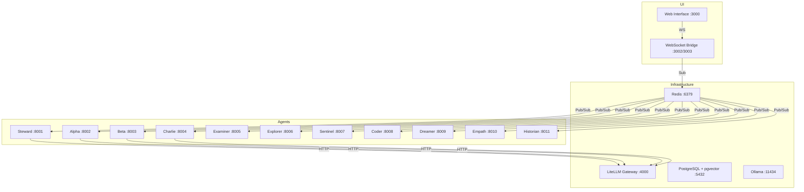
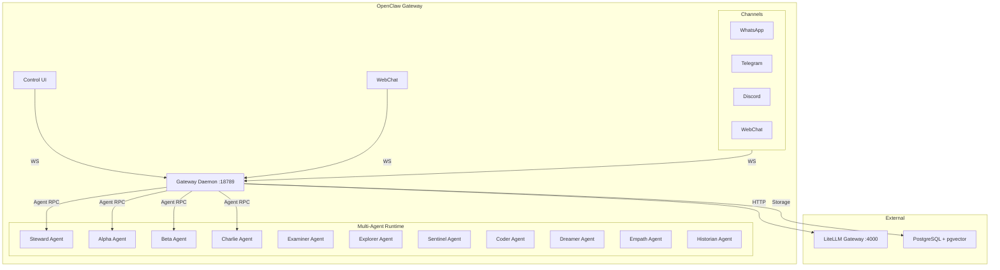

# OpenClaw Migration Plan

## Executive Summary

This document outlines a comprehensive migration strategy for transitioning the Heretek OpenClaw collective from a custom-built agent framework to the official **OpenClaw agent framework**. The migration leverages OpenClaw's mature Gateway architecture, channel system, tools, skills, and automation capabilities while preserving the existing 11-agent collective identity and specialized roles.

**Key Decision**: Instead of maintaining our own agent-to-agent (A2A) protocol built on Redis Pub/Sub, we will adopt OpenClaw's production-ready Gateway-based architecture that provides:
- Built-in multi-agent routing and session management
- 30+ messaging channel integrations (WhatsApp, Telegram, Discord, Slack, etc.)
- Native LiteLLM integration for model routing and failover
- Comprehensive tool system with exec approvals and sandboxing
- Plugin architecture for extensibility
- Web UI, Control UI, and Dashboard interfaces
- Automation hooks, cron jobs, and webhooks

---

## Table of Contents

1. [Current State Analysis](#1-current-state-analysis)
2. [OpenClaw Capabilities Overview](#2-openclaw-capabilities-overview)
3. [Gap Analysis](#3-gap-analysis)
4. [Migration Strategy](#4-migration-strategy)
5. [Architecture Comparison](#5-architecture-comparison)
6. [Integration Opportunities](#6-integration-opportunities)
7. [Risk Assessment](#7-risk-assessment)
8. [Implementation Timeline](#8-implementation-timeline)

---

## 1. Current State Analysis

### 1.1 Current Architecture

The Heretek OpenClaw deployment consists of:

**Infrastructure Services:**
- **LiteLLM Gateway** (Port 4000) - Unified LLM API with A2A protocol extensions
- **PostgreSQL + pgvector** (Port 5432) - Vector database for RAG
- **Redis** (Port 6379) - Cache and Pub/Sub messaging backbone
- **Ollama** (Port 11434) - Local LLM runtime with AMD ROCm support

**Agent Collective (11 Agents):**
| Agent | Role | Port | Model Endpoint |
|-------|------|------|----------------|
| Steward | Orchestrator | 8001 | agent/steward |
| Alpha | Triad Member | 8002 | agent/alpha |
| Beta | Triad Member | 8003 | agent/beta |
| Charlie | Triad Member | 8004 | agent/charlie |
| Examiner | Interrogator | 8005 | agent/examiner |
| Explorer | Scout | 8006 | agent/explorer |
| Sentinel | Guardian | 8007 | agent/sentinel |
| Coder | Artisan | 8008 | agent/coder |
| Dreamer | Visionary | 8009 | agent/dreamer |
| Empath | Diplomat | 8010 | agent/empath |
| Historian | Archivist | 8011 | agent/historian |

**Communication Model:**
- **Redis Pub/Sub** for A2A messaging
- Custom message envelope format with threading support
- Triad deliberation protocol for consensus decisions
- Per-agent inbox channels for direct messaging

**Current Configuration Files:**
- [`litellm_config.yaml`](../litellm_config.yaml) - LiteLLM model routing and A2A settings
- [`openclaw.json`](../openclaw.json) - Collective configuration and agent definitions
- [`docker-compose.yml`](../docker-compose.yml) - Service orchestration

### 1.2 Current Skills Library

Located in `./skills/`:
- **Core**: healthcheck, a2a-agent-register, a2a-message-send
- **Deployment Testing**: deployment-health-check, deployment-smoke-test, config-validator
- **Autonomy**: curiosity-engine, gap-detector, opportunity-scanner
- **Governance**: quorum-enforcement, triad-heartbeat, triad-sync-protocol
- **Operations**: backup-ledger, fleet-backup, detect-corruption, audit-triad-files
- **Cognitive**: day-dream, memory-consolidation
- **Session**: autonomous-pulse, user-rolodex

### 1.3 Current Modules

Located in `./modules/`:
- **thought-loop** - Continuous background thinking
- **self-model** - Meta-cognition and capability tracking
- **goal-arbitration** - Goal prioritization
- **predictive-reasoning** - Anticipatory planning
- **consciousness** - Global workspace theory implementation
- **memory** - Vector store and graph RAG

---

## 2. OpenClaw Capabilities Overview

### 2.1 Gateway Architecture

OpenClaw's Gateway is the central hub that:
- Owns all messaging surfaces (WhatsApp, Telegram, Discord, Slack, Signal, iMessage, WebChat, etc.)
- Exposes a typed WebSocket API for control-plane clients
- Manages agent sessions and context
- Handles model provider connections and failover
- Serves the Control UI and WebChat interfaces

**Key Components:**
- **Gateway Daemon**: Long-lived process maintaining provider connections
- **WebSocket Server**: Default port 18789, supports auth tokens/passwords
- **HTTP APIs**: OpenAI-compatible endpoints (`/v1/models`, `/v1/chat/completions`, `/v1/embeddings`)
- **Channel Managers**: Per-channel integrations with pairing/allowlist controls

### 2.2 Agent Runtime

OpenClaw runs a **single embedded agent runtime** per Gateway instance:

**Workspace Structure:**
```
~/.openclaw/workspace/
├── AGENTS.md       # Operating instructions + memory
├── SOUL.md         # Persona, boundaries, tone
├── TOOLS.md        # Tool usage notes
├── BOOTSTRAP.md    # First-run ritual (deleted after completion)
├── IDENTITY.md     # Agent name/vibe/emoji
├── USER.md         # User profile + preferred address
└── skills/         # Workspace skills
```

**Agent Loop:**
1. Intake → Context assembly → Model inference → Tool execution → Streaming replies → Persistence
2. Serialized runs via per-session + global queues
3. Lifecycle events: `start`, `end`, `error`, `stream:assistant`, `stream:tool`

### 2.3 Multi-Agent Support

OpenClaw supports multi-agent routing through:
- **Agent List**: Multiple agent definitions with separate workspaces
- **Bindings**: Route messages to agents based on channel/account patterns
- **Sub-agents**: Spawn child sessions for delegated tasks
- **Session Scoping**: `dmScope` controls session isolation (`main`, `per-peer`, `per-channel-peer`)

**Configuration Example:**
```json
{
  "agents": {
    "list": [
      { "id": "home", "default": true, "workspace": "~/.openclaw/workspace-home" },
      { "id": "work", "workspace": "~/.openclaw/workspace-work" }
    ]
  },
  "bindings": [
    { "agentId": "home", "match": { "channel": "whatsapp", "accountId": "personal" } },
    { "agentId": "work", "match": { "channel": "whatsapp", "accountId": "biz" } }
  ]
}
```

### 2.4 Tools and Skills

**Built-in Tools:**
- `exec`, `process` - Shell commands and background processes
- `read`, `write`, `edit`, `apply_patch` - File I/O
- `browser` - Chromium browser control
- `web_search`, `x_search`, `web_fetch` - Web operations
- `message` - Send messages across channels
- `canvas` - Drive node Canvas (present, eval, snapshot)
- `nodes` - Discover and target paired devices
- `cron`, `gateway` - Automation and management
- `image`, `image_generate` - Image analysis/generation
- `sessions_*`, `agents_list` - Session management

**Skills System:**
- Markdown files (`SKILL.md`) injected into system prompt
- Three locations: Bundled, Managed (`~/.openclaw/skills`), Workspace (`<workspace>/skills`)
- Skills list injected; full content loaded on-demand via `read` tool

### 2.5 Automation

**Mechanisms:**
| Mechanism | Purpose | Runs In |
|-----------|---------|---------|
| **Heartbeat** | Periodic main-session turn | Main session |
| **Cron** | Scheduled jobs with precise timing | Main or isolated session |
| **Hooks** | Event-driven scripts | Hook runner |
| **Standing Orders** | Persistent instructions | System prompt |
| **Webhooks** | Inbound HTTP events | Gateway HTTP |
| **Gmail PubSub** | Real-time Gmail notifications | Gateway |
| **Polling** | Periodic data source checks | Background |

### 2.6 Channels

**Supported Channels:**
- **Messaging**: WhatsApp, Telegram, Signal, iMessage (BlueBubbles), Discord, Slack
- **Enterprise**: Microsoft Teams, Mattermost, Google Chat, Nextcloud Talk
- **Social**: Twitch, LINE, Nostr, Tlon
- **Protocols**: IRC, Matrix
- **Voice**: Voice Call (Plivo/Twilio plugin)
- **Web**: WebChat (built-in browser UI)

**Channel Configuration:**
```json
{
  "channels": {
    "whatsapp": {
      "enabled": true,
      "dmPolicy": "pairing",
      "allowFrom": ["+15555550123"],
      "groups": { "*": { "requireMention": true } }
    },
    "telegram": {
      "enabled": true,
      "botToken": "${TELEGRAM_BOT_TOKEN}",
      "dmPolicy": "allowlist",
      "allowFrom": ["tg:123456789"]
    }
  }
}
```

### 2.7 LiteLLM Integration

OpenClaw has native LiteLLM support:
- Configure LiteLLM as a model provider
- Route through LiteLLM for cost tracking, logging, and model routing
- Virtual keys with spend limits
- Automatic failover configuration

**Configuration:**
```json
{
  "models": {
    "providers": {
      "litellm": {
        "baseUrl": "http://localhost:4000",
        "apiKey": "${LITELLM_API_KEY}",
        "api": "openai-completions",
        "models": [
          {
            "id": "claude-opus-4-6",
            "name": "Claude Opus 4.6",
            "contextWindow": 200000,
            "maxTokens": 64000
          }
        ]
      }
    }
  },
  "agents": {
    "defaults": {
      "model": { "primary": "litellm/claude-opus-4-6" }
    }
  }
}
```

### 2.8 Web Interfaces

**Control UI** (Port 18789):
- Config editor with JSON Schema validation
- Agent status dashboard
- Session management
- Health monitoring

**WebChat**:
- Gateway WebChat UI over WebSocket
- Chat history and send functionality
- Multi-channel support

**TUI** (Terminal UI):
- CLI-based interface for agent interaction

---

## 3. Gap Analysis

### 3.1 Architecture Gaps

| Current State | OpenClaw Target | Gap |
|---------------|-----------------|-----|
| 11 independent Docker containers | Single Gateway with multi-agent routing | **Major**: Consolidate agent runtime |
| Redis Pub/Sub A2A | Gateway WebSocket RPC + agent events | **Major**: Rewrite communication layer |
| Custom triad deliberation protocol | OpenClaw multi-agent routing + subagents | **Medium**: Map protocol to OpenClaw patterns |
| Per-agent model endpoints via LiteLLM | OpenClaw Gateway with LiteLLM provider | **Minor**: Reconfigure LiteLLM integration |
| Custom web UI (SvelteKit) | OpenClaw Control UI + WebChat | **Medium**: Migrate or integrate UI |

### 3.2 Skills and Tools Gaps

| Current Skills | OpenClaw Equivalent | Migration Action |
|----------------|---------------------|------------------|
| healthcheck | Built-in `gateway status`, `health` RPC | **Replace**: Use native commands |
| a2a-message-send | `message` tool + `agent` RPC | **Rewrite**: Adapt to OpenClaw API |
| curiosity-engine | OpenClaw skills format | **Port**: Convert to SKILL.md |
| gap-detector | OpenClaw skills format | **Port**: Convert to SKILL.md |
| opportunity-scanner | OpenClaw skills format | **Port**: Convert to SKILL.md |
| quorum-enforcement | OpenClaw multi-agent + bindings | **Redesign**: Use native routing |
| triad-heartbeat | Heartbeat + cron automation | **Replace**: Use native heartbeat |
| backup-ledger, fleet-backup | OpenClaw skills format | **Port**: Convert to SKILL.md |
| day-dream | Background tasks + cron | **Redesign**: Use native automation |
| memory-consolidation | Context engine + compaction | **Redesign**: Use native compaction |
| autonomous-pulse | Heartbeat + session management | **Replace**: Use native features |
| user-rolodex | USER.md + custom skill | **Port**: Convert to skill |

### 3.3 Module Gaps

| Current Module | OpenClaw Equivalent | Migration Action |
|----------------|---------------------|------------------|
| thought-loop | Agent loop + streaming | **Replace**: Use native agent loop |
| self-model | IDENTITY.md + reflection tools | **Port**: Convert to skill |
| goal-arbitration | Standing orders + hooks | **Redesign**: Use automation |
| predictive-reasoning | Custom skill | **Port**: Convert to skill |
| consciousness (GWT) | Not directly supported | **Evaluate**: Custom plugin or skill |
| memory (vector/graph) | pgvector + session storage | **Integrate**: Use OpenClaw storage |

### 3.4 Configuration Gaps

| Current Config | OpenClaw Equivalent | Migration Action |
|----------------|---------------------|------------------|
| `openclaw.json` collective | `~/.openclaw/openclaw.json` | **Migrate**: Map fields |
| `litellm_config.yaml` | OpenClaw LiteLLM provider config | **Migrate**: Reformat |
| `docker-compose.yml` agents | OpenClaw multi-agent list | **Redesign**: Single Gateway |
| Redis A2A channels | Gateway event streams | **Replace**: Use native events |

---

## 4. Migration Strategy

### Phase 1: Foundation Setup (Week 1-2)

**Objective**: Establish OpenClaw Gateway infrastructure alongside existing deployment.

**Tasks:**
1. **Install OpenClaw Gateway**
   ```bash
   curl -fsSL https://openclaw.ai/install.sh | bash
   openclaw onboard --install-daemon
   ```

2. **Configure LiteLLM Provider**
   - Point OpenClaw to existing LiteLLM Gateway at `http://litellm:4000`
   - Migrate model routing from `litellm_config.yaml` to OpenClaw config
   - Preserve agent passthrough endpoints (`agent/steward`, `agent/alpha`, etc.)

3. **Set Up Workspace Structure**
   ```
   ~/.openclaw/
   ├── openclaw.json           # Gateway configuration
   ├── workspace/              # Default agent workspace
   │   ├── AGENTS.md
   │   ├── SOUL.md
   │   ├── IDENTITY.md
   │   ├── TOOLS.md
   │   └── USER.md
   └── skills/                 # Migrated skills
   ```

4. **Configure Channels**
   - Start with WebChat for testing
   - Add WhatsApp/Telegram for production messaging
   - Set up pairing/allowlist controls

### Phase 2: Multi-Agent Migration (Week 3-4)

**Objective**: Migrate 11 agents to OpenClaw multi-agent routing.

**Tasks:**
1. **Define Agent List**
   ```json
   {
     "agents": {
       "list": [
         {
           "id": "steward",
           "default": true,
           "workspace": "~/.openclaw/workspaces/steward",
           "model": { "primary": "litellm/agent/steward" },
           "tools": { "profile": "full" }
         },
         {
           "id": "alpha",
           "workspace": "~/.openclaw/workspaces/alpha",
           "model": { "primary": "litellm/agent/alpha" }
         },
         // ... remaining 9 agents
       ]
     }
   }
   ```

2. **Create Agent Workspaces**
   - Migrate identity files (`IDENTITY.md`, `SOUL.md`, `AGENTS.md`)
   - Preserve agent-specific memory directories
   - Set up per-agent skills

3. **Configure Agent Bindings**
   ```json
   {
     "bindings": [
       {
         "agentId": "steward",
         "match": { "channel": "webchat", "sessionKey": "orchestrator" }
       },
       {
         "agentId": "triad",
         "match": { "channel": "webchat", "sessionKey": "deliberation" }
       }
     ]
   }
   ```

4. **Migrate Triad Protocol**
   - Implement triad deliberation as OpenClaw skill
   - Use subagents for parallel deliberation
   - Replace Redis Pub/Sub with Gateway agent events

### Phase 3: Skills Migration (Week 5-6)

**Objective**: Port existing skills library to OpenClaw format.

**Tasks:**
1. **Audit Existing Skills**
   - Identify which skills are still needed
   - Map to OpenClaw built-in tools
   - Prioritize migration order

2. **Convert Skills Format**
   ```markdown
   # SKILL.md Template
   
   ## Description
   What this skill does
   
   ## Triggers
   When to use this skill
   
   ## Steps
   1. Step one
   2. Step two
   
   ## Tools Used
   - read
   - exec
   - message
   ```

3. **Install Skills**
   - Workspace skills: `~/.openclaw/workspace/skills/`
   - Managed skills: `~/.openclaw/skills/`
   - Test skill loading via `/skills list`

4. **Validate Skill Execution**
   - Test each skill in isolation
   - Verify tool access and permissions
   - Check context injection

### Phase 4: Automation Migration (Week 7-8)

**Objective**: Replace custom automation with OpenClaw native features.

**Tasks:**
1. **Migrate Heartbeat**
   ```json
   {
     "agents": {
       "defaults": {
         "heartbeat": {
           "every": "30m",
           "target": "last"
         }
       }
     }
   }
   ```

2. **Set Up Cron Jobs**
   ```json
   {
     "cron": {
       "enabled": true,
       "jobs": [
         {
           "id": "daily-backup",
           "schedule": "0 4 * * *",
           "command": "backup-ledger"
         }
       ]
     }
   }
   ```

3. **Configure Hooks**
   ```json
   {
     "hooks": {
       "enabled": true,
       "entries": {
         "agent_end": "./hooks/on-agent-end.js",
         "session_start": "./hooks/on-session-start.js"
       }
     }
   }
   ```

4. **Set Up Webhooks**
   ```json
   {
     "hooks": {
       "enabled": true,
       "mappings": [
         {
           "match": { "path": "gmail" },
           "action": "agent",
           "agentId": "main",
           "deliver": true
         }
       ]
     }
   }
   ```

### Phase 5: UI Integration (Week 9-10)

**Objective**: Integrate or replace existing web UI.

**Options:**

**Option A: Use OpenClaw Control UI**
- Enable Control UI in Gateway config
- Customize via CSS/JS injection
- Use WebChat for user interactions

**Option B: Hybrid Approach**
- Keep existing SvelteKit UI for dashboard
- Connect to OpenClaw Gateway via WebSocket
- Use OpenClaw RPC API for agent control

**Option C: Full Migration**
- Deprecate existing UI
- Use OpenClaw Control UI + WebChat
- Build custom extensions as plugins

### Phase 6: Testing and Validation (Week 11-12)

**Objective**: Validate complete migration.

**Tasks:**
1. **Health Checks**
   ```bash
   openclaw doctor
   openclaw gateway status
   openclaw channels status --probe
   ```

2. **Smoke Tests**
   - Test each agent individually
   - Test multi-agent deliberation
   - Test channel messaging
   - Test automation triggers

3. **Performance Validation**
   - Monitor Gateway resource usage
   - Check session persistence
   - Validate context window management

4. **Rollback Plan**
   - Maintain parallel deployment during transition
   - Document rollback procedures
   - Keep Redis A2A as fallback

---

## 5. Architecture Comparison

### Current Architecture



### Target OpenClaw Architecture



---

## 6. Integration Opportunities

### 6.1 Third-Party Projects

Based on the provided GitHub projects list, here are integration opportunities:

| Project | Integration Potential | Priority |
|---------|----------------------|----------|
| **Cherry Studio** | UI inspiration, agent workflow patterns | High |
| **PraisonAI** | Multi-agent orchestration patterns | High |
| **ClawRouter** | Enhanced routing logic | Medium |
| **MemOS/Memoh** | Memory management integration | Medium |
| **DeepLake** | Vector storage alternative | Low |
| **OpenViking** | Agent framework patterns | Low |

### 6.2 Plugin Opportunities

OpenClaw plugins that could enhance the deployment:

1. **Context Engine Plugins**
   - Replace legacy context engine with advanced retrieval
   - Integrate GraphRAG from existing modules

2. **Memory Plugins**
   - Connect to existing pgvector storage
   - Add memory search/retrieval tools

3. **Channel Plugins**
   - Add additional channel support if needed
   - Custom webhook integrations

4. **Tool Plugins**
   - Lobster workflow runtime
   - LLM Task for structured output
   - Custom tools from existing modules

---

## 7. Risk Assessment

### High Risk

| Risk | Impact | Mitigation |
|------|--------|------------|
| **Agent runtime consolidation** | 11 containers → 1 Gateway | Parallel deployment, gradual migration |
| **Triad protocol rewrite** | Core governance logic | Preserve logic in skills, test extensively |
| **Session data migration** | Conversation history loss | Export/import Redis data, preserve session IDs |

### Medium Risk

| Risk | Impact | Mitigation |
|------|--------|------------|
| **Skills compatibility** | Skills may not work | Test each skill, maintain fallback |
| **Channel reconfiguration** | Messaging disruptions | Test channels in isolation first |
| **UI integration** | User experience changes | Hybrid approach, gradual transition |

### Low Risk

| Risk | Impact | Mitigation |
|------|--------|------------|
| **LiteLLM integration** | Model routing changes | Preserve existing LiteLLM config |
| **Automation timing** | Cron/heartbeat drift | Validate schedules post-migration |
| **Tool permissions** | exec/sandbox issues | Review tool policy config |

---

## 8. Implementation Timeline

### Week 1-2: Foundation
- [ ] Install OpenClaw Gateway
- [ ] Configure LiteLLM provider
- [ ] Set up workspace structure
- [ ] Test WebChat connectivity

### Week 3-4: Multi-Agent
- [ ] Define agent list in config
- [ ] Create per-agent workspaces
- [ ] Migrate identity files
- [ ] Configure agent bindings
- [ ] Test multi-agent routing

### Week 5-6: Skills
- [ ] Audit existing skills
- [ ] Convert to OpenClaw format
- [ ] Install and test skills
- [ ] Validate tool access

### Week 7-8: Automation
- [ ] Configure heartbeat
- [ ] Set up cron jobs
- [ ] Configure hooks
- [ ] Test automation flows

### Week 9-10: UI
- [ ] Decide UI strategy
- [ ] Implement chosen approach
- [ ] Test user flows
- [ ] Gather feedback

### Week 11-12: Validation
- [ ] Run health checks
- [ ] Execute smoke tests
- [ ] Performance validation
- [ ] Documentation update
- [ ] Final cutover decision

---

## Appendix A: Configuration Mapping

### openclaw.json Field Mapping

| Current Field | OpenClaw Equivalent |
|---------------|---------------------|
| `collective.name` | `identity.name` |
| `agents[].model` | `agents.list[].model.primary` |
| `agents[].session` | `session.dmScope` |
| `agents[].skills` | `skills.entries` |
| `a2a_protocol.endpoints` | Gateway RPC API |
| `embedding.model` | `models.providers.ollama.models[]` |
| `memory.vector_store` | Built-in session storage |

### LiteLLM Configuration Preservation

The existing `litellm_config.yaml` agent passthrough endpoints can be preserved:

```yaml
# Keep in LiteLLM
model_list:
  - model_name: agent/steward
    litellm_params:
      model: minimax/MiniMax-M2.7
      
# OpenClaw config references these
{
  "models": {
    "providers": {
      "litellm": {
        "baseUrl": "http://litellm:4000",
        "models": [
          { "id": "agent/steward", "name": "Steward Agent" }
        ]
      }
    }
  }
}
```

---

## Appendix B: Command Reference

### OpenClaw CLI Commands

```bash
# Gateway management
openclaw gateway                    # Start gateway
openclaw gateway status             # Check status
openclaw gateway restart            # Restart
openclaw gateway install            # Install as service

# Configuration
openclaw config get <path>          # Get config value
openclaw config set <path> <value>  # Set config value
openclaw configure                  # Interactive wizard

# Diagnostics
openclaw doctor                     # Health check
openclaw logs --follow              # Stream logs
openclaw health                     # Quick health probe

# Channels
openclaw channels status            # Channel status
openclaw pairing list <channel>     # List pending pairings
openclaw pairing approve <channel> <code>  # Approve pairing

# Agents
openclaw agent <message>            # Run agent
openclaw agent.wait <message>       # Run and wait for completion

# Skills
openclaw skills list                # List available skills
openclaw skills install <name>      # Install skill

# Plugins
openclaw plugins list               # List plugins
openclaw plugins install <name>     # Install plugin
```

---

## Appendix C: Testing Checklist

### Gateway Health
- [ ] `openclaw gateway status` returns `running`
- [ ] `openclaw doctor` passes all checks
- [ ] WebSocket connection succeeds
- [ ] HTTP API responds

### Agent Functionality
- [ ] Each agent responds to messages
- [ ] Multi-agent routing works
- [ ] Subagent spawning works
- [ ] Session persistence verified

### Channel Testing
- [ ] WebChat connects and sends messages
- [ ] WhatsApp/Telegram pairing works
- [ ] Group messages handled correctly
- [ ] Mention gating works

### Skills Testing
- [ ] All migrated skills load
- [ ] Skills execute correctly
- [ ] Tool access works
- [ ] Context injection verified

### Automation Testing
- [ ] Heartbeat triggers on schedule
- [ ] Cron jobs execute
- [ ] Hooks fire on events
- [ ] Webhooks receive payloads

---

## Conclusion

This migration plan provides a structured approach to transitioning from the custom Heretek OpenClaw implementation to the official OpenClaw framework. The key benefits include:

1. **Reduced Maintenance Burden**: Leverage OpenClaw's mature codebase instead of maintaining custom A2A protocol
2. **Enhanced Capabilities**: Access to 30+ channels, comprehensive tool system, and plugin architecture
3. **Better Integration**: Native LiteLLM support aligns with existing model routing
4. **Production Ready**: OpenClaw's Gateway is battle-tested with proper auth, sandboxing, and monitoring

The migration is designed to be incremental with parallel deployment options, allowing for rollback if issues arise. The 12-week timeline provides buffer for unexpected challenges while maintaining momentum.

**Next Steps:**
1. Review and approve this plan
2. Set up OpenClaw development environment
3. Begin Phase 1 foundation work
4. Establish testing benchmarks for validation
